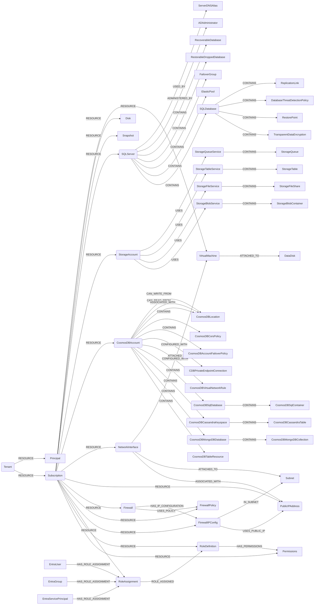

## Azure Schema



:::{note}
All entities are linked to an AzureSubscription, these relationships are not represented for readability.
:::

### AzureTenant

Representation of an [Azure Tenant](https://docs.microsoft.com/en-us/rest/api/resources/Tenants/List).

> **Ontology Mapping**: This node has the extra label `Tenant` to enable cross-platform queries for organizational tenants across different systems (e.g., OktaOrganization, AWSAccount, GCPOrganization).

| Field | Description |
|-------|-------------|
|firstseen| Timestamp of when a sync job discovered this node|
|lastupdated| Timestamp of the last time the node was updated|
|**id**| The Azure Tenant ID number|

#### Relationships

- Azure Principal is part of the Azure Account.
    ```cypher
    (AzureTenant)-[RESOURCE]->(AzurePrincipal)
    ```

### AzurePrincipal

Representation of an [Azure Principal](https://docs.microsoft.com/en-us/graph/api/resources/user?view=graph-rest-1.0)..

| Field | Description |
|-------|-------------|
|firstseen| Timestamp of when a sync job discovered this node|
|lastupdated| Timestamp of the last time the node was updated|
|**email**| Email of the Azure Principal|

#### Relationships

- Azure Principal is part of the Azure Account.
    ```cypher
    (AzurePrincipal)-[RESOURCE]->(AzureTenant)
    ```

### AzureSubscription

Representation of an [Azure Subscription](https://docs.microsoft.com/en-us/rest/api/resources/subscriptions)..

> **Ontology Mapping**: This node has the extra label `Tenant` to enable cross-platform queries for organizational tenants across different systems (e.g., OktaOrganization, AWSAccount, GCPOrganization).

| Field | Description |
|-------|-------------|
|firstseen| Timestamp of when a sync job discovered this node|
|lastupdated| Timestamp of the last time the node was updated|
|**id**| The Azure Subscription ID number|
|name | The friendly name that identifies the subscription|
|path | The full ID for the Subscription|
|state| Can be one of ``Enabled \| Disabled \| Deleted \| PastDue \| Warned``|

#### Relationships

- Azure Tenant contains one or more Subscriptions.
    ```cypher
    (AzureTenant)-[RESOURCE]->(AzureSubscription)
    ```

### AzureRoleAssignment

Representation of an [Azure Role Assignment](https://learn.microsoft.com/en-us/azure/role-based-access-control/role-assignments-list-rest). Role assignments associate a principal (user, group, service principal, or managed identity) with a role definition at a given scope.

| Field | Description |
|-------|-------------|
|firstseen| Timestamp of when a sync job discovered this node|
|lastupdated| Timestamp of the last time the node was updated|
|**id**| The fully qualified ID of the role assignment|
|name| The name (GUID) of the role assignment|
|type| The type of the resource (Microsoft.Authorization/roleAssignments)|
|principal_id| The principal ID of the assignee (user, group, or service principal)|
|principal_type| The type of principal (User, Group, ServicePrincipal)|
|role_definition_id| The ID of the role definition being assigned|
|scope| The scope at which the role is assigned (subscription, resource group, or resource)|
|scope_type| The type of scope|
|created_on| Timestamp when the role assignment was created|
|updated_on| Timestamp when the role assignment was last updated|
|created_by| The ID of the principal who created the role assignment|
|updated_by| The ID of the principal who last updated the role assignment|
|condition| JSON string containing any conditions on the role assignment|
|description| Description of the role assignment|
|delegated_managed_identity_resource_id| The delegated managed identity resource ID, if applicable|
|subscription_id| The Azure subscription ID|

#### Relationships

- Azure Subscription contains Role Assignments.
    ```cypher
    (AzureSubscription)-[RESOURCE]->(AzureRoleAssignment)
    ```

- Role Assignment references a Role Definition.
    ```cypher
    (AzureRoleAssignment)-[ROLE_ASSIGNED]->(AzureRoleDefinition)
    ```

- Entra Users can have Role Assignments.
    ```cypher
    (EntraUser)-[HAS_ROLE_ASSIGNMENT]->(AzureRoleAssignment)
    ```

- Entra Groups can have Role Assignments.
    ```cypher
    (EntraGroup)-[HAS_ROLE_ASSIGNMENT]->(AzureRoleAssignment)
    ```

- Entra Service Principals can have Role Assignments.
    ```cypher
    (EntraServicePrincipal)-[HAS_ROLE_ASSIGNMENT]->(AzureRoleAssignment)
    ```

### AzureRoleDefinition

Representation of an [Azure Role Definition](https://learn.microsoft.com/en-us/azure/role-based-access-control/role-definitions). Role definitions describe the permissions that can be granted, including allowed actions, not actions, data actions, and not data actions.

> **Ontology Mapping**: This node has the extra label `PermissionRole` to enable cross-platform queries for IAM roles and permission roles across different systems (e.g., AWSRole, AzureRoleDefinition, GCPRole, KubernetesRole).

| Field | Description |
|-------|-------------|
|firstseen| Timestamp of when a sync job discovered this node|
|lastupdated| Timestamp of the last time the node was updated|
|**id**| The fully qualified ID of the role definition|
|name| The name (GUID) of the role definition|
|type| The type of the resource (Microsoft.Authorization/roleDefinitions)|
|role_name| The display name of the role (e.g., "Contributor", "Reader")|
|description| Description of what the role allows|
|assignable_scopes| List of scopes where this role can be assigned|
|subscription_id| The Azure subscription ID|

#### Relationships

- Azure Subscription contains Role Definitions.
    ```cypher
    (AzureSubscription)-[RESOURCE]->(AzureRoleDefinition)
    ```

- Role Definition has Permissions.
    ```cypher
    (AzureRoleDefinition)-[HAS_PERMISSIONS]->(AzurePermissions)
    ```

- Role Assignments reference Role Definitions.
    ```cypher
    (AzureRoleAssignment)-[ROLE_ASSIGNED]->(AzureRoleDefinition)
    ```

### AzurePermissions

Representation of the permissions within an Azure Role Definition. Each permission set contains allowed and denied actions for both control plane (management) and data plane operations.

| Field | Description |
|-------|-------------|
|firstseen| Timestamp of when a sync job discovered this node|
|lastupdated| Timestamp of the last time the node was updated|
|**id**| Unique identifier for the permission set (role_definition_id/permissions/index)|
|actions| List of allowed control plane actions (e.g., "Microsoft.Compute/virtualMachines/read")|
|not_actions| List of denied control plane actions|
|data_actions| List of allowed data plane actions (e.g., "Microsoft.Storage/storageAccounts/blobServices/containers/blobs/read")|
|not_data_actions| List of denied data plane actions|
|subscription_id| The Azure subscription ID|

#### Relationships

- Azure Subscription contains Permissions.
    ```cypher
    (AzureSubscription)-[RESOURCE]->(AzurePermissions)
    ```

- Role Definition has Permissions.
    ```cypher
    (AzureRoleDefinition)-[HAS_PERMISSIONS]->(AzurePermissions)
    ```

#### Example Queries

- Find all users with the "Owner" role:
    ```cypher
    MATCH (u:EntraUser)-[:HAS_ROLE_ASSIGNMENT]->(ra:AzureRoleAssignment)-[:ROLE_ASSIGNED]->(rd:AzureRoleDefinition)
    WHERE rd.role_name = 'Owner'
    RETURN u.email, ra.scope
    ```

- Find all principals with write access to storage accounts:
    ```cypher
    MATCH (ra:AzureRoleAssignment)-[:ROLE_ASSIGNED]->(rd:AzureRoleDefinition)-[:HAS_PERMISSIONS]->(p:AzurePermissions)
    WHERE ANY(action IN p.actions WHERE action CONTAINS 'Microsoft.Storage' AND action CONTAINS 'write')
    RETURN ra.principal_id, ra.principal_type, rd.role_name, ra.scope
    ```

- Find service principals with high-privilege roles:
    ```cypher
    MATCH (sp:EntraServicePrincipal)-[:HAS_ROLE_ASSIGNMENT]->(ra:AzureRoleAssignment)-[:ROLE_ASSIGNED]->(rd:AzureRoleDefinition)
    WHERE rd.role_name IN ['Owner', 'Contributor', 'User Access Administrator']
    RETURN sp.display_name, rd.role_name, ra.scope
    ```

### VirtualMachine

Representation of an [Azure Virtual Machine](https://docs.microsoft.com/en-us/rest/api/compute/virtualmachines).

> **Ontology Mapping**: This node has the extra label `ComputeInstance` to enable cross-platform queries for compute instances across different systems (e.g., EC2Instance, GCPInstance, DODroplet).

| Field | Description |
|-------|-------------|
|firstseen| Timestamp of when a sync job discovered this node|
|lastupdated| Timestamp of the last time the node was updated|
|**id**| The Azure Virtual Machine ID number|
|type | The type of the resource|
|location | The location where Virtual Machine is created|
|resourcegroup | The Resource Group where Virtual Machine is created|
|name | The friendly name that identifies the Virtual Machine|
|plan | The plan associated with the Virtual Machine|
|size | The size of the Virtual Machine|
|license\_type | The type of license|
|computer\_name | The computer name|
|identity\_type | The type of identity used for the virtual machine|
|zones | The Virtual Machine zones|
|ultra\_ssd\_enabled | Enables or disables a capability on the virtual machine or virtual machine scale set.|
|priority | Specifies the priority for the virtual machine|
|eviction\_policy | Specifies the eviction policy for the Virtual Machine|
|exposed\_internet | Whether the VM is exposed to the internet (direct or via LB). Set by an analysis job. |
|exposed\_internet\_type | List of exposure types (e.g., `['direct']`, `['lb']`, `['direct', 'lb']`). Set by an analysis job. |

#### Relationships

- Azure Subscription contains one or more Virtual Machines.
    ```cypher
    (AzureSubscription)-[RESOURCE]->(VirtualMachine)
    ```

- An Azure Virtual Machine can be tagged with Azure Tags.
    ```cypher
    (AzureVirtualMachine)-[:TAGGED]->(AzureTag)
    ```

### AzureDataDisk

Representation of an [Azure Data Disk](https://docs.microsoft.com/en-us/rest/api/compute/virtualmachines/get#datadisk).

| Field | Description |
|-------|-------------|
|firstseen| Timestamp of when a sync job discovered this node|
|lastupdated| Timestamp of the last time the node was updated|
|**id**| The Azure Data Disk ID number|
|lun | Specifies the logical unit number of the data disk|
|name | The data disk name|
|vhd | The virtual hard disk associated with data disk|
|image | The source user image virtual hard disk|
|size | The size of the disk in GB|
|caching | Specifies the caching requirement|
|createoption | Specifies how the disk should be created|
|write\_accelerator\_enabled | Specifies whether writeAccelerator should be enabled or disabled on the data disk|
|managed\_disk\_storage\_type | The data disk storage type|

#### Relationships

- Azure Virtual Machines are attached to Data Disks.
    ```cypher
    (VirtualMachine)-[ATTACHED_TO]->(AzureDataDisk)
    ```

- Azure Data Disks belongs to a Subscription.
    ```
        (AzureSubscription)-[RESOURCE]->(AzureDataDisk)
    ```

### AzureDisk

Representation of an [Azure Disk](https://docs.microsoft.com/en-us/rest/api/compute/disks).

| Field | Description |
|-------|-------------|
|firstseen| Timestamp of when a sync job discovered this node|
|lastupdated| Timestamp of the last time the node was updated|
|**id**| The Azure Disk ID number|
|type | The type of the resource|
|location | The location where Disk is created|
|resourcegroup | The Resource Group where Disk is created|
|name | The friendly name that identifies the Disk|
|createoption | Specifies how the disk should be created|
|disksizegb | The size of the disk in GB|
|encryption | Specifies whether the disk has encryption enabled |
|maxshares | Specifies how many machines can share the disk|
|ostype | The operating system type of the disk|
|tier | Performance Tier associated with the disk|
|sku | The disk sku name|
|zones | The logical zone list for disk|

#### Relationships

- Azure Subscription contains one or more Disks.
    ```cypher
    (AzureSubscription)-[RESOURCE]->(AzureDisk)
    ```

### AzureSnapshot

Representation of an [Azure Snapshot](https://docs.microsoft.com/en-us/rest/api/compute/snapshots).

| Field | Description |
|-------|-------------|
|firstseen| Timestamp of when a sync job discovered this node|
|lastupdated| Timestamp of the last time the node was updated|
|**id**| The Azure Snapshot ID number|
|type | The type of the resource|
|location | The location where snapshot is created|
|resourcegroup | The Resource Group where snapshot is created|
|name | The friendly name that identifies the snapshot|
|createoption | Specifies how the disk should be created|
|disksizegb | The size of the snapshot in GB|
|encryption | Specifies whether the snapshot has encryption enabled |
|incremental | Indicates whether a snapshot is incremental or not |
|network\_access\_policy | Policy for accessing the snapshot via network|
|ostype | The operating system type of the snapshot|
|tier | Performance Tier associated with the snapshot|
|sku | The snapshot sku name|
|zones | The logical zone list for snapshot|

#### Relationships

- Azure Subscription contains one or more Snapshots.
    ```cypher
    (AzureSubscription)-[RESOURCE]->(AzureSnapshot)
    ```

### AzureSQLServer

Representation of an [AzureSQLServer](https://docs.microsoft.com/en-us/rest/api/sql/servers).

| Field | Description |
|-------|-------------|
|firstseen| Timestamp of when a sync job discovered this node|
|lastupdated| Timestamp of the last time the node was updated|
|**id**| The resource ID|
|location | The location where the resource is created|
|resourcegroup | The Resource Group where SQL Server is created|
|name | The friendly name that identifies the SQL server|
|kind | Specifies the kind of SQL server|
|state | The state of the server|
|version | The version of the server |

#### Relationships

- Azure Subscription contains one or more SQL Servers.
    ```cypher
    (AzureSubscription)-[RESOURCE]->(AzureSQLServer)
    ```
- Azure SQL Server can be used by one or more Azure Server DNS Aliases.
    ```cypher
    (AzureSQLServer)-[USED_BY]->(AzureServerDNSAlias)
    ```
- Azure SQL Server can be administered by one or more Azure Server AD Administrators.
    ```cypher
    (AzureSQLServer)-[ADMINISTERED_BY]->(AzureServerADAdministrator)
    ```
- Azure SQL Server contains one or more Azure Recoverable Database.
    ```
    (AzureSQLServer)-[CONTAINS]->(AzureRecoverableDatabase)
    ```
- Azure SQL Server contains one or more Azure Restorable Dropped Database.
    ```
    (AzureSQLServer)-[CONTAINS]->(AzureRestorableDroppedDatabase)
    ```
- Azure SQL Server contains one or more Azure Failover Group.
    ```
    (AzureSQLServer)-[CONTAINS]->(AzureFailoverGroup)
    ```
- Azure SQL Server contains one or more Azure Elastic Pool.
    ```
    (AzureSQLServer)-[CONTAINS]->(AzureElasticPool)
    ```
- Azure SQL Server contains one or more Azure SQL Database.
    ```
    (AzureSQLServer)-[CONTAINS]->(AzureSQLDatabase)
    ```

- Azure SQL Servers can be tagged with Azure Tags.
    ```cypher
    (AzureSQLServer)-[:TAGGED]->(AzureTag)
    ```

- Entra principals with appropriate permissions can manage Azure SQL Servers. Created from [azure_permission_relationships.yaml](https://github.com/cartography-cncf/cartography/blob/master/cartography/data/azure_permission_relationships.yaml).
    ```
    (EntraUser, EntraGroup, EntraServicePrincipal)-[CAN_MANAGE]->(AzureSQLServer)
    ```

- Entra principals with appropriate permissions can read Azure SQL Servers. Created from [azure_permission_relationships.yaml](https://github.com/cartography-cncf/cartography/blob/master/cartography/data/azure_permission_relationships.yaml).
    ```
    (EntraUser, EntraGroup, EntraServicePrincipal)-[CAN_READ]->(AzureSQLServer)
    ```

- Entra principals with appropriate permissions can write to Azure SQL Servers. Created from [azure_permission_relationships.yaml](https://github.com/cartography-cncf/cartography/blob/master/cartography/data/azure_permission_relationships.yaml).
    ```
    (EntraUser, EntraGroup, EntraServicePrincipal)-[CAN_WRITE]->(AzureSQLServer)
    ```

### AzureServerDNSAlias

Representation of an [AzureServerDNSAlias](https://docs.microsoft.com/en-us/rest/api/sql/serverdnsaliases).

| Field | Description |
|-------|-------------|
|firstseen| Timestamp of when a sync job discovered this node|
|lastupdated| Timestamp of the last time the node was updated|
|**id**| The resource ID|
|name | The name of the server DNS alias|
|dnsrecord | The fully qualified DNS record for alias.|

#### Relationships

- Azure SQL Server can be used by one or more Azure Server DNS Aliases.
    ```cypher
    (AzureSQLServer)-[USED_BY]->(AzureServerDNSAlias)
    ```

- Azure DNS Aliases belongs to a Subscription.
    ```
        (AzureSubscription)-[RESOURCE]->(AzureServerDNSAlias)
    ```

### AzureServerADAdministrator

Representation of an [AzureServerADAdministrator](https://docs.microsoft.com/en-us/rest/api/sql/serverazureadadministrators).

| Field | Description |
|-------|-------------|
|firstseen| Timestamp of when a sync job discovered this node|
|lastupdated| Timestamp of the last time the node was updated|
|**id**| The resource ID|
|name | The name of the resource.|
|administratortype | The type of the server administrator.|
|login | The login name of the server administrator.|

#### Relationships

- Azure SQL Server can be administered by one or more Azure Server AD Administrators.
    ```cypher
    (AzureSQLServer)-[ADMINISTERED_BY]->(AzureServerADAdministrator)
    ```

- Azure Server AD Administrators belongs to a Subscription.
    ```
        (AzureSubscription)-[RESOURCE]->(AzureServerADAdministrator)
    ```

### AzureRecoverableDatabase

Representation of an [AzureRecoverableDatabase](https://docs.microsoft.com/en-us/rest/api/sql/recoverabledatabases).

| Field | Description |
|-------|-------------|
|firstseen| Timestamp of when a sync job discovered this node|
|lastupdated| Timestamp of the last time the node was updated|
|**id**| The resource ID|
|name | The name of the resource.|
|edition | The edition of the database.|
|servicelevelobjective | The service level objective name of the database.|
|lastbackupdate | The last available backup date of the database (ISO8601 format).|

#### Relationships

- Azure SQL Server contains one or more Azure Recoverable Database.
    ```
        (AzureSQLServer)-[CONTAINS]->(AzureRecoverableDatabase)
    ```

- Azure Recoverable Database belongs to a Subscription.
    ```
        (AzureSubscription)-[RESOURCE]->(AzureRecoverableDatabase)
    ```

### AzureRestorableDroppedDatabase

Representation of an [AzureRestorableDroppedDatabase](https://docs.microsoft.com/en-us/rest/api/sql/restorabledroppeddatabases).

| Field | Description |
|-------|-------------|
|firstseen| Timestamp of when a sync job discovered this node|
|lastupdated| Timestamp of the last time the node was updated|
|**id**| The resource ID|
|name | The name of the resource.|
|location | The geo-location where the resource lives.|
|databasename | The name of the database.|
|creationdate | The creation date of the database (ISO8601 format).|
|deletiondate | The deletion date of the database (ISO8601 format).|
|restoredate | The earliest restore date of the database (ISO8601 format).|
|edition | The edition of the database.|
|servicelevelobjective | The service level objective name of the database.|
|maxsizebytes | The max size in bytes of the database.|

#### Relationships

- Azure SQL Server contains one or more Azure Restorable Dropped Database.
    ```
        (AzureSQLServer)-[CONTAINS]->(AzureRestorableDroppedDatabase)
    ```

- Azure Restorable Dropped Database belongs to a Subscription.
    ```
        (AzureSubscription)-[RESOURCE]->(AzureRestorableDroppedDatabase)
    ```

### AzureFailoverGroup

Representation of an [AzureFailoverGroup](https://docs.microsoft.com/en-us/rest/api/sql/failovergroups).

| Field | Description |
|-------|-------------|
|firstseen| Timestamp of when a sync job discovered this node|
|lastupdated| Timestamp of the last time the node was updated|
|**id**| The resource ID|
|name | The name of the resource.|
|location | The geo-location where the resource lives.|
|replicationrole | Local replication role of the failover group instance.|
|replicationstate | Replication state of the failover group instance.|

#### Relationships

- Azure SQL Server contains one or more Azure Failover Group.
    ```
        (AzureSQLServer)-[CONTAINS]->(AzureFailoverGroup)
    ```

- Azure Failover Group belongs to a Subscription.
    ```
        (AzureSubscription)-[RESOURCE]->(AzureFailoverGroup)
    ```

### AzureElasticPool

Representation of an [AzureElasticPool](https://docs.microsoft.com/en-us/rest/api/sql/elasticpools).

| Field | Description |
|-------|-------------|
|firstseen| Timestamp of when a sync job discovered this node|
|lastupdated| Timestamp of the last time the node was updated|
|**id**| The resource ID|
|name | The name of the resource.|
|location | The location of the resource.|
|kind | The kind of elastic pool.|
|creationdate | The creation date of the elastic pool (ISO8601 format).|
|state | The state of the elastic pool.|
|maxsizebytes | The storage limit for the database elastic pool in bytes.|
|licensetype | The license type to apply for this elastic pool. |
|zoneredundant | Specifies whether or not this elastic pool is zone redundant, which means the replicas of this elastic pool will be spread across multiple availability zones.|

#### Relationships

- Azure SQL Server contains one or more Azure Elastic Pool.
    ```
        (AzureSQLServer)-[CONTAINS]->(AzureElasticPool)
    ```

- Azure Elastic Pool belongs to a Subscription.
    ```
        (AzureSubscription)-[RESOURCE]->(AzureElasticPool)
    ```

### AzureSQLDatabase

Representation of an [AzureSQLDatabase](https://docs.microsoft.com/en-us/rest/api/sql/databases).

> **Ontology Mapping**: This node has the extra label `Database` to enable cross-platform queries for database instances across different systems (e.g., RDSInstance, DynamoDBTable, GCPBigtableInstance).

| Field | Description |
|-------|-------------|
|firstseen| Timestamp of when a sync job discovered this node|
|lastupdated| Timestamp of the last time the node was updated|
|**id**| The resource ID|
|name | The name of the resource.|
|location | The location of the resource.|
|kind | The kind of database.|
|creationdate | The creation date of the database (ISO8601 format).|
|databaseid | The ID of the database.|
|maxsizebytes | The max size of the database expressed in bytes.|
|licensetype | The license type to apply for this database.|
|secondarylocation | The default secondary region for this database.|
|elasticpoolid | The resource identifier of the elastic pool containing this database.|
|collation | The collation of the database.|
|failovergroupid | Failover Group resource identifier that this database belongs to.|
|zoneredundant | Whether or not this database is zone redundant, which means the replicas of this database will be spread across multiple availability zones.|
|restorabledroppeddbid | The resource identifier of the restorable dropped database associated with create operation of this database.|
|recoverabledbid | The resource identifier of the recoverable database associated with create operation of this database.|

#### Relationships

- Azure SQL Server contains one or more Azure SQL Database.
    ```
        (AzureSQLServer)-[CONTAINS]->(AzureSQLDatabase)
    ```
- Azure SQL Database contains one or more Azure Replication Links.
    ```cypher
    (AzureSQLDatabase)-[CONTAINS]->(AzureReplicationLink)
    ```
- Azure SQL Database contains a Database Threat Detection Policy.
    ```cypher
    (AzureSQLDatabase)-[CONTAINS]->(AzureDatabaseThreatDetectionPolicy)
    ```
- Azure SQL Database contains one or more Restore Points.
    ```cypher
    (AzureSQLDatabase)-[CONTAINS]->(AzureRestorePoint)
    ```
- Azure SQL Database contains Transparent Data Encryption.
    ```
        (AzureSQLDatabase)-[CONTAINS]->(AzureTransparentDataEncryption)
    ```
- Azure SQL Database belongs to a Subscription.
    ```
        (AzureSubscription)-[RESOURCE]->(AzureSQLDatabase)
    ```

### AzureReplicationLink

Representation of an [AzureReplicationLink](https://docs.microsoft.com/en-us/rest/api/sql/replicationlinks).

| Field | Description |
|-------|-------------|
|firstseen| Timestamp of when a sync job discovered this node|
|lastupdated| Timestamp of the last time the node was updated|
|**id**| The resource ID|
|name | The name of the resource.|
|location | Location of the server that contains this firewall rule.|
|partnerdatabase | The name of the partner database.|
|partnerlocation | The Azure Region of the partner database.|
|partnerrole | The role of the database in the replication link.|
|partnerserver | The name of the server hosting the partner database.|
|mode | Replication mode of this replication link.|
|state | The replication state for the replication link.|
|percentcomplete | The percentage of seeding complete for the replication link.|
|role | The role of the database in the replication link.|
|starttime | The start time for the replication link.|
|terminationallowed | Legacy value indicating whether termination is allowed.|

#### Relationships

- Azure SQL Database contains one or more Azure Replication Links.
    ```
        (AzureSQLDatabase)-[CONTAINS]->(AzureReplicationLink)
    ```
- Azure Replication Links belongs to a Subscription.
    ```
        (AzureSubscription)-[RESOURCE]->(AzureReplicationLink)
    ```


### AzureDatabaseThreatDetectionPolicy

Representation of an [AzureDatabaseThreatDetectionPolicy](https://learn.microsoft.com/en-us/rest/api/sql/database-security-alert-policies).

| Field | Description |
|-------|-------------|
|firstseen| Timestamp of when a sync job discovered this node|
|lastupdated| Timestamp of the last time the node was updated|
|**id**| The resource ID|
|name | The name of the resource.|
|emailadmins | Specifies that the alert is sent to the account administrators.|
|emailaddresses | List of e-mail addresses to which the alert is sent.|
|retentiondays | Specifies the number of days to keep in the Threat Detection audit logs.|
|state | Specifies the state of the policy.|
|storageendpoint | Specifies the blob storage endpoint.|
|disabledalerts | List of alerts that are disabled.|
|creationtime | Specifies the UTC creation time of the policy.|

#### Relationships

- Azure SQL Database contains a Database Threat Detection Policy.
    ```
        (AzureSQLDatabase)-[CONTAINS]->(AzureDatabaseThreatDetectionPolicy)
    ```
- Azure Database Threat Detection Policy belongs to a Subscription.
    ```
        (AzureSubscription)-[RESOURCE]->(AzureDatabaseThreatDetectionPolicy)
    ```


### AzureRestorePoint

Representation of an [AzureRestorePoint](https://docs.microsoft.com/en-us/rest/api/sql/restorepoints).

| Field | Description |
|-------|-------------|
|firstseen| Timestamp of when a sync job discovered this node|
|lastupdated| Timestamp of the last time the node was updated|
|**id**| The resource ID|
|name | The name of the resource.|
|location | The geo-location where the resource lives.|
|restoredate | The earliest time to which this database can be restored.|
|restorepointtype | The type of restore point.|
|creationdate | The time the backup was taken.|

#### Relationships

- Azure SQL Database contains one or more Restore Points.
    ```
        (AzureSQLDatabase)-[CONTAINS]->(AzureRestorePoint)
    ```
- Azure Restore Points belongs to a Subscription.
    ```
        (AzureSubscription)-[RESOURCE]->(AzureRestorePoint)
    ```

### AzureTransparentDataEncryption

Representation of an [AzureTransparentDataEncryption](https://docs.microsoft.com/en-us/rest/api/sql/transparentdataencryptions).

| Field | Description |
|-------|-------------|
|firstseen| Timestamp of when a sync job discovered this node|
|lastupdated| Timestamp of the last time the node was updated|
|**id**| The resource ID|
|name | The name of the resource.|
|location | The resource location.|
|status | The status of the database transparent data encryption.|

#### Relationships

- Azure SQL Database contains Transparent Data Encryption.
    ```
        (AzureSQLDatabase)-[CONTAINS]->(AzureTransparentDataEncryption)
    ```
- Azure Transparent Data Encryption belongs to a Subscription.
    ```
        (AzureSubscription)-[RESOURCE]->(AzureTransparentDataEncryption)
    ```

### AzureStorageAccount

Representation of an [AzureStorageAccount](https://docs.microsoft.com/en-us/rest/api/storagerp/storageaccounts).

| Field | Description |
|-------|-------------|
|firstseen| Timestamp of when a sync job discovered this node|
|lastupdated| Timestamp of the last time the node was updated|
|**id**| Fully qualified resource ID for the resource.|
|type | The type of the resource.|
|location | The geo-location where the resource lives.|
|resourcegroup | The Resource Group where the storage account is created|
|name | The name of the resource.|
|kind | Gets the Kind of the resource.|
|creationtime | Gets the creation date and time of the storage account in UTC.|
|hnsenabled | Specifies if the Account HierarchicalNamespace is enabled.|
|primarylocation | Gets the location of the primary data center for the storage account.|
|secondarylocation | Gets the location of the geo-replicated secondary for the storage account.|
|provisioningstate | Gets the status of the storage account at the time the operation was called.|
|statusofprimary | Gets the status availability status of the primary location of the storage account.|
|statusofsecondary | Gets the status availability status of the secondary location of the storage account.|
|supportshttpstrafficonly | Allows https traffic only to storage service if sets to true.|

#### Relationships

- Azure Subscription contains one or more Storage Accounts.
    ```cypher
    (AzureSubscription)-[RESOURCE]->(AzureStorageAccount)
    ```
- Azure Storage Accounts uses one or more Queue Services.
    ```cypher
    (AzureStorageAccount)-[USES]->(AzureStorageQueueService)
    ```
- Azure Storage Accounts uses one or more Table Services.
    ```cypher
    (AzureStorageAccount)-[USES]->(AzureStorageTableService)
    ```
- Azure Storage Accounts uses one or more File Services.
    ```cypher
    (AzureStorageAccount)-[USES]->(AzureStorageFileService)
    ```
- Azure Storage Accounts uses one or more Blob Services.
    ```cypher
    (AzureStorageAccount)-[USES]->(AzureStorageBlobService)
    ```
- Azure Storage Accounts can be tagged with Azure Tags.

    ```cypher
    (:AzureStorageAccount)-[:TAGGED]->(:AzureTag)
    ```

### AzureStorageQueueService

Representation of an [AzureStorageQueueService](https://docs.microsoft.com/en-us/rest/api/storagerp/queueservices).

| Field | Description |
|-------|-------------|
|firstseen| Timestamp of when a sync job discovered this node|
|lastupdated| Timestamp of the last time the node was updated|
|**id**| Fully qualified resource ID for the resource.|
|type | The type of the resource.|
|name | The name of the queue service.|

#### Relationships

- Azure Storage Accounts uses one or more Queue Services.
    ```cypher
    (AzureStorageAccount)-[USES]->(AzureStorageQueueService)
    ```
- Queue Service contains one or more queues.
    ```
        (AzureStorageQueueService)-[CONTAINS]->(AzureStorageQueue)
    ```
- Queue Services belongs to a Subscription.
    ```
        (AzureSubscription)-[RESOURCE]->(AzureStorageQueueService)
    ```

### AzureStorageTableService

Representation of an [AzureStorageTableService](https://docs.microsoft.com/en-us/rest/api/storagerp/tableservices).

| Field | Description |
|-------|-------------|
|firstseen| Timestamp of when a sync job discovered this node|
|lastupdated| Timestamp of the last time the node was updated|
|**id**| Fully qualified resource ID for the resource.|
|type | The type of the resource.|
|name | The name of the table service.|

#### Relationships

- Azure Storage Accounts uses one or more Table Services.
    ```cypher
    (AzureStorageAccount)-[USES]->(AzureStorageTableService)
    ```
- Table Service contains one or more tables.
    ```
        (AzureStorageTableService)-[CONTAINS]->(AzureStorageTable)
    ```
- Table Service belongs to a Subscription.
    ```
        (AzureSubscription)-[RESOURCE]->(AzureStorageTableService)
    ```

### AzureStorageFileService

Representation of an [AzureStorageFileService](https://docs.microsoft.com/en-us/rest/api/storagerp/fileservices).

| Field | Description |
|-------|-------------|
|firstseen| Timestamp of when a sync job discovered this node|
|lastupdated| Timestamp of the last time the node was updated|
|**id**| Fully qualified resource ID for the resource.|
|type | The type of the resource.|
|name | The name of the file service.|

#### Relationships

- Azure Storage Accounts uses one or more File Services.
    ```
        (AzureStorageAccount)-[USES]->(AzureStorageFileService)
    ```
- File Service contains one or more file shares.
    ```
        (AzureStorageFileService)-[CONTAINS]->(AzureStorageFileShare)
    ```
- File Service belongs to a Subscription.
    ```
        (AzureSubscription)-[RESOURCE]->(AzureStorageFileService)
    ```

### AzureStorageBlobService

Representation of an [AzureStorageBlobService](https://docs.microsoft.com/en-us/rest/api/storagerp/blobservices).

| Field | Description |
|-------|-------------|
|firstseen| Timestamp of when a sync job discovered this node|
|lastupdated| Timestamp of the last time the node was updated|
|**id**| Fully qualified resource ID for the resource.|
|type | The type of the resource.|
|name | The name of the blob service.|

#### Relationships

- Azure Storage Accounts uses one or more Blob Services.
    ```cypher
    (AzureStorageAccount)-[USES]->(AzureStorageBlobService)
    ```
- Blob Service contains one or more blob containers.
    ```
        (AzureStorageBlobService)-[CONTAINS]->(AzureStorageBlobContainer)
    ```
- Blob Service belongs to a Subscription.
    ```
        (AzureSubscription)-[RESOURCE]->(AzureStorageBlobService)
    ```

### AzureStorageQueue

Representation of an [AzureStorageQueue](https://docs.microsoft.com/en-us/rest/api/storagerp/queue).

| Field | Description |
|-------|-------------|
|firstseen| Timestamp of when a sync job discovered this node|
|lastupdated| Timestamp of the last time the node was updated|
|**id**| Fully qualified resource ID for the resource.|
|type | The type of the resource.|
|name | The name of the queue.|

#### Relationships

- Queue Service contains one or more queues.
    ```
        (AzureStorageQueueService)-[CONTAINS]->(AzureStorageQueue)
    ```
- Queue belongs to a Subscription.
    ```
        (AzureSubscription)-[RESOURCE]->(AzureStorageQueue)
    ```

### AzureStorageTable

Representation of an [AzureStorageTable](https://docs.microsoft.com/en-us/rest/api/storagerp/table).

| Field | Description |
|-------|-------------|
|firstseen| Timestamp of when a sync job discovered this node|
|lastupdated| Timestamp of the last time the node was updated|
|**id**| Fully qualified resource ID for the resource.|
|type | The type of the resource.|
|name | The name of the table resource.|
|tablename | Table name under the specified account.|

#### Relationships

- Table Service contains one or more tables.
    ```
        (AzureStorageTableService)-[CONTAINS]->(AzureStorageTable)
    ```
- Table belongs to a Subscription.
    ```
        (AzureSubscription)-[RESOURCE]->(AzureStorageTable)
    ```

### AzureStorageFileShare

Representation of an [AzureStorageFileShare](https://docs.microsoft.com/en-us/rest/api/storagerp/fileshares).

| Field | Description |
|-------|-------------|
|firstseen| Timestamp of when a sync job discovered this node|
|lastupdated| Timestamp of the last time the node was updated|
|**id**| Fully qualified resource ID for the resource.|
|type | The type of the resource.|
|name | The name of the resource.|
|lastmodifiedtime | Specifies the date and time the share was last modified.|
|sharequota | The maximum size of the share, in gigabytes.|
|accesstier | Specifies the access tier for the share.|
|deleted | Indicates whether the share was deleted.|
|accesstierchangetime | Indicates the last modification time for share access tier.|
|accesstierstatus | Indicates if there is a pending transition for access tier.|
|deletedtime | The deleted time if the share was deleted.|
|enabledprotocols | The authentication protocol that is used for the file share.|
|remainingretentiondays | Remaining retention days for share that was soft deleted.|
|shareusagebytes | The approximate size of the data stored on the share.|
|version | The version of the share.|

#### Relationships

- File Service contains one or more file shares.
    ```
        (AzureStorageFileService)-[CONTAINS]->(AzureStorageFileShare)
    ```
- File share belongs to a Subscription.
    ```
        (AzureSubscription)-[RESOURCE]->(AzureStorageFileShare)
    ```

### AzureStorageBlobContainer

Representation of an [AzureStorageBlobContainer](https://docs.microsoft.com/en-us/rest/api/storagerp/blobcontainers).

> **Ontology Mapping**: This node has the extra label `ObjectStorage` to enable cross-platform queries for object storage across different systems (e.g., S3Bucket, GCPBucket).

| Field | Description |
|-------|-------------|
|firstseen| Timestamp of when a sync job discovered this node|
|lastupdated| Timestamp of the last time the node was updated|
|**id**| Fully qualified resource ID for the resource.|
|type | The type of the resource.|
|name | The name of the resource.|
|deleted | Indicates whether the blob container was deleted.|
|deletedtime | Blob container deletion time.|
|defaultencryptionscope | Default the container to use specified encryption scope for all writes.|
|publicaccess | Specifies whether data in the container may be accessed publicly and the level of access.|
|leasestatus | The lease status of the container.|
|leasestate | Lease state of the container.|
|lastmodifiedtime | Specifies the date and time the container was last modified.|
|remainingretentiondays | Specifies the remaining retention days for soft deleted blob container.|
|version | The version of the deleted blob container.|
|hasimmutabilitypolicy | Specifies the if the container has an ImmutabilityPolicy or not.|
|haslegalhold | Specifies if the container has any legal hold tags.|
|leaseduration | Specifies whether the lease on a container is of infinite or fixed duration, only when the container is leased.|

#### Relationships

- Blob Service contains one or more blob containers.
    ```
        (AzureStorageBlobService)-[CONTAINS]->(AzureStorageBlobContainer)
    ```
- Blob container belongs to a Subscription.
    ```
        (AzureSubscription)-[RESOURCE]->(AzureStorageBlobContainer)
    ```

### AzureCosmosDBAccount

Representation of an [AzureCosmosDBAccount](https://docs.microsoft.com/en-us/rest/api/cosmos-db-resource-provider/).

| Field | Description |
|-------|-------------|
|firstseen| Timestamp of when a sync job discovered this node|
|lastupdated| Timestamp of the last time the node was updated|
|**id**| The unique resource identifier of the ARM resource.|
|location | The location of the resource group to which the resource belongs.|
|resourcegroup | The Resource Group where the database account is created.|
|name | The name of the ARM resource.|
|kind | Indicates the type of database account.|
|type | The type of Azure resource.|
|ipranges | List of IpRules.|
|capabilities | List of Cosmos DB capabilities for the account.|
|documentendpoint | The connection endpoint for the Cosmos DB database account.|
|virtualnetworkfilterenabled | Flag to indicate whether to enable/disable Virtual Network ACL rules.|
|enableautomaticfailover | Enables automatic failover of the write region in the rare event that the region is unavailable due to an outage.|
|provisioningstate | The status of the Cosmos DB account at the time the operation was called.|
|multiplewritelocations | Enables the account to write in multiple locations.|
|accountoffertype | The offer type for the Cosmos DB database account.|
|publicnetworkaccess | Whether requests from Public Network are allowed.|
|enablecassandraconnector | Enables the cassandra connector on the Cosmos DB C* account.|
|connectoroffer | The cassandra connector offer type for the Cosmos DB database C* account.|
|disablekeybasedmetadatawriteaccess | Disable write operations on metadata resources (databases, containers, throughput) via account keys.|
|keyvaulturi | The URI of the key vault.|
|enablefreetier | Flag to indicate whether Free Tier is enabled.|
|enableanalyticalstorage | Flag to indicate whether to enable storage analytics.|
|defaultconsistencylevel | The default consistency level and configuration settings of the Cosmos DB account.|
|maxstalenessprefix | When used with the Bounded Staleness consistency level, this value represents the number of stale requests tolerated.|
|maxintervalinseconds | When used with the Bounded Staleness consistency level, this value represents the time amount of staleness (in seconds) tolerated.|

#### Relationships

- Azure Subscription contains one or more database accounts.
    ```cypher
    (AzureSubscription)-[RESOURCE]->(AzureCosmosDBAccount)
    ```
- Azure Database Account can be read from, written from and is associated with Azure CosmosDB Locations.
    ```cypher
    (AzureCosmosDBAccount)-[CAN_WRITE_FROM]->(AzureCosmosDBLocation)
    (AzureCosmosDBAccount)-[CAN_READ_FROM]->(AzureCosmosDBLocation)
    (AzureCosmosDBAccount)-[ASSOCIATED_WITH]->(AzureCosmosDBLocation)
    ```
- Azure Database Account contains one or more Cors Policy.
    ```cypher
    (AzureCosmosDBAccount)-[CONTAINS]->(AzureCosmosDBCorsPolicy)
    ```
- Azure Database Account contains one or more failover policies.
    ```cypher
    (AzureCosmosDBAccount)-[CONTAINS]->(AzureCosmosDBAccountFailoverPolicy)
    ```
- Azure Database Account is configured with one or more private endpoint connections.
    ```cypher
    (AzureCosmosDBAccount)-[CONFIGURED_WITH]->(AzureCDBPrivateEndpointConnection)
    ```
- Azure Database Account is configured with one or more virtual network rules.
    ```cypher
    (AzureCosmosDBAccount)-[CONFIGURED_WITH]->(AzureCosmosDBVirtualNetworkRule)
    ```
- Azure Database Account contains one or more SQL databases.
    ```cypher
    (AzureCosmosDBAccount)-[CONTAINS]->(AzureCosmosDBSqlDatabase)
    ```
- Azure Database Account contains one or more Cassandra keyspace.
    ```cypher
    (AzureCosmosDBAccount)-[CONTAINS]->(AzureCosmosDBCassandraKeyspace)
    ```
- Azure Database Account contains one or more MongoDB Database.
    ```cypher
    (AzureCosmosDBAccount)-[CONTAINS]->(AzureCosmosDBMongoDBDatabase)
    ```
- Azure Database Account contains one or more table resource.
    ```cypher
    (AzureCosmosDBAccount)-[CONTAINS]->(AzureCosmosDBTableResource)
    ```
- Azure Cosmos DB Accounts can be tagged with Azure Tags.
    ```cypher
    (AzureCosmosDBAccount)-[:TAGGED]->(AzureTag)
    ```

### AzureCosmosDBLocation

Representation of an [Azure CosmosDB Location](https://docs.microsoft.com/en-us/rest/api/cosmos-db-resource-provider/).

| Field | Description |
|-------|-------------|
|firstseen| Timestamp of when a sync job discovered this node|
|lastupdated| Timestamp of the last time the node was updated|
|**id**| The unique identifier of the region within the database account.|
|locationname | The name of the region.|
|documentendpoint | The connection endpoint for the specific region.|
|provisioningstate | The status of the Cosmos DB account at the time the operation was called.|
|failoverpriority | The failover priority of the region.|
|iszoneredundant | Flag to indicate whether or not this region is an AvailabilityZone region.|

#### Relationships

- Azure Database Account has write permissions from, read permissions from and is associated with Azure CosmosDB Locations.
    ```
        (AzureCosmosDBAccount)-[CAN_WRITE_FROM]->(AzureCosmosDBLocation)
        (AzureCosmosDBAccount)-[CAN_READ_FROM]->(AzureCosmosDBLocation)
        (AzureCosmosDBAccount)-[ASSOCIATED_WITH]->(AzureCosmosDBLocation)
    ```
- CosmosDB Locations belongs to a Subscription.
    ```
        (AzureSubscription)-[RESOURCE]->(AzureCosmosDBLocation)
    ```

### AzureCosmosDBCorsPolicy

Representation of an [Azure Cosmos DB Cors Policy](https://docs.microsoft.com/en-us/rest/api/cosmos-db-resource-provider/).

| Field | Description |
|-------|-------------|
|firstseen| Timestamp of when a sync job discovered this node|
|lastupdated| Timestamp of the last time the node was updated|
|**id**| The unique resource identifier for Cors Policy.|
|allowedorigins | The origin domains that are permitted to make a request against the service via CORS.|
|allowedmethods | The methods (HTTP request verbs) that the origin domain may use for a CORS request.|
|allowedheaders | The request headers that the origin domain may specify on the CORS request.|
|exposedheaders | The response headers that may be sent in the response to the CORS request and exposed by the browser to the request issuer.|
|maxageinseconds | The maximum amount time that a browser should cache the preflight OPTIONS request.|

#### Relationships

- Azure Database Account contains one or more Cors Policy.
    ```
        (AzureCosmosDBAccount)-[CONTAINS]->(AzureCosmosDBCorsPolicy)
    ```
- CosmosDB Cors Policy belongs to a Subscription.
    ```
        (AzureSubscription)-[RESOURCE]->(AzureCosmosDBCorsPolicy)
    ```

### AzureCosmosDBAccountFailoverPolicy

Representation of an Azure Database Account [Failover Policy](https://docs.microsoft.com/en-us/rest/api/cosmos-db-resource-provider/).

| Field | Description |
|-------|-------------|
|firstseen| Timestamp of when a sync job discovered this node|
|lastupdated| Timestamp of the last time the node was updated|
|**id**| The unique identifier of the region in which the database account replicates to.|
|locationname | The name of the region in which the database account exists.|
|failoverpriority | The failover priority of the region. A failover priority of 0 indicates a write region.|

#### Relationships

- Azure Database Account contains one or more failover policies.
    ```
        (AzureCosmosDBAccount)-[CONTAINS]->(AzureCosmosDBAccountFailoverPolicy)
    ```
- CosmosDB Failover Policy belongs to a Subscription.
    ```
        (AzureSubscription)-[RESOURCE]->(AzureCosmosDBAccountFailoverPolicy)
    ```

### AzureCDBPrivateEndpointConnection

Representation of an Azure Cosmos DB [Private Endpoint Connection](https://docs.microsoft.com/en-us/rest/api/cosmos-db-resource-provider/).

| Field | Description |
|-------|-------------|
|firstseen| Timestamp of when a sync job discovered this node|
|lastupdated| Timestamp of the last time the node was updated|
|**id**| Fully qualified resource Id for the resource.|
|name | The name of the resource.|
|privateendpointid | Resource id of the private endpoint.|
|status | The private link service connection status.|
|actionrequired | Any action that is required beyond basic workflow (approve/ reject/ disconnect).|

#### Relationships

- Azure Database Account is configured with one or more private endpoint connections.
    ```
        (AzureCosmosDBAccount)-[CONFIGURED_WITH]->(AzureCDBPrivateEndpointConnection)
    ```
- Private endpoint connection belongs to a Subscription.
    ```
        (AzureSubscription)-[RESOURCE]->(AzureCDBPrivateEndpointConnection)
    ```

### AzureCosmosDBVirtualNetworkRule

Representation of an Azure Cosmos DB [Virtual Network Rule](https://docs.microsoft.com/en-us/rest/api/cosmos-db-resource-provider/).

| Field | Description |
|-------|-------------|
|firstseen| Timestamp of when a sync job discovered this node|
|lastupdated| Timestamp of the last time the node was updated|
|**id**| Resource ID of a subnet.|
|ignoremissingvnetserviceendpoint | Create firewall rule before the virtual network has vnet service endpoint enabled.|

#### Relationships

- Azure Database Account is configured with one or more virtual network rules.
    ```
        (AzureCosmosDBAccount)-[CONFIGURED_WITH]->(AzureCosmosDBVirtualNetworkRule)
    ```
- Virtual network rule belongs to a Subscription.
    ```
        (AzureSubscription)-[RESOURCE]->(AzureCosmosDBVirtualNetworkRule)
    ```

### AzureCosmosDBSqlDatabase

Representation of an [AzureCosmosDBSqlDatabase](https://docs.microsoft.com/en-us/rest/api/cosmos-db-resource-provider/).

> **Ontology Mapping**: This node has the extra label `Database` to enable cross-platform queries for database instances across different systems (e.g., RDSInstance, DynamoDBTable, GCPBigtableInstance).

| Field | Description |
|-------|-------------|
|firstseen| Timestamp of when a sync job discovered this node|
|lastupdated| Timestamp of the last time the node was updated|
|**id**| The unique resource identifier of the ARM resource.|
|name | The name of the ARM resource.|
|type| The type of Azure resource.|
|location| The location of the resource group to which the resource belongs.|
|throughput| Value of the Cosmos DB resource throughput or autoscaleSettings.|
|maxthroughput| Represents maximum throughput, the resource can scale up to.|

#### Relationships

- Azure Database Account contains one or more SQL databases.
    ```cypher
    (AzureCosmosDBAccount)-[CONTAINS]->(AzureCosmosDBSqlDatabase)
    ```
- SQL Databases contain one or more SQL containers.
    ```
        (AzureCosmosDBSqlDatabase)-[CONTAINS]->(AzureCosmosDBSqlContainer)
    ```
- SQL database belongs to a Subscription.
    ```
        (AzureSubscription)-[RESOURCE]->(AzureCosmosDBSqlDatabase)
    ```

### AzureCosmosDBCassandraKeyspace

Representation of an [AzureCosmosDBCassandraKeyspace](https://docs.microsoft.com/en-us/rest/api/cosmos-db-resource-provider/).

> **Ontology Mapping**: This node has the extra label `Database` to enable cross-platform queries for database instances across different systems (e.g., RDSInstance, DynamoDBTable, GCPBigtableInstance).

| Field | Description |
|-------|-------------|
|firstseen| Timestamp of when a sync job discovered this node|
|lastupdated| Timestamp of the last time the node was updated|
|**id**| The unique resource identifier of the ARM resource.|
|name | The name of the ARM resource.|
|type| The type of Azure resource.|
|location| The location of the resource group to which the resource belongs.|
|throughput| Value of the Cosmos DB resource throughput or autoscaleSettings.|
|maxthroughput| Represents maximum throughput, the resource can scale up to.|

#### Relationships

- Azure Database Account contains one or more Cassandra keyspace.
    ```cypher
    (AzureCosmosDBAccount)-[CONTAINS]->(AzureCosmosDBCassandraKeyspace)
    ```
- Cassandra Keyspace contains one or more Cassandra tables.
    ```
        (AzureCosmosDBCassandraKeyspace)-[CONTAINS]->(AzureCosmosDBCassandraTable)
    ```
- Cassandra keyspace belongs to a Subscription.
    ```
        (AzureSubscription)-[RESOURCE]->(AzureCosmosDBCassandraKeyspace)
    ```

### AzureCosmosDBMongoDBDatabase

Representation of an [AzureCosmosDBMongoDBDatabase](https://docs.microsoft.com/en-us/rest/api/cosmos-db-resource-provider/).

> **Ontology Mapping**: This node has the extra label `Database` to enable cross-platform queries for database instances across different systems (e.g., RDSInstance, DynamoDBTable, GCPBigtableInstance).

| Field | Description |
|-------|-------------|
|firstseen| Timestamp of when a sync job discovered this node|
|lastupdated| Timestamp of the last time the node was updated|
|**id**| The unique resource identifier of the ARM resource.|
|name | The name of the ARM resource.|
|type| The type of Azure resource.|
|location| The location of the resource group to which the resource belongs.|
|throughput| Value of the Cosmos DB resource throughput or autoscaleSettings.|
|maxthroughput| Represents maximum throughput, the resource can scale up to.|

#### Relationships

- Azure Database Account contains one or more MongoDB Database.
    ```cypher
    (AzureCosmosDBAccount)-[CONTAINS]->(AzureCosmosDBMongoDBDatabase)
    ```
- MongoDB database contains one or more MongoDB collections.
    ```
        (AzureCosmosDBMongoDBDatabase)-[CONTAINS]->(AzureCosmosDBMongoDBCollection)
    ```
- MongoDB database belongs to a Subscription.
    ```
        (AzureSubscription)-[RESOURCE]->(AzureCosmosDBMongoDBDatabase)
    ```

### AzureCosmosDBTableResource

Representation of an [AzureCosmosDBTableResource](https://docs.microsoft.com/en-us/rest/api/cosmos-db-resource-provider/).

| Field | Description |
|-------|-------------|
|firstseen| Timestamp of when a sync job discovered this node|
|lastupdated| Timestamp of the last time the node was updated|
|**id**| The unique resource identifier of the ARM resource.|
|name | The name of the ARM resource.|
|type| The type of Azure resource.|
|location| The location of the resource group to which the resource belongs.|
|throughput| Value of the Cosmos DB resource throughput or autoscaleSettings.|
|maxthroughput| Represents maximum throughput, the resource can scale up to.|

#### Relationships

- Azure Database Account contains one or more table resource.
    ```
        (AzureCosmosDBAccount)-[CONTAINS]->(AzureCosmosDBTableResource)
    ```
- CosmosDB table belongs to a Subscription.
    ```
        (AzureSubscription)-[RESOURCE]->(AzureCosmosDBTableResource)
    ```

### AzureCosmosDBSqlContainer

Representation of an [AzureCosmosDBSqlContainer](https://docs.microsoft.com/en-us/rest/api/cosmos-db-resource-provider/).

| Field | Description |
|-------|-------------|
|firstseen| Timestamp of when a sync job discovered this node|
|lastupdated| Timestamp of the last time the node was updated|
|**id**| The unique resource identifier of the ARM resource.|
|name | The name of the ARM resource.|
|type| The type of Azure resource.|
|location| The location of the resource group to which the resource belongs.|
|throughput| Value of the Cosmos DB resource throughput or autoscaleSettings.|
|maxthroughput| Represents maximum throughput, the resource can scale up to.|
|container| Name of the Cosmos DB SQL container.|
|defaultttl| Default time to live.|
|analyticalttl| Specifies the Analytical TTL.|
|isautomaticindexingpolicy| Indicates if the indexing policy is automatic.|
|indexingmode|  Indicates the indexing mode.|
|conflictresolutionpolicymode| Indicates the conflict resolution mode.|

#### Relationships

- SQL Databases contain one or more SQL containers.
    ```
        (AzureCosmosDBSqlDatabase)-[CONTAINS]->(AzureCosmosDBSqlContainer)
    ```
- CosmosDB SQL Container belongs to a Subscription.
    ```
        (AzureSubscription)-[RESOURCE]->(AzureCosmosDBSqlContainer)
    ```

### AzureCosmosDBCassandraTable

Representation of an [AzureCosmosDBCassandraTable](https://docs.microsoft.com/en-us/rest/api/cosmos-db-resource-provider/).

| Field | Description |
|-------|-------------|
|firstseen| Timestamp of when a sync job discovered this node|
|lastupdated| Timestamp of the last time the node was updated|
|**id**| The unique resource identifier of the ARM resource.|
|name | The name of the ARM resource.|
|type| The type of Azure resource.|
|location| The location of the resource group to which the resource belongs.|
|throughput| Value of the Cosmos DB resource throughput or autoscaleSettings.|
|maxthroughput| Represents maximum throughput, the resource can scale up to.|
|container| Name of the Cosmos DB Cassandra table.|
|defaultttl| Time to live of the Cosmos DB Cassandra table.|
|analyticalttl| Specifies the Analytical TTL.|

#### Relationships

- Cassandra Keyspace contains one or more Cassandra tables.
    ```
        (AzureCosmosDBCassandraKeyspace)-[CONTAINS]->(AzureCosmosDBCassandraTable)
    ```
- Cassandra table belongs to a Subscription.
    ```
        (AzureSubscription)-[RESOURCE]->(AzureCosmosDBCassandraTable)
    ```

### AzureCosmosDBMongoDBCollection

Representation of an [AzureCosmosDBMongoDBCollection](https://docs.microsoft.com/en-us/rest/api/cosmos-db-resource-provider/).

| Field | Description |
|-------|-------------|
|firstseen| Timestamp of when a sync job discovered this node|
|lastupdated| Timestamp of the last time the node was updated|
|**id**| The unique resource identifier of the ARM resource.|
|name | The name of the ARM resource.|
|type| The type of Azure resource.|
|location| The location of the resource group to which the resource belongs.|
|throughput| Value of the Cosmos DB resource throughput or autoscaleSettings.|
|maxthroughput| Represents maximum throughput, the resource can scale up to.|
|collectionname| Name of the Cosmos DB MongoDB collection.|
|analyticalttl| Specifies the Analytical TTL.|

#### Relationships

- MongoDB database contains one or more MongoDB collections.
    ```
        (AzureCosmosDBMongoDBDatabase)-[CONTAINS]->(AzureCosmosDBMongoDBCollection)
    ```
- MongoDB collection belongs to a Subscription.
    ```
        (AzureSubscription)-[RESOURCE]->(AzureCosmosDBMongoDBCollection)
    ```

### AzureFunctionApp

Representation of an [Azure Function App](https://learn.microsoft.com/en-us/rest/api/appservice/web-apps/get).

> **Ontology Mapping**: This node has the extra label `Function` and normalized `_ont_*` properties for cross-platform serverless function queries. See [Function](../../ontology/schema.md#function).

| Field | Description |
|-------|-------------|
|firstseen| Timestamp of when a sync job discovered this node|
|lastupdated| Timestamp of the last time the node was updated|
|**id**| The full resource ID of the Function App. |
|name| The name of the Function App. |
|kind| The kind of the resource, used to identify it as a function app. |
|location| The Azure region where the Function App is deployed. |
|state| The operational state of the Function App (e.g., Running, Stopped). |
|default_host_name| The default hostname of the Function App. |
|https_only| A boolean indicating if the Function App is configured to only accept HTTPS traffic. |
|is_container| `true` when the Function App is deployed from a container image (linuxFxVersion prefixed with `DOCKER|`); `false` for code-based runtimes. |
|deployment_type| `"container"` when the Function App runs a container image, `"code"` otherwise. Derived from `is_container`. |
|image_uri| Container image reference parsed from `linuxFxVersion` (without the `DOCKER|` prefix). Populated only when `is_container=true`. |
|image_digest| Content-addressable digest (`sha256:...`) extracted from `image_uri` when the reference is digest-pinned. |
|architecture_normalized| Canonical architecture for container-based Function Apps. Function Apps do not expose host architecture; Linux container plans are assumed to run on `amd64`. |

#### Relationships

- An Azure Function App is a resource within an Azure Subscription.
    ```cypher
    (AzureSubscription)-[RESOURCE]->(AzureFunctionApp)
    ```

- Azure Function Apps can be tagged with Azure Tags.
    ```cypher
    (AzureFunctionApp)-[:TAGGED]->(AzureTag)
    ```

- Container-deployed Function Apps are linked to the image they run via `HAS_IMAGE` (matched on `image_digest`):
    ```cypher
    (AzureFunctionApp)-[:HAS_IMAGE]->(:ECRImage)
    (AzureFunctionApp)-[:HAS_IMAGE]->(:GitLabContainerImage)
    (AzureFunctionApp)-[:HAS_IMAGE]->(:GCPArtifactRegistryContainerImage)
    ```

- Container-deployed Function Apps are connected to the concrete single platform `Image` they actually ran via `RESOLVED_IMAGE`. See [Function](../../ontology/schema.md#function) for the full semantics.
    ```cypher
    (AzureFunctionApp)-[:RESOLVED_IMAGE]->(:Image)
    ```

### AzureAppService

Representation of an [Azure App Service](https://learn.microsoft.com/en-us/rest/api/appservice/web-apps/get).

| Field | Description |
|---|---|
|firstseen| Timestamp of when a sync job discovered this node|
|lastupdated| Timestamp of the last time the node was updated|
|**id**| The full resource ID of the App Service. |
|name| The name of the App Service. |
|kind| The kind of the resource, used to identify it as an app service. |
|location| The Azure region where the App Service is deployed. |
|state| The operational state of the App Service (e.g., Running, Stopped). |
|default_host_name| The default hostname of the App Service. |
|https_only| A boolean indicating if the App Service is configured to only accept HTTPS traffic. |

#### Relationships

- An Azure App Service is a resource within an Azure Subscription.
    ```cypher
    (AzureSubscription)-[RESOURCE]->(AzureAppService)
    ```

- An Azure App Service can be tagged with Azure Tags.
    ```cypher
    (AzureAppService)-[:TAGGED]->(AzureTag)
    ```

### AzureEventGridTopic

Representation of an [Azure Event Grid Topic](https://learn.microsoft.com/en-us/rest/api/eventgrid/controlplane-stable/topics/get).

| Field | Description |
|---|---|
|firstseen| Timestamp of when a sync job discovered this node|
|lastupdated| Timestamp of the last time the node was updated|
|**id**| The full resource ID of the Event Grid Topic. |
|name| The name of the Event Grid Topic. |
|location| The Azure region where the Topic is deployed. |
|provisioning_state| The deployment status of the Topic (e.g., Succeeded). |
|public_network_access| Indicates if the topic can be accessed from the public internet. |

#### Relationships

- An Azure Event Grid Topic is a resource within an Azure Subscription.
    ```cypher
    (AzureSubscription)-[:RESOURCE]->(:AzureEventGridTopic)
    ```

- Azure Event Grid Topics can be tagged with Azure Tags.
    ```cypher
    (AzureEventGridTopic)-[:TAGGED]->(AzureTag)
    ```

### AzureLogicApp

Representation of an [Azure Logic App](https://learn.microsoft.com/en-us/rest/api/logic/workflows/get).

|**id**| The full resource ID of the Logic App. |
|name| The name of the Logic App. |
|location| The Azure region where the Logic App is deployed. |
|state| The operational state of the Logic App (e.g., Enabled, Disabled). |
|created_time| The timestamp of when the Logic App was created. |
|changed_time| The timestamp of when the Logic App was last modified. |
|version| The version of the Logic App's definition. |
|access_endpoint| The public URL that can be used to trigger the Logic App. |

#### Relationships

- An Azure Logic App is a resource within an Azure Subscription.
    ```cypher
    (AzureSubscription)-[RESOURCE]->(AzureLogicApp)
    ```

- Azure Logic Apps can be tagged with Azure Tags.
    ```cypher
    (AzureLogicApp)-[:TAGGED]->(AzureTag)
    ```

### AzureResourceGroup

Representation of an [Azure Resource Group](https://learn.microsoft.com/en-us/rest/api/resources/resource-groups/get).

| Field | Description |
|---|---|
|firstseen| Timestamp of when a sync job discovered this node|
|lastupdated| Timestamp of the last time the node was updated|
|**id**| The full resource ID of the Resource Group. |
|name| The name of the Resource Group. |
|location| The Azure region where the Resource Group is deployed. |
|provisioning_state| The deployment status of the Resource Group (e.g., Succeeded). |

#### Relationships

- An Azure Resource Group is a resource within an Azure Subscription.
    ```cypher
    (AzureSubscription)-[RESOURCE]->(:AzureResourceGroup)
    ```

- Azure Resource Groups can be tagged with Azure Tags.
    ```cypher
    (AzureResourceGroup)-[:TAGGED]->(AzureTag)
    ```

### AzureDataFactory

Representation of an [Azure Data Factory](https://learn.microsoft.com/en-us/rest/api/datafactory/factories/get).

| Field | Description |
| --- | --- |
| firstseen | Timestamp of when a sync job discovered this node |
| lastupdated | Timestamp of the last time the node was updated |
| **id** | The full resource ID of the Data Factory. |
| name | The name of the Data Factory. |
| location | The Azure region where the Data Factory is deployed. |
| provisioning\_state | The deployment status of the Data Factory (e.g., Succeeded). |
| create\_time | The timestamp of when the Data Factory was created. |
| version | The version of the Data Factory. |

#### Relationships

  - An Azure Data Factory is a resource within an Azure Subscription.

    ```cypher
    (AzureSubscription)-[:RESOURCE]->(:AzureDataFactory)
    ```

  - An Azure Data Factory contains Pipelines, Datasets, and Linked Services.

    ```cypher
    (AzureDataFactory)-[:CONTAINS]->(:AzureDataFactoryPipeline)
    (AzureDataFactory)-[:CONTAINS]->(:AzureDataFactoryDataset)
    (AzureDataFactory)-[:CONTAINS]->(:AzureDataFactoryLinkedService)
    ```

### AzureDataFactoryPipeline

Representation of a [Pipeline within an Azure Data Factory](https://learn.microsoft.com/en-us/rest/api/datafactory/pipelines/get).

| Field | Description |
| --- | --- |
| firstseen | Timestamp of when a sync job discovered this node |
| lastupdated | Timestamp of the last time the node was updated |
| **id** | The full resource ID of the Pipeline. |
| name | The name of the Pipeline. |
| description | The description of the Pipeline. |

#### Relationships

  - A Pipeline is a resource within an Azure Subscription.

    ```cypher
    (AzureSubscription)-[:RESOURCE]->(:AzureDataFactoryPipeline)
    ```

  - A Pipeline uses one or more Datasets.

    ```cypher
    (AzureDataFactoryPipeline)-[:USES_DATASET]->(:AzureDataFactoryDataset)
    ```

### AzureDataFactoryDataset

Representation of a [Dataset within an Azure Data Factory](https://learn.microsoft.com/en-us/rest/api/datafactory/datasets/get).

| Field | Description |
| --- | --- |
| firstseen | Timestamp of when a sync job discovered this node |
| lastupdated | Timestamp of the last time the node was updated |
| **id** | The full resource ID of the Dataset. |
| name | The name of the Dataset. |
| type | The type of the Dataset (e.g., `DelimitedText`). |

#### Relationships

  - A Dataset is a resource within an Azure Subscription.

    ```cypher
    (AzureSubscription)-[:RESOURCE]->(:AzureDataFactoryDataset)
    ```

  - A Dataset uses a Linked Service for its connection.

    ```cypher
    (AzureDataFactoryDataset)-[:USES_LINKED_SERVICE]->(:AzureDataFactoryLinkedService)
    ```

### AzureDataFactoryLinkedService

Representation of a [Linked Service within an Azure Data Factory](https://www.google.com/search?q=https://learn.microsoft.com/en-us/rest/api/datafactory/linked-services/get).

| Field | Description |
| --- | --- |
| firstseen | Timestamp of when a sync job discovered this node |
| lastupdated | Timestamp of the last time the node was updated |
| **id** | The full resource ID of the Linked Service. |
| name | The name of the Linked Service. |
| type | The type of the Linked Service (e.g., `AzureBlobFS`). |

#### Relationships

  - A Linked Service is a resource within an Azure Subscription.
    ```cypher
    (AzureSubscription)-[:RESOURCE]->(:AzureDataFactoryLinkedService)
    ```

*(External `[:CONNECTS_TO]` relationships will be added in a future PR.)*

### AzureKeyVault

Representation of an [Azure Key Vault](https://learn.microsoft.com/en-us/rest/api/keyvault/controlplane-stable/vaults/get).

| Field | Description |
|---|---|
|firstseen| Timestamp of when a sync job discovered this node|
|lastupdated| Timestamp of the last time the node was updated|
|**id**| The full resource ID of the Key Vault. |
|name| The name of the Key Vault. |
|location| The Azure region where the Key Vault is deployed. |
|tenant_id| The ID of the Azure Tenant that owns the vault. |
|sku_name| The pricing tier of the Key Vault (e.g., standard or premium). |

#### Relationships

- An Azure Key Vault is a resource within an Azure Subscription.
    ```cypher
    (AzureSubscription)-[:RESOURCE]->(:AzureKeyVault)
    ```

- An Azure Key Vault contains Secrets, Keys, and Certificates.
    ```cypher
    (AzureKeyVault)-[:CONTAINS]->(:AzureKeyVaultSecret)
    (AzureKeyVault)-[:CONTAINS]->(:AzureKeyVaultKey)
    (AzureKeyVault)-[:CONTAINS]->(:AzureKeyVaultCertificate)
    ```

### AzureKeyVaultSecret

Representation of a [Secret within an Azure Key Vault](https://learn.microsoft.com/en-us/rest/api/keyvault/secrets/get-secrets/get-secrets).

> **Ontology Mapping**: This node has the extra label `Secret` and normalized `_ont_*` properties for cross-platform secret queries. See [Secret](../../ontology/schema.md#secret).

| Field | Description |
|---|---|
|firstseen| Timestamp of when a sync job discovered this node|
|lastupdated| Timestamp of the last time the node was updated|
|**id**| The unique URI of the secret. |
|name| The name of the secret. |
|enabled| A boolean indicating if the secret is active. |
|created_on| The timestamp of when the secret was created. |
|updated_on| The timestamp of when the secret was last updated. |

#### Relationships

- An Azure Key Vault Secret is a resource within an Azure Subscription.
    ```cypher
    (AzureSubscription)-[:RESOURCE]->(:AzureKeyVaultSecret)
    ```

- An Azure Key Vault contains one or more Secrets.
    ```cypher
    (AzureKeyVault)-[:CONTAINS]->(:AzureKeyVaultSecret)
    ```

### AzureKeyVaultKey

Representation of a [Key within an Azure Key Vault](https://learn.microsoft.com/en-us/rest/api/keyvault/keys/get-keys/get-keys).

> **Ontology Mapping**: This node has the extra label `EncryptionKey` to enable cross-platform queries for encryption keys across different systems (e.g., KMSKey, GCPCryptoKey, AzureKeyVaultKey).

| Field | Description |
|---|---|
|firstseen| Timestamp of when a sync job discovered this node|
|lastupdated| Timestamp of the last time the node was updated|
|**id**| The unique URI of the key. |
|name| The name of the key. |
|enabled| A boolean indicating if the key is active. |
|created_on| The timestamp of when the key was created. |
|updated_on| The timestamp of when the key was last updated. |

#### Relationships

- An Azure Key Vault Key is a resource within an Azure Subscription.
    ```cypher
    (AzureSubscription)-[:RESOURCE]->(:AzureKeyVaultKey)
    ```

- An Azure Key Vault contains one or more Keys.
    ```cypher
    (AzureKeyVault)-[:CONTAINS]->(:AzureKeyVaultKey)
    ```

### AzureKeyVaultCertificate

Representation of a [Certificate within an Azure Key Vault](https://learn.microsoft.com/en-us/rest/api/keyvault/certificates/get-certificates).

> **Ontology Mapping**: This node has the extra label `Certificate` to enable cross-platform queries for managed certificates across different systems (e.g., ACMCertificate, AWSServerCertificate).

| Field | Description |
|---|---|
|firstseen| Timestamp of when a sync job discovered this node|
|lastupdated| Timestamp of the last time the node was updated|
|**id**| The unique URI of the certificate. |
|name| The name of the certificate. |
|enabled| A boolean indicating if the certificate is active. |
|created_on| The timestamp of when the certificate was created. |
|updated_on| The timestamp of when the certificate was last updated. |
|x5t| The thumbprint of the certificate. |

#### Relationships

- An Azure Key Vault Certificate is a resource within an Azure Subscription.
    ```cypher
    (AzureSubscription)-[:RESOURCE]->(:AzureKeyVaultCertificate)
    ```

- An Azure Key Vault contains one or more Certificates.
    ```cypher
    (AzureKeyVault)-[:CONTAINS]->(:AzureKeyVaultCertificate)
    ```

### AzureKubernetesCluster

Representation of an [Azure Kubernetes Service Cluster](https://learn.microsoft.com/en-us/rest/api/aks/managed-clusters/get).

> **Ontology Mapping**: This node has the extra label `ComputeCluster` to enable cross-platform queries for compute clusters across different systems (e.g., EKSCluster, ECSCluster, GKECluster, KubernetesCluster).

| Field | Description |
|---|---|
|firstseen| Timestamp of when a sync job discovered this node|
|lastupdated| Timestamp of the last time the node was updated|
|**id**| The full resource ID of the AKS Cluster. |
|name| The name of the AKS Cluster. |
|location| The Azure region where the Cluster is deployed. |
|provisioning_state| The deployment status of the Cluster (e.g., Succeeded). |
|kubernetes_version| The version of Kubernetes the Cluster is running. |
|fqdn| The fully qualified domain name of the Cluster's API server. |

#### Relationships

- An Azure Kubernetes Cluster is a resource within an Azure Subscription.
    ```cypher
    (AzureSubscription)-[:RESOURCE]->(:AzureKubernetesCluster)
    ```

- An Azure Kubernetes Cluster can be tagged with Azure Tags.
    ```cypher
    (AzureKubernetesCluster)-[:TAGGED]->(AzureTag)
    ```

### AzureKubernetesAgentPool

Representation of an [Azure Kubernetes Service Agent Pool](https://learn.microsoft.com/en-us/rest/api/aks/agent-pools/get).

| Field | Description |
|---|---|
|firstseen| Timestamp of when a sync job discovered this node|
|lastupdated| Timestamp of the last time the node was updated|
|**id**| The full resource ID of the Agent Pool. |
|name| The name of the Agent Pool. |
|provisioning_state| The deployment status of the Agent Pool (e.g., Succeeded). |
|vm_size| The size of the virtual machines in the pool. |
|os_type| The operating system of the nodes (e.g., Linux). |
|count| The number of virtual machines in the pool. |

#### Relationships

- An Azure Kubernetes Cluster has one or more Agent Pools.
    ```cypher
    (AzureKubernetesCluster)-[:HAS_AGENT_POOL]->(:AzureKubernetesAgentPool)
    ```

### AzureGroupContainer

Representation of an [Azure Container Group](https://learn.microsoft.com/en-us/rest/api/container-instances/container-groups/get). In Azure's API this resource is a *container group* that holds one or more individual containers (modeled as [AzureContainerInstance](#azurecontainerinstance)) — analogous to an ECS Task or Kubernetes Pod rather than an individual container.

|**id**| The full resource ID of the Container Group. |
|name| The name of the Container Group. |
|location| The Azure region where the Container Group is deployed. |
|type| The type of the resource (e.g., `Microsoft.ContainerInstance/containerGroups`). |
|provisioning_state| The deployment status of the Container Group (e.g., Succeeded). |
|ip_address| The public IP address of the Container Group, if one is assigned. |
|ip_address_type| The IP type of the Container Group (`Public` or `Private`) when available. |
|os_type| The operating system type of the Container Group (e.g., Linux or Windows). |

#### Relationships

- An Azure Container Group is a resource within an Azure Subscription.
    ```cypher
    (AzureSubscription)-[:RESOURCE]->(:AzureGroupContainer)
    ```
- Azure Container Groups can be tagged with Azure Tags.
    ```cypher
    (AzureGroupContainer)-[:TAGGED]->(AzureTag)
    ```
- VNet-integrated Container Groups are attached to a Subnet.
    ```cypher
    (AzureGroupContainer)-[:ATTACHED_TO]->(:AzureSubnet)
    ```
- An Azure Container Group contains one or more AzureContainerInstances.
    ```cypher
    (AzureGroupContainer)-[:CONTAINS]->(:AzureContainerInstance)
    ```

### AzureContainerInstance

Representation of an individual container within an [Azure Container Group](https://learn.microsoft.com/en-us/rest/api/container-instances/container-groups/get). A container group may run one or more containers — this node models each container separately to enable per-container image tracking.

> **Ontology Mapping**: This node has the extra label `Container` to enable cross-platform queries across container runtimes (e.g., KubernetesContainer, ECSContainer).
> **Note**: ACI does not expose host architecture via its API; all workloads are assumed to run on `amd64`. `HAS_IMAGE` resolves only when the image is referenced by digest (`image@sha256:...`); tag-based references produce no relationship.

| Field | Description |
|---|---|
| firstseen | Timestamp of when a sync job first discovered this node |
| lastupdated | Timestamp of the last time the node was updated |
| **id** | `{container_group_id}/{container_name}` |
| name | The name of the container |
| group_id | The full resource ID of the parent container group |
| image | The container image reference as specified in the container group definition |
| image_digest | The digest portion of the image reference (e.g., `sha256:abc...`), if the image was pinned by digest. `None` for tag-based references |
| architecture | CPU architecture. Hardcoded to `amd64` — ACI does not expose host architecture and ARM64 support is not yet GA |
| architecture_normalized | Canonical CPU architecture. Hardcoded to `amd64` |
| state | Per-container runtime state from `instanceView.currentState.state` (e.g., `Running`, `Waiting`, `Terminated`). Distinct from the parent container group's `provisioning_state` |
| cpu_request | CPU units requested by the container |
| memory_request_gb | Memory (in GB) requested by the container |
| cpu_limit | CPU limit for the container, if set |
| memory_limit_gb | Memory limit (in GB) for the container, if set |

#### Relationships

- An AzureContainerInstance is a resource within an Azure Subscription.
    ```cypher
    (AzureSubscription)-[:RESOURCE]->(:AzureContainerInstance)
    ```
- An Azure Container Group contains its AzureContainerInstances.
    ```cypher
    (AzureGroupContainer)-[:CONTAINS]->(:AzureContainerInstance)
    ```
- AzureContainerInstances are linked to the image they run when the image is pinned by digest.
    ```cypher
    (AzureContainerInstance)-[:HAS_IMAGE]->(ECRImage)
    (AzureContainerInstance)-[:HAS_IMAGE]->(GitLabContainerImage)
    (AzureContainerInstance)-[:HAS_IMAGE]->(GCPArtifactRegistryContainerImage)
    (AzureContainerInstance)-[:HAS_IMAGE]->(GCPArtifactRegistryPlatformImage)
    ```

### AzureLoadBalancer

Representation of an [Azure Load Balancer](https://learn.microsoft.com/en-us/rest/api/virtualnetwork/load-balancers/get).

> **Ontology Mapping**: This node has the extra label `LoadBalancer` to enable cross-platform queries for load balancers across different systems (e.g., AWSLoadBalancerV2, LoadBalancer, GCPForwardingRule).

| Field      | Description                                                 |
| ---------- | ----------------------------------------------------------- |
| firstseen  | Timestamp of when a sync job discovered this node           |
| lastupdated| Timestamp of the last time the node was updated             |
| **id** | The full resource ID of the Load Balancer.                  |
| name       | The name of the Load Balancer.                              |
| location   | The Azure region where the Load Balancer is deployed.       |
| sku_name   | The SKU of the Load Balancer (e.g., `Standard`, `Basic`).   |
| exposed\_internet | Whether the Load Balancer has a public frontend IP. Set by an analysis job. |

#### Relationships

- An Azure Load Balancer is a resource within an Azure Subscription.
    ```cypher
    (AzureSubscription)-[:RESOURCE]->(:AzureLoadBalancer)
    (AzureSubscription)-[:RESOURCE]->(:AzureLoadBalancerFrontendIPConfiguration)
    (AzureSubscription)-[:RESOURCE]->(:AzureLoadBalancerBackendPool)
    (AzureSubscription)-[:RESOURCE]->(:AzureLoadBalancerRule)
    (AzureSubscription)-[:RESOURCE]->(:AzureLoadBalancerInboundNatRule)
    ```

- An Azure Load Balancer contains its component parts.
    ```cypher
    (AzureLoadBalancer)-[:CONTAINS]->(:AzureLoadBalancerFrontendIPConfiguration)
    (AzureLoadBalancer)-[:CONTAINS]->(:AzureLoadBalancerBackendPool)
    (AzureLoadBalancer)-[:CONTAINS]->(:AzureLoadBalancerRule)
    (AzureLoadBalancer)-[:CONTAINS]->(:AzureLoadBalancerInboundNatRule)
    ```

- Azure Load Balancers can be tagged with Azure Tags.
    ```cypher
    (AzureLoadBalancer)-[:TAGGED]->(AzureTag)
    ```
- Internet-facing Load Balancers can expose private VMs. Set by an analysis job.
    ```cypher
    (AzureLoadBalancer)-[:EXPOSE]->(:AzureVirtualMachine)
    ```
- Azure Firewalls can protect Load Balancers via VNet traversal. Set by an analysis job. This is a topology-based approximation and does not validate effective route path or firewall rule evaluation.
    ```cypher
    (AzureFirewall)-[:PROTECTS]->(:AzureLoadBalancer)
    ```

### AzureLoadBalancerFrontendIPConfiguration

Representation of a Frontend IP Configuration for an Azure Load Balancer.

| Field                | Description                                                              |
| -------------------- | ------------------------------------------------------------------------ |
| firstseen            | Timestamp of when a sync job discovered this node                        |
| lastupdated          | Timestamp of the last time the node was updated                          |
| **id** | The full resource ID of the Frontend IP Configuration.                   |
| name                 | The name of the Frontend IP Configuration.                               |
| private\_ip\_address   | The private IP address of the configuration, if applicable.              |
| public\_ip\_address\_id | The resource ID of the associated Public IP Address object, if applicable. |

#### Relationships

- A Frontend IP Configuration can be associated with a Public IP Address.
    ```cypher
    (AzureLoadBalancerFrontendIPConfiguration)-[:ASSOCIATED_WITH]->(:AzurePublicIPAddress)
    ```

### AzureLoadBalancerBackendPool

Representation of a Backend Pool for an Azure Load Balancer.

| Field       | Description                                       |
| ----------- | ------------------------------------------------- |
| firstseen   | Timestamp of when a sync job discovered this node |
| lastupdated | Timestamp of the last time the node was updated   |
| **id** | The full resource ID of the Backend Pool.         |
| name        | The name of the Backend Pool.                     |

#### Relationships

- A Backend Pool routes traffic to Network Interfaces.
    ```cypher
    (AzureLoadBalancerBackendPool)-[:ROUTES_TO]->(:AzureNetworkInterface)
    ```

### AzureLoadBalancerRule

Representation of a Load Balancing Rule for an Azure Load Balancer.

| Field         | Description                                       |
| ------------- | ------------------------------------------------- |
| firstseen     | Timestamp of when a sync job discovered this node |
| lastupdated   | Timestamp of the last time the node was updated   |
| **id** | The full resource ID of the Rule.                 |
| name          | The name of the Rule.                             |
| protocol      | The network protocol for the rule (e.g., `Tcp`).  |
| frontend\_port | The port that receives traffic.                   |
| backend\_port  | The port that traffic is sent to.                 |

#### Relationships

  - A Rule uses a Frontend IP Configuration.
    ```cypher
    (AzureLoadBalancerRule)-[:USES_FRONTEND_IP]->(:AzureLoadBalancerFrontendIPConfiguration)
    ```
  - A Rule routes traffic to a Backend Pool.
    ```cypher
    (AzureLoadBalancerRule)-[:ROUTES_TO]->(:AzureLoadBalancerBackendPool)
    ```

### AzureLoadBalancerInboundNatRule

Representation of an Inbound NAT Rule for an Azure Load Balancer.

| Field         | Description                                       |
| ------------- | ------------------------------------------------- |
| firstseen     | Timestamp of when a sync job discovered this node |
| lastupdated   | Timestamp of the last time the node was updated   |
| **id** | The full resource ID of the NAT Rule.             |
| name          | The name of the NAT Rule.                         |
| protocol      | The network protocol for the rule (e.g., `Tcp`).  |
| frontend\_port | The public port that receives traffic.            |
| backend\_port  | The private port on the target VM.                |

#### Relationships

*(External `[:FORWARDS_TO]` relationships to Network Interfaces will be added in a future PR.)*

### AzureTag

Representation of a key-value tag applied to an Azure resource. Tags with the same key and value share a single node in the graph, allowing for easy cross-resource querying.

| Field | Description |
|---|---|
| firstseen | Timestamp of when a sync job discovered this node |
| id | Unique identifier for the tag, formatted as `{subscription_id}|{key}:{value}`. |
| key | The tag name (e.g., `Environment`). |
| value | The tag value (e.g., `Production`). |
| lastupdated | The timestamp of the last time this tag was seen on any resource. |

#### Relationships

- Azure Storage Accounts can be tagged with Azure Tags.

    ```cypher
    (:AzureStorageAccount)-[:TAGGED]->(:AzureTag)
    ```

### AzureVirtualNetwork

Representation of an [Azure Virtual Network](https://learn.microsoft.com/en-us/rest/api/virtualnetwork/virtual-networks/get).

| Field                | Description                                                       |
| -------------------- | ----------------------------------------------------------------- |
| firstseen            | Timestamp of when a sync job discovered this node                 |
| lastupdated          | Timestamp of the last time the node was updated                   |
| **id** | The full resource ID of the Virtual Network.                      |
| name                 | The name of the Virtual Network.                                  |
| location             | The Azure region where the Virtual Network is deployed.           |
| provisioning_state   | The deployment status of the Virtual Network (e.g., Succeeded).   |

#### Relationships

- An Azure Virtual Network is a resource within an Azure Subscription.
    ```cypher
    (AzureSubscription)-[:RESOURCE]->(:AzureVirtualNetwork)
    ```

- An Azure Virtual Network contains one or more Subnets.
    ```cypher
    (AzureVirtualNetwork)-[:CONTAINS]->(:AzureSubnet)
    ```

- Azure Virtual Networks can be tagged with Azure Tags.
    ```cypher
    (AzureVirtualNetwork)-[:TAGGED]->(AzureTag)
    ```

### AzureSubnet

Representation of a [Subnet within an Azure Virtual Network](https://learn.microsoft.com/en-us/rest/api/virtualnetwork/subnets/get).

| Field          | Description                                         |
| -------------- | --------------------------------------------------- |
| firstseen      | Timestamp of when a sync job discovered this node   |
| lastupdated    | Timestamp of the last time the node was updated     |
| **id** | The full resource ID of the Subnet.                 |
| name           | The name of the Subnet.                             |
| address\_prefix | The address prefix of the Subnet in CIDR notation.  |

#### Relationships

  - A Subnet can be associated with a Network Security Group.
    ```cypher
    (AzureSubnet)-[:ASSOCIATED_WITH]->(:AzureNetworkSecurityGroup)
    ```

### AzureNetworkSecurityGroup

Representation of an [Azure Network Security Group (NSG)](https://learn.microsoft.com/en-us/rest/api/virtualnetwork/network-security-groups/get).

> **Ontology Mapping**: This node has the extra label `NetworkAccessControl` to enable cross-platform queries for security groups and firewall rules across different systems (e.g., EC2SecurityGroup, GCPFirewall, AzureNetworkSecurityGroup).

| Field       | Description                                           |
| ----------- | ----------------------------------------------------- |
| firstseen   | Timestamp of when a sync job discovered this node     |
| lastupdated | Timestamp of the last time the node was updated       |
| **id** | The full resource ID of the Network Security Group.   |
| name        | The name of the Network Security Group.               |
| location    | The Azure region where the NSG is deployed.           |

#### Relationships

  - An Azure Network Security Group is a resource within an Azure Subscription.
    ```cypher
    (AzureSubscription)-[:RESOURCE]->(:AzureNetworkSecurityGroup)
    ```

  - Azure Network Security Groups can be tagged with Azure Tags.
    ```cypher
    (AzureNetworkSecurityGroup)-[:TAGGED]->(AzureTag)
    ```

### AzureFirewall

Representation of an [Azure Firewall](https://learn.microsoft.com/en-us/rest/api/firewall/azure-firewalls/get).

Azure Firewall is a cloud-native network security service that provides threat protection for cloud workloads running in Azure. It's a fully stateful firewall as a service with built-in high availability and unrestricted cloud scalability.

> **Ontology Mapping**: This node has the extra label `NetworkAccessControl` to enable cross-platform queries for security groups and firewall rules across different systems (e.g., EC2SecurityGroup, GCPFirewall, AzureNetworkSecurityGroup).

| Field       | Description                                           |
| ----------- | ----------------------------------------------------- |
| firstseen   | Timestamp of when a sync job discovered this node     |
| lastupdated | Timestamp of the last time the node was updated       |
| **id** | The full resource ID of the Azure Firewall.   |
| name        | The name of the Azure Firewall.               |
| location    | The Azure region where the Firewall is deployed.           |
| type    | The resource type (Microsoft.Network/azureFirewalls).           |
| provisioning_state    | The provisioning state of the Firewall (e.g., Succeeded).           |
| threat_intel_mode    | Threat intelligence mode: Off, Alert, or Deny.           |
| sku_name    | The SKU name: AZFW_VNet (VNet) or AZFW_Hub (Virtual WAN).           |
| sku_tier    | The SKU tier: Standard, Premium, or Basic.           |
| firewall_policy_id    | Resource ID of the associated Firewall Policy.           |
| virtual_hub_id    | Resource ID of the Virtual Hub (for AZFW_Hub deployments).           |
| zones    | Availability zones for the Firewall (JSON string).           |
| tags    | Resource tags (JSON string).           |
| hub_private_ip_address    | Private IP address when deployed in a Virtual Hub.           |
| hub_public_ip_count    | Number of public IPs when deployed in a Virtual Hub.           |
| ip_groups_count    | Number of IP Groups associated with the Firewall.           |
| autoscale_min_capacity    | Minimum number of firewall instances for autoscaling.           |
| autoscale_max_capacity    | Maximum number of firewall instances for autoscaling.           |
| has_management_ip    | Boolean indicating if a dedicated management IP is configured.           |
| ip_configuration_count    | Number of IP configurations on the Firewall.           |
| application_rule_collection_count    | Number of application rule collections (deprecated, use policy).           |
| nat_rule_collection_count    | Number of NAT rule collections (deprecated, use policy).           |
| network_rule_collection_count    | Number of network rule collections (deprecated, use policy).           |
| ip_configurations    | Detailed IP configurations (JSON string).           |
| application_rule_collections    | Application rule collections with ports and FQDNs (JSON string).           |
| nat_rule_collections    | NAT rule collections with destination/translated addresses and ports (JSON string).           |
| network_rule_collections    | Network rule collections with ports, protocols, and addresses (JSON string).           |
| ip_groups_detail    | Detailed information about associated IP Groups (JSON string).           |

#### Security Properties

The following fields capture critical security configuration:

- **threat_intel_mode**: Controls Microsoft threat intelligence filtering (Off/Alert/Deny)
- **application_rule_collections**: L7 filtering rules with target FQDNs and ports
- **network_rule_collections**: L4 filtering rules with ports, protocols, and IP addresses
- **nat_rule_collections**: DNAT rules exposing internal services to the internet
- **ip_groups_detail**: Reusable IP address collections for rule definitions

#### Relationships

  - An Azure Firewall is a resource within an Azure Subscription.
    ```cypher
    (AzureSubscription)-[:RESOURCE]->(:AzureFirewall)
    ```

  - An Azure Firewall uses a Firewall Policy for rule management.
    ```cypher
    (AzureFirewall)-[:USES_POLICY]->(:AzureFirewallPolicy)
    ```

  - An Azure Firewall has one or more IP Configurations.
    ```cypher
    (AzureFirewall)-[:HAS_IP_CONFIGURATION]->(:AzureFirewallIPConfiguration)
    ```

  - An Azure Firewall is a member of a Virtual Network (for AZFW_VNet deployments).
    ```cypher
    (AzureFirewall)-[:MEMBER_OF]->(:AzureVirtualNetwork)
    ```

  - An Azure Firewall is deployed to a Virtual Hub (for AZFW_Hub deployments).
    ```cypher
    (AzureFirewall)-[:DEPLOYED_TO]->(:AzureVirtualHub)
    ```

### AzureFirewallPolicy

Representation of an [Azure Firewall Policy](https://learn.microsoft.com/en-us/rest/api/firewall/firewall-policies/get).

Azure Firewall Policy is a top-level resource that contains security and operational settings for Azure Firewall. It allows you to define rule collections and hierarchies, and can be shared across multiple firewalls.

| Field       | Description                                           |
| ----------- | ----------------------------------------------------- |
| firstseen   | Timestamp of when a sync job discovered this node     |
| lastupdated | Timestamp of the last time the node was updated       |
| **id** | The full resource ID of the Firewall Policy.   |
| name        | The name of the Firewall Policy.               |
| location    | The Azure region where the Policy is deployed.           |
| type    | The resource type (Microsoft.Network/firewallPolicies).           |
| provisioning_state    | The provisioning state (e.g., Succeeded).           |
| threat_intel_mode    | Threat intelligence mode: Off, Alert, or Deny.           |
| size    | The size of the policy in bytes.           |
| sku_tier    | The SKU tier: Standard, Premium, or Basic.           |
| base_policy_id    | Resource ID of the parent policy (for policy hierarchies).           |
| dns_servers    | Custom DNS servers (JSON string).           |
| dns_enable_proxy    | Boolean indicating if DNS proxy is enabled.           |
| sql_allow_sql_redirect    | Boolean allowing SQL redirect traffic.           |
| snat_private_ranges    | Private IP ranges to exclude from SNAT (JSON string).           |
| explicit_proxy_enable    | Boolean indicating if explicit proxy is enabled.           |
| explicit_proxy_http_port    | HTTP port for explicit proxy.           |
| explicit_proxy_https_port    | HTTPS port for explicit proxy.           |
| intrusion_detection_mode    | IDPS mode: Off, Alert, or Deny.           |
| intrusion_detection_profile    | IDPS profile: Basic, Standard, Advanced, or Extended.           |
| tls_certificate_authority_name    | Name of the TLS inspection certificate authority.           |
| threat_intel_whitelist_ip_addresses    | Whitelisted IP addresses for threat intelligence (JSON string).           |
| threat_intel_whitelist_fqdns    | Whitelisted FQDNs for threat intelligence (JSON string).           |
| rule_groups    | List of rule collection group IDs (JSON string).           |
| rule_groups_detail    | Detailed security rules with ports, protocols, and addresses (JSON string).           |

#### Security Properties

The following fields capture critical security configuration:

- **threat_intel_mode**: Controls Microsoft threat intelligence filtering
- **intrusion_detection_mode**: Controls IDPS (Intrusion Detection and Prevention System)
- **rule_groups_detail**: Contains all security rules including:
  - Network rules: destination_ports (22, 80, 443, etc.), ip_protocols (TCP, UDP, ICMP), source/destination addresses
  - Application rules: target_fqdns, protocols, ports
  - NAT rules: destination/translated addresses and ports
- **dns_servers**: Custom DNS configuration for name resolution
- **snat_private_ranges**: Controls which traffic bypasses SNAT
- **tls_certificate_authority_name**: TLS inspection for encrypted traffic

#### Relationships

  - An Azure Firewall Policy is a resource within an Azure Subscription.
    ```cypher
    (AzureSubscription)-[:RESOURCE]->(:AzureFirewallPolicy)
    ```

  - An Azure Firewall Policy can inherit from a parent policy.
    ```cypher
    (AzureFirewallPolicy)-[:INHERITS_FROM]->(:AzureFirewallPolicy)
    ```

### AzureFirewallIPConfiguration

Representation of an [Azure Firewall IP Configuration](https://learn.microsoft.com/en-us/rest/api/firewall/azure-firewalls/get).

Azure Firewall IP Configurations define the network connectivity settings for an Azure Firewall instance. Each IP configuration associates the firewall with a subnet and a public IP address. Firewalls can have multiple IP configurations for load balancing and high availability. Management IP configurations provide dedicated connectivity for control plane operations.

| Field       | Description                                           |
| ----------- | ----------------------------------------------------- |
| firstseen   | Timestamp of when a sync job discovered this node     |
| lastupdated | Timestamp of the last time the node was updated       |
| **id** | The full resource ID of the IP Configuration.   |
| name        | The name of the IP Configuration.               |
| private_ip_address    | The private IP address assigned to the Firewall in the subnet.           |
| private_ip_allocation_method    | IP allocation method: Dynamic or Static.           |
| provisioning_state    | The provisioning state (e.g., Succeeded).           |
| type    | The resource type (Microsoft.Network/azureFirewalls/azureFirewallIpConfigurations).           |
| etag    | A unique read-only string that changes when the resource is updated.           |
| subnet_id    | Resource ID of the subnet this IP configuration connects to.           |
| public_ip_address_id    | Resource ID of the public IP address used by this configuration.           |
| firewall_id    | Resource ID of the parent Azure Firewall.           |

#### Security Properties

The following fields capture critical network configuration:

- **subnet_id**: Identifies which Azure subnet the firewall protects (typically AzureFirewallSubnet or AzureFirewallManagementSubnet)
- **public_ip_address_id**: Public IP used for outbound traffic and management
- **private_ip_address**: Internal IP for routing protected subnet traffic through the firewall

#### Relationships

  - An Azure Firewall IP Configuration is a resource within an Azure Subscription.
    ```cypher
    (AzureSubscription)-[:RESOURCE]->(:AzureFirewallIPConfiguration)
    ```

  - An Azure Firewall has one or more IP Configurations.
    ```cypher
    (AzureFirewall)-[:HAS_IP_CONFIGURATION]->(:AzureFirewallIPConfiguration)
    ```

  - An Azure Firewall IP Configuration connects to a Subnet.
    ```cypher
    (AzureFirewallIPConfiguration)-[:IN_SUBNET]->(:AzureSubnet)
    ```

  - An Azure Firewall IP Configuration uses a Public IP Address.
    ```cypher
    (AzureFirewallIPConfiguration)-[:USES_PUBLIC_IP]->(:AzurePublicIPAddress)
    ```

### AzureNetworkInterface

Representation of an [Azure Network Interface](https://learn.microsoft.com/en-us/rest/api/virtualnetwork/network-interfaces/get).

| Field                | Description                                                       |
| -------------------- | ----------------------------------------------------------------- |
| firstseen            | Timestamp of when a sync job discovered this node                 |
| lastupdated          | Timestamp of the last time the node was updated                   |
| **id**               | The full resource ID of the Network Interface.                    |
| name                 | The name of the Network Interface.                                |
| location             | The Azure region where the Network Interface is deployed.         |
| mac\_address         | The MAC address of the Network Interface.                         |
| private\_ip\_addresses | List of private IP addresses assigned to the Network Interface. |

#### Relationships

  - An Azure Network Interface is a resource within an Azure Subscription.
    ```cypher
    (AzureSubscription)-[:RESOURCE]->(:AzureNetworkInterface)
    ```

  - An Azure Network Interface is attached to a Virtual Machine.
    ```cypher
    (AzureNetworkInterface)-[:ATTACHED_TO]->(:AzureVirtualMachine)
    ```

  - An Azure Network Interface is attached to one or more Subnets.
    ```cypher
    (AzureNetworkInterface)-[:ATTACHED_TO]->(:AzureSubnet)
    ```

  - An Azure Network Interface is associated with one or more Public IP Addresses.
    ```cypher
    (AzureNetworkInterface)-[:ASSOCIATED_WITH]->(:AzurePublicIPAddress)
    ```

### AzurePublicIPAddress

Representation of an [Azure Public IP Address](https://learn.microsoft.com/en-us/rest/api/virtualnetwork/public-ip-addresses/get).

| Field             | Description                                                              |
| ----------------- | ------------------------------------------------------------------------ |
| firstseen         | Timestamp of when a sync job discovered this node                        |
| lastupdated       | Timestamp of the last time the node was updated                          |
| **id**            | The full resource ID of the Public IP Address.                           |
| name              | The name of the Public IP Address.                                       |
| location          | The Azure region where the Public IP Address is deployed.                |
| ip\_address       | The actual IP address value assigned to this resource.                   |
| allocation\_method | The allocation method (Static or Dynamic) for the public IP address.    |

#### Relationships

  - An Azure Public IP Address is a resource within an Azure Subscription.
    ```cypher
    (AzureSubscription)-[:RESOURCE]->(:AzurePublicIPAddress)
    ```

### AzureSynapseWorkspace

Representation of an Azure Synapse [Workspace](https://learn.microsoft.com/en-us/rest/api/synapse/workspaces/get).

| Field | Description |
|---|---|
| firstseen | Timestamp of when a sync job discovered this node |
| lastupdated| Timestamp of the last time the node was updated |
| **id** | The full resource ID of the Synapse Workspace. |
| name | The name of the Synapse Workspace. |
| location | The Azure region where the Workspace is deployed. |
| connectivity\_endpoints | A string representation of the connectivity endpoints for the workspace. |

#### Relationships

  - An Azure Synapse Workspace is a resource within an Azure Subscription.
    ```cypher
    (AzureSubscription)-[:RESOURCE]->(:AzureSynapseWorkspace)
    ```

### AzureSynapseDedicatedSqlPool

Representation of an Azure Synapse [Dedicated SQL Pool](https://learn.microsoft.com/en-us/rest/api/synapse/sql-pools/get).

| Field | Description |
|---|---|
| firstseen | Timestamp of when a sync job discovered this node |
| lastupdated| Timestamp of the last time the node was updated |
| **id** | The full resource ID of the Dedicated SQL Pool. |
| name | The name of the Dedicated SQL Pool. |
| location | The Azure region where the pool is deployed. |
| state | The provisioning state of the pool (e.g., `Succeeded`). |

#### Relationships

  - A Synapse Workspace contains one or more Dedicated SQL Pools.
    ```cypher
    (AzureSynapseWorkspace)-[:CONTAINS]->(AzureSynapseDedicatedSqlPool)
    ```
  - A Dedicated SQL Pool is a resource within an Azure Subscription.
    ```cypher
    (AzureSubscription)-[:RESOURCE]->(AzureSynapseDedicatedSqlPool)
    ```

### AzureSynapseSparkPool

Representation of an Azure Synapse [Spark Pool](https://learn.microsoft.com/en-us/rest/api/synapse/big-data-pools/get).

| Field | Description |
|---|---|
| firstseen | Timestamp of when a sync job discovered this node |
| lastupdated| Timestamp of the last time the node was updated |
| **id** | The full resource ID of the Spark Pool. |
| name | The name of the Spark Pool. |
| location | The Azure region where the pool is deployed. |
| state | The provisioning state of the pool (e.g., `Succeeded`). |

#### Relationships

  - A Synapse Workspace contains one or more Spark Pools.
    ```cypher
    (AzureSynapseWorkspace)-[:CONTAINS]->(AzureSynapseSparkPool)
    ```
  - A Spark Pool is a resource within an Azure Subscription.
    ```cypher
    (AzureSubscription)-[:RESOURCE]->(AzureSynapseSparkPool)
    ```

### AzureSynapsePipeline

Representation of an Azure Synapse [Pipeline](https://learn.microsoft.com/en-us/azure/data-factory/concepts-pipelines-activities?tabs=data-factory).

| Field | Description |
|---|---|
| firstseen | Timestamp of when a sync job discovered this node |
| lastupdated| Timestamp of the last time the node was updated |
| **id** | The full resource ID of the Pipeline. |
| name | The name of the Pipeline. |

#### Relationships

  - A Synapse Workspace contains one or more Pipelines.
    ```cypher
    (AzureSynapseWorkspace)-[:CONTAINS]->(AzureSynapsePipeline)
    ```
  - A Pipeline is a resource within an Azure Subscription.
    ```cypher
    (AzureSubscription)-[:RESOURCE]->(AzureSynapsePipeline)
    ```

### AzureSynapseLinkedService

Representation of an Azure Synapse [Linked Service](https://learn.microsoft.com/en-us/azure/data-factory/concepts-linked-services).

| Field | Description |
|---|---|
| firstseen | Timestamp of when a sync job discovered this node |
| lastupdated| Timestamp of the last time the node was updated |
| **id** | The full resource ID of the Linked Service. |
| name | The name of the Linked Service. |

#### Relationships

  - A Synapse Workspace contains one or more Linked Services.
    ```cypher
    (AzureSynapseWorkspace)-[:CONTAINS]->(AzureSynapseLinkedService)
    ```
  - A Linked Service is a resource within an Azure Subscription.
    ```cypher
    (AzureSubscription)-[:RESOURCE]->(AzureSynapseLinkedService)
    ```

### AzureSynapseManagedPrivateEndpoint

Representation of an Azure Synapse [Managed Private Endpoint](https://learn.microsoft.com/en-us/azure/synapse-analytics/security/synapse-workspace-managed-private-endpoints).

| Field | Description |
|---|---|
| firstseen | Timestamp of when a sync job discovered this node |
| lastupdated| Timestamp of the last time the node was updated |
| **id** | The full resource ID of the Managed Private Endpoint. |
| name | The name of the Managed Private Endpoint. |

#### Relationships

  - A Synapse Workspace contains one or more Managed Private Endpoints.
    ```cypher
    (AzureSynapseWorkspace)-[:CONTAINS]->(AzureSynapseManagedPrivateEndpoint)
    ```
  - A Managed Private Endpoint is a resource within an Azure Subscription.
    ```cypher
    (AzureSubscription)-[:RESOURCE]->(AzureSynapseManagedPrivateEndpoint)
    ```

### AzureSecurityAssessment::SecurityIssue

Representation of an Azure Security [Assessment](https://learn.microsoft.com/en-us/rest/api/defenderforcloud/assessments/get).

> **Ontology Mapping**: This node has the extra label `SecurityIssue` to enable cross-scanner queries for non-CVE security issues across different tools (e.g., GuardDutyFinding, SemgrepSASTFinding, SemgrepSecretsFinding).

| Field | Description |
|---|---|
|firstseen| Timestamp of when a sync job discovered this node|
|lastupdated| Timestamp of the last time the node was updated|
|**id**| The full resource ID of the Assessment.|
|name| The name of the Assessment.|
|display\_name| The user-friendly display name of the Assessment.|
|description| The description of the security issue identified by the assessment.|
|remediation\_description| The description of the steps required to remediate the issue.|

#### Relationships

  - An Azure Security Assessment is a resource within an Azure Subscription.
    ```cypher
    (AzureSubscription)-[HAS_ASSESSMENT]->(AzureSecurityAssessment)
    ```

  - Azure Security Assessments can be tagged with Azure Tags.
    ```cypher
    (AzureSecurityAssessment)-[:TAGGED]->(AzureTag)
    ```

### AzureMonitorMetricAlert

Representation of an Azure Monitor [Metric Alert](https://learn.microsoft.com/en-us/rest/api/monitor/metricalerts/get).

| Field | Description |
|---|---|
|firstseen| Timestamp of when a sync job discovered this node|
|lastupdated| Timestamp of the last time the node was updated|
|**id**| The full resource ID of the Metric Alert.|
|name| The name of the Metric Alert.|
|location| The Azure region where the Metric Alert is deployed.|
|description| The description of the Metric Alert.|
|severity| The severity of the alert, from 0 (critical) to 4 (verbose).|
|enabled| A boolean indicating if the alert rule is enabled.|
|window\_size| The period of time (in ISO 8601 duration format) that is used to monitor alert activity.|
|evaluation\_frequency| The frequency (in ISO 8601 duration format) with which the metric data is collected.|
|last\_updated\_time| The timestamp of when the alert rule was last modified.|

#### Relationships

- An Azure Monitor Metric Alert is a resource within an Azure Subscription.
    ```cypher
    (AzureSubscription)-[:HAS_METRIC_ALERT]->(AzureMonitorMetricAlert)
    ```

- Azure Monitor Metric Alerts can be tagged with Azure Tags.
    ```cypher
    (AzureMonitorMetricAlert)-[:TAGGED]->(AzureTag)
    ```

### AzureDataLakeFileSystem

Representation of an [Azure Data Lake File System](https://learn.microsoft.com/en-us/rest/api/storagerp/blob-containers/get), which is a container within a Data Lake enabled Storage Account.

| Field | Description |
|---|---|
| firstseen | Timestamp of when a sync job discovered this node |
| lastupdated | Timestamp of the last time the node was updated |
| **id** | The full resource ID of the File System. |
| name | The name of the File System. |
| public_access | The public access level of the File System (e.g., None). |
| last_modified_time | The timestamp of when the File System was last modified. |
| has_immutability_policy | A boolean indicating if the data is protected from being changed or deleted. |
| has_legal_hold | A boolean indicating if the data is locked for legal reasons. |

#### Relationships

- An Azure Storage Account contains one or more File Systems.
    ```cypher
    (AzureStorageAccount)-[:CONTAINS]->(:AzureDataLakeFileSystem)
    ```
