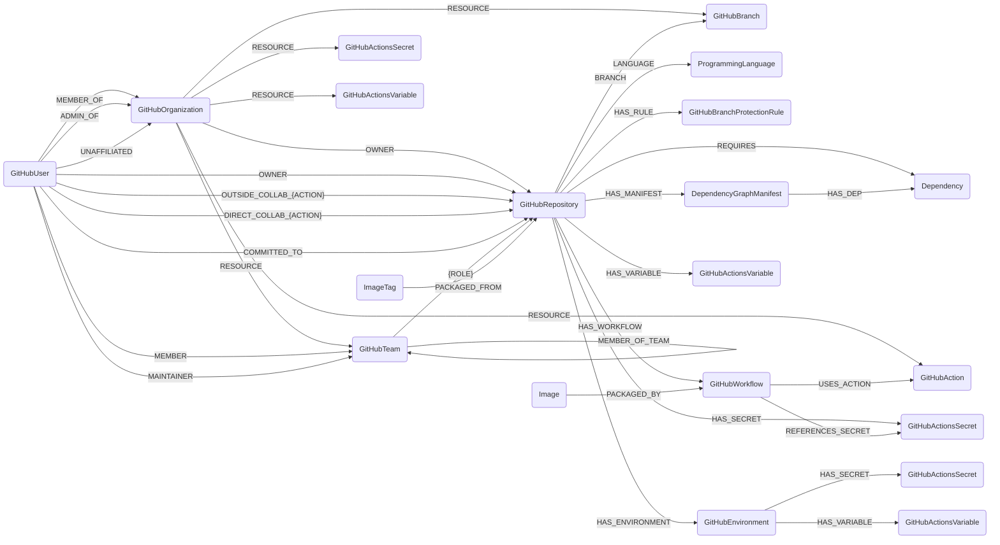

## Github Schema



### GitHubRepository

Representation of a single GitHubRepository (repo) [repository object](https://developer.github.com/v4/object/repository/). This node contains all data unique to the repo.

> **Ontology Mapping**: This node has the extra label `CodeRepository` to enable cross-platform queries for source code repositories across different systems (e.g., GitLabProject).

| Field | Description |
|-------|--------------|
| firstseen| Timestamp of when a sync job first created this node  |
| lastupdated |  Timestamp of the last time the node was updated |
| id | The GitHub repo id. These are not unique across GitHub instances, so are prepended with the API URL the id applies to |
| createdat | GitHub timestamp from when the repo was created |
| name | Name of the repo |
| fullname | Name of the organization and repo together |
| description | Text describing the repo |
| primarylanguage | The primary language used in the repo |
| homepage | The website used as a homepage for project information |
| defaultbranch | The default branch used by the repo, typically master |
| defaultbranchid | The unique identifier of the default branch |
| private | True if repo is private |
| disabled | True if repo is disabled |
| archived | True if repo is archived |
| locked | True if repo is locked |
| giturl | URL used to access the repo from git commandline |
| url | Web URL for viewing the repo
| sshurl | URL for access the repo via SSH
| updatedat | GitHub timestamp for last time repo was modified |


#### Relationships

- GitHubUsers or GitHubOrganizations own GitHubRepositories.

    ```
    (GitHubUser)-[OWNER]->(GitHubRepository)
    (GitHubOrganization)-[OWNER]->(GitHubRepository)
    ```

- GitHubRepositories in an organization can have [outside collaborators](https://docs.github.com/en/graphql/reference/enums#collaboratoraffiliation) who may be granted different levels of access, including ADMIN,
WRITE, MAINTAIN, TRIAGE, and READ ([Reference](https://docs.github.com/en/graphql/reference/enums#repositorypermission)).

    ```
    (GitHubUser)-[:OUTSIDE_COLLAB_{ACTION}]->(GitHubRepository)
    ```

- GitHubRepositories in an organization also mark all [direct collaborators](https://docs.github.com/en/graphql/reference/enums#collaboratoraffiliation), folks who are not necessarily 'outside' but who are granted access directly to the repository (as opposed to via membership in a team).  They may be granted different levels of access, including ADMIN,
WRITE, MAINTAIN, TRIAGE, and READ ([Reference](https://docs.github.com/en/graphql/reference/enums#repositorypermission)).

    ```
    (GitHubUser)-[:DIRECT_COLLAB_{ACTION}]->(GitHubRepository)
    ```

- GitHubRepositories use ProgrammingLanguages
    ```
   (GitHubRepository)-[:LANGUAGE]->(ProgrammingLanguage)
    ```
- GitHubRepositories have GitHubBranches
    ```
   (GitHubRepository)-[:BRANCH]->(GitHubBranch)
    ```
- GitHubRepositories have GitHubBranchProtectionRules.
    ```
   (GitHubRepository)-[:HAS_RULE]->(GitHubBranchProtectionRule)
    ```
- GitHubTeams can have various levels of [access](https://docs.github.com/en/graphql/reference/enums#repositorypermission) to GitHubRepositories.

  ```
  (GitHubTeam)-[ADMIN|READ|WRITE|TRIAGE|MAINTAIN]->(GitHubRepository)
  ```

- GitHubUsers who have committed to GitHubRepositories in the last 30 days are tracked with commit activity data.

  ```
  (GitHubUser)-[:COMMITTED_TO]->(GitHubRepository)
  ```

  This relationship includes the following properties:
  - **commit_count**: Number of commits made by the user to the repository in the last 30 days
  - **last_commit_date**: ISO 8601 timestamp of the user's most recent commit to the repository
  - **first_commit_date**: ISO 8601 timestamp of the user's oldest commit to the repository within the 30-day period

- GitHubRepositories can have Semgrep findings (optional, requires Semgrep integration).

    ```
    (SemgrepSASTFinding)-[:FOUND_IN]->(GitHubRepository)
    (SemgrepSCAFinding)-[:FOUND_IN]->(GitHubRepository)
    (SemgrepSecretsFinding)-[:FOUND_IN]->(GitHubRepository)
    ```

### GitHubOrganization

Representation of a single GitHubOrganization [organization object](https://developer.github.com/v4/object/organization/). This node contains minimal data for the GitHub Organization.

> **Ontology Mapping**: This node has the extra label `Tenant` to enable cross-platform queries for organizational tenants across different systems (e.g., OktaOrganization, AWSAccount).

| Field | Description |
|-------|--------------|
| firstseen| Timestamp of when a sync job first created this node  |
| lastupdated |  Timestamp of the last time the node was updated |
| id | The URL of the GitHub organization |
| username | Name of the organization |


#### Relationships

- GitHubOrganizations own GitHubRepositories.

    ```
    (GitHubOrganization)-[OWNER]->(GitHubRepository)
    ```

- GitHubTeams are resources under GitHubOrganizations

    ```
    (GitHubOrganization)-[RESOURCE]->(GitHubTeam)
    ```

- GitHubUsers relate to GitHubOrganizations in a few ways:
  - Most typically, they are members of an organization.
  - They may also be org admins (aka org owners), with broad permissions over repo and team settings.  In these cases, they will be graphed with two relationships between GitHubUser and GitHubOrganization, both `MEMBER_OF` and `ADMIN_OF`.
  - In some cases there may be a user who is "unaffiliated" with an org, for example if the user is an enterprise owner, but not member of, the org.  [Enterprise owners](https://docs.github.com/en/enterprise-cloud@latest/admin/managing-accounts-and-repositories/managing-users-in-your-enterprise/roles-in-an-enterprise#enterprise-owners) have complete control over the enterprise (i.e. they can manage all enterprise settings, members, and policies) yet may not show up on member lists of the GitHub org.

    ```
    # a typical member
    (GitHubUser)-[MEMBER_OF]->(GitHubOrganization)

    # an admin member has two relationships to the org
    (GitHubUser)-[MEMBER_OF]->(GitHubOrganization)
    (GitHubUser)-[ADMIN_OF]->(GitHubOrganization)

    # an unaffiliated user (e.g. an enterprise owner)
    (GitHubUser)-[UNAFFILIATED]->(GitHubOrganization)
    ```


### GitHubTeam

A GitHubTeam [organization object](https://docs.github.com/en/graphql/reference/objects#team).

> **Ontology Mapping**: This node has the extra label `UserGroup` to enable cross-platform queries for user groups across different systems (e.g., AWSGroup, EntraGroup, GoogleWorkspaceGroup).

| Field | Description |
|-------|--------------|
| firstseen| Timestamp of when a sync job first created this node  |
| lastupdated |  Timestamp of the last time the node was updated |
| id | The URL of the GitHub Team |
| name | The name (a.k.a URL slug) of the GitHub Team |
| description | Description of the GitHub team |


#### Relationships

- GitHubTeams can have various levels of [access](https://docs.github.com/en/graphql/reference/enums#repositorypermission) to GitHubRepositories.

    ```
    (GitHubTeam)-[ADMIN|READ|WRITE|TRIAGE|MAINTAIN]->(GitHubRepository)
    ```

- GitHubTeams are resources under GitHubOrganizations

    ```
    (GitHubOrganization)-[RESOURCE]->(GitHubTeam)
    ```

- GitHubTeams may be children of other teams:

    ```
    (GitHubTeam)-[MEMBER_OF_TEAM]->(GitHubTeam)
    ```

- GitHubUsers may be ['immediate'](https://docs.github.com/en/graphql/reference/enums#teammembershiptype) members of a team (as opposed to being members via membership in a child team), with their membership [role](https://docs.github.com/en/graphql/reference/enums#teammemberrole) being MEMBER or MAINTAINER.

    ```
    (GitHubUser)-[MEMBER|MAINTAINER]->(GitHubTeam)
    ```


### GitHubUser

Representation of a single GitHubUser [user object](https://developer.github.com/v4/object/user/). This node contains minimal data for the GitHub User.

> **Ontology Mapping**: This node has the extra label `UserAccount` to enable cross-platform queries for user accounts across different systems (e.g., OktaUser, AWSSSOUser, EntraUser).

| Field | Description |
|-------|--------------|
| firstseen| Timestamp of when a sync job first created this node  |
| lastupdated |  Timestamp of the last time the node was updated |
| id | The URL of the GitHub user |
| username | Name of the user |
| fullname | The full name |
| has_2fa_enabled | Whether the user has 2-factor authentication enabled |
| is_site_admin | Whether the user is a site admin |
| is_enterprise_owner | Whether the user is an [enterprise owner](https://docs.github.com/en/enterprise-cloud@latest/admin/managing-accounts-and-repositories/managing-users-in-your-enterprise/roles-in-an-enterprise#enterprise-owners) |
| permission | Only present if the user is an [outside collaborator](https://docs.github.com/en/graphql/reference/objects#repositorycollaboratorconnection) of this repo.  `permission` is either ADMIN, MAINTAIN, READ, TRIAGE, or WRITE ([ref](https://docs.github.com/en/graphql/reference/enums#repositorypermission)). |
| email | The user's publicly visible profile email. |
| company | The user's public profile company. |
| organization_verified_domain_emails | List of emails verified by the user's organization. |


#### Relationships

- GitHubUsers own GitHubRepositories.

    ```
    (GitHubUser)-[OWNER]->(GitHubRepository)
    ```

- GitHubRepositories in an organization can have [outside collaborators](https://docs.github.com/en/graphql/reference/enums#collaboratoraffiliation) who may be granted different levels of access, including ADMIN,
WRITE, MAINTAIN, TRIAGE, and READ ([Reference](https://docs.github.com/en/graphql/reference/enums#repositorypermission)).

    ```
    (GitHubUser)-[:OUTSIDE_COLLAB_{ACTION}]->(GitHubRepository)
    ```

- GitHubRepositories in an organization also mark all [direct collaborators](https://docs.github.com/en/graphql/reference/enums#collaboratoraffiliation), folks who are not necessarily 'outside' but who are granted access directly to the repository (as opposed to via membership in a team).  They may be granted different levels of access, including ADMIN,
WRITE, MAINTAIN, TRIAGE, and READ ([Reference](https://docs.github.com/en/graphql/reference/enums#repositorypermission)).

    ```
    (GitHubUser)-[:DIRECT_COLLAB_{ACTION}]->(GitHubRepository)
    ```

- GitHubUsers relate to GitHubOrganizations in a few ways:
  - Most typically, they are members of an organization.
  - They may also be org admins (aka org owners), with broad permissions over repo and team settings.  In these cases, they will be graphed with two relationships between GitHubUser and GitHubOrganization, both `MEMBER_OF` and `ADMIN_OF`.
  - In some cases there may be a user who is "unaffiliated" with an org, for example if the user is an enterprise owner, but not member of, the org.  [Enterprise owners](https://docs.github.com/en/enterprise-cloud@latest/admin/managing-accounts-and-repositories/managing-users-in-your-enterprise/roles-in-an-enterprise#enterprise-owners) have complete control over the enterprise (i.e. they can manage all enterprise settings, members, and policies) yet may not show up on member lists of the GitHub org.

    ```
    # a typical member
    (GitHubUser)-[MEMBER_OF]->(GitHubOrganization)

    # an admin member has two relationships to the org
    (GitHubUser)-[MEMBER_OF]->(GitHubOrganization)
    (GitHubUser)-[ADMIN_OF]->(GitHubOrganization)

    # an unaffiliated user (e.g. an enterprise owner)
    (GitHubUser)-[UNAFFILIATED]->(GitHubOrganization)
    ```

- GitHubTeams may be children of other teams:

    ```
    (GitHubTeam)-[MEMBER_OF_TEAM]->(GitHubTeam)
    ```

- GitHubUsers may be ['immediate'](https://docs.github.com/en/graphql/reference/enums#teammembershiptype) members of a team (as opposed to being members via membership in a child team), with their membership [role](https://docs.github.com/en/graphql/reference/enums#teammemberrole) being MEMBER or MAINTAINER.

    ```
    (GitHubUser)-[MEMBER|MAINTAINER]->(GitHubTeam)
    ```

- GitHubUsers who have committed to GitHubRepositories in the last 30 days are tracked with commit activity data.

    ```
    (GitHubUser)-[:COMMITTED_TO]->(GitHubRepository)
    ```

    This relationship includes the following properties:
    - **commit_count**: Number of commits made by the user to the repository in the last 30 days
    - **last_commit_date**: ISO 8601 timestamp of the user's most recent commit to the repository
    - **first_commit_date**: ISO 8601 timestamp of the user's oldest commit to the repository within the 30-day period


### GitHubBranch

Representation of a single GitHubBranch [ref object](https://developer.github.com/v4/object/ref). This node contains minimal data for a repository branch.

GitHub branches are modeled as resources scoped to the parent GitHub organization and also linked to their repository via the `BRANCH` relationship.

| Field | Description |
|-------|--------------|
| firstseen| Timestamp of when a sync job first created this node  |
| lastupdated |  Timestamp of the last time the node was updated |
| id | The GitHub branch id. These are not unique across GitHub instances, so are prepended with the API URL the id applies to |
| name | Name of the branch |


#### Relationships

- GitHubOrganizations scope GitHubBranches as resources.

    ```
    (GitHubOrganization)-[:RESOURCE]->(GitHubBranch)
    ```

- GitHubRepositories have GitHubBranches.

    ```
    (GitHubBranch)<-[BRANCH]-(GitHubRepository)
    ```

### GitHubBranchProtectionRule

Representation of a single GitHubBranchProtectionRule [BranchProtectionRule object](https://docs.github.com/en/graphql/reference/objects#branchprotectionrule). This node contains branch protection configuration for repositories.


| Field | Description |
|-------|--------------|
| firstseen| Timestamp of when a sync job first created this node  |
| lastupdated |  Timestamp of the last time the node was updated |
| id | The GitHub branch protection rule id |
| pattern | The branch name pattern protected by this rule (e.g., "main", "release/*") |
| allows_deletions | Whether users can delete matching branches |
| allows_force_pushes | Whether force pushes are allowed on matching branches |
| dismisses_stale_reviews | Whether reviews are dismissed when new commits are pushed |
| is_admin_enforced | Whether admins must follow this rule |
| requires_approving_reviews | Whether pull requests require approval before merging |
| required_approving_review_count | Number of approvals required (if requires_approving_reviews is true) |
| requires_code_owner_reviews | Whether code owner review is required |
| requires_commit_signatures | Whether commits must be signed |
| requires_linear_history | Whether merge commits are prohibited |
| requires_status_checks | Whether status checks must pass before merging |
| requires_strict_status_checks | Whether branches must be up to date before merging |
| restricts_pushes | Whether push access is restricted |
| restricts_review_dismissals | Whether review dismissals are restricted |


#### Relationships

- GitHubRepositories have GitHubBranchProtectionRules.

    ```
    (GitHubRepository)-[:HAS_RULE]->(GitHubBranchProtectionRule)
    ```

### ProgrammingLanguage

Representation of a single Programming Language [language object](https://developer.github.com/v4/object/language). This node contains programming language information.

ProgrammingLanguage nodes are shared globally across repositories and are linked from each repository with `:LANGUAGE`.

| Field | Description |
|-------|--------------|
| firstseen| Timestamp of when a sync job first created this node  |
| lastupdated |  Timestamp of the last time the node was updated |
| id | Language ids need not be tracked across instances, so defaults to the name |
| name | Name of the language |


#### Relationships

- GitHubRepositories use ProgrammingLanguages.

    ```
    (ProgrammingLanguage)<-[LANGUAGE]-(GitHubRepository)
    ```


### DependencyGraphManifest

Represents a dependency manifest file (e.g., package.json, requirements.txt, pom.xml) from GitHub's dependency graph API.

| Field | Description |
|-------|-------------|
| firstseen | Timestamp of when a sync job first discovered this node |
| lastupdated | Timestamp of the last time the node was updated |
| **id** | Unique identifier: `{repo_url}#{blob_path}` |
| **blob_path** | Path to the manifest file in the repository (e.g., "/package.json") |
| **filename** | Name of the manifest file (e.g., "package.json") |
| **dependencies_count** | Number of dependencies listed in this manifest |
| **repo_url** | URL of the GitHub repository containing this manifest |

#### Relationships

- **GitHubRepository** via **HAS_MANIFEST** relationship
  - GitHubRepositories can have multiple dependency manifests

    ```
    (GitHubRepository)-[:HAS_MANIFEST]->(DependencyGraphManifest)
    ```

- **Dependency** via **HAS_DEP** relationship
  - Each manifest lists specific dependencies

    ```
    (DependencyGraphManifest)-[:HAS_DEP]->(Dependency)
    ```

### Dependency
https://docs.github.com/en/graphql/reference/objects#dependencygraphdependency
Represents a software dependency from GitHub's dependency graph manifests. This node contains information about a package dependency within a repository

| Field | Description |
|-------|-------------|
| firstseen | Timestamp of when a sync job first discovered this node |
| lastupdated | Timestamp of the last time the node was updated |
| **id** | Identifier: `{canonical_name}|{requirements}` when a requirements string exists, otherwise `{canonical_name}` |
| **name** | Canonical name of the dependency (ecosystem-specific normalization) |
| **original_name** | Original name as specified in the manifest file |
| **requirements** | Unparsed requirement string from the manifest (e.g., `"18.2.0"`, `"==4.2.0"`, `"^4.17.21"`, `"1.*.*"`) |
| **ecosystem** | Package ecosystem (npm, pip, maven, etc.) |
| **package_manager** | Package manager name (NPM, PIP, MAVEN, etc.) |
| **manifest_file** | Manifest filename (package.json, requirements.txt, etc.) |
| version | Exact version if pinned (e.g., `"18.2.0"`). `null` for ranges or unpinned dependencies. |
| type | Package URL type (e.g., `npm`, `pypi`, `maven`). `null` if version is not exact. |
| purl | Package URL (e.g., `"pkg:npm/react@18.2.0"`). `null` if version is not exact. |
| **normalized_id** | Normalized ID for cross-tool matching (format: `{type}\|{namespace/}{name}\|{version}`). Indexed. `null` if version is not exact. |

#### Relationships

- **GitHubRepository** via **REQUIRES** relationship
  - **requirements**: Original requirement string from manifest
  - **manifest_path**: Path to manifest file in repository

    ```
    (GitHubRepository)-[:REQUIRES]->(Dependency)
    ```

- **DependencyGraphManifest** via **HAS_DEP** relationship
  - Dependencies are linked to their specific manifest files

    ```
    (DependencyGraphManifest)-[:HAS_DEP]->(Dependency)
    ```

### ImageTag to GitHubRepository (Cross-module relationship)

Container images (ImageTag nodes from any registry: ECR, GitLab, GCR, etc.) can be linked to the GitHubRepository that contains the Dockerfile used to build them. This relationship is created by analyzing Dockerfile content and matching layer commands against image history.

#### Relationships

- ImageTag nodes may be packaged from a GitHubRepository
    ```
    (:ImageTag)-[:PACKAGED_FROM]->(:GitHubRepository)
    ```

    Relationship properties:
    - **match_method**: How the match was determined: `"provenance"` (from SLSA attestation) or `"dockerfile_analysis"` (from command matching)
    - **dockerfile_path**: Path to the Dockerfile in the repository (only for `dockerfile_analysis` method)
    - **confidence**: Confidence score of the match (0.0 to 1.0, only for `dockerfile_analysis` method)
    - **matched_commands**: Number of commands that matched between Dockerfile and image history (only for `dockerfile_analysis` method)
    - **total_commands**: Total number of commands compared (only for `dockerfile_analysis` method)
    - **command_similarity**: Average similarity score of matched commands (only for `dockerfile_analysis` method)

    Note: This relationship uses the generic `ImageTag` semantic label, enabling cross-registry querying (ECR, GitLab, GCR, etc.).

### Dependency::PythonLibrary

Representation of a Python library as listed in a [requirements.txt](https://pip.pypa.io/en/stable/user_guide/#requirements-files)
or [setup.cfg](https://setuptools.pypa.io/en/latest/userguide/declarative_config.html) file.
Within a setup.cfg file, cartography will load everything from `install_requires`, `setup_requires`, and `extras_require`.

These nodes are also shared globally across repositories. Repository-specific version constraints stay on the `:REQUIRES` relationship via the `specifier` property.

| Field | Description |
|-------|-------------|
|**id**|The [canonicalized](https://packaging.pypa.io/en/latest/utils/#packaging.utils.canonicalize_name) name of the library. If the library was pinned in a requirements file using the `==` operator, then `id` has the form ``{canonical name}\|{pinned_version}``.|
|name|The [canonicalized](https://packaging.pypa.io/en/latest/utils/#packaging.utils.canonicalize_name) name of the library.|
|version|The exact version of the library. This field is only present if the library was pinned in a requirements file using the `==` operator.|

#### Relationships

- Software on Github repos can import Python libraries by optionally specifying a version number.

    ```
    (GitHubRepository)-[:REQUIRES{specifier}]->(PythonLibrary)
    ```

    - specifier: A string describing this library's version e.g. "<4.0,>=3.0" or "==1.0.2". This field is only present on the `:REQUIRES` edge if the repo's requirements file provided a version pin.

- A Python Dependency is affected by a SemgrepSCAFinding (optional)

    ```
    (:SemgrepSCAFinding)-[:AFFECTS]->(:PythonLibrary)
    ```


### GitHubWorkflow

Represents a GitHub Actions workflow definition file in a repository.

| Field | Description |
|-------|-------------|
| firstseen | Timestamp of when a sync job first discovered this node |
| lastupdated | Timestamp of the last time the node was updated |
| **id** | The GitHub workflow ID |
| **name** | Name of the workflow |
| **path** | Path to the workflow file (e.g., `.github/workflows/ci.yml`) |
| **state** | Workflow state: `active`, `disabled_manually`, `disabled_inactivity`, `disabled_fork`, or `deleted` |
| **created_at** | Timestamp when the workflow was created |
| **updated_at** | Timestamp when the workflow was last updated |
| **repo_url** | URL of the repository containing this workflow (e.g., `https://github.com/org/repo`) |
| **trigger_events** | List of events that trigger the workflow (e.g., `push`, `pull_request`, `schedule`) |
| **permissions_actions** | Permission level for the `actions` scope |
| **permissions_contents** | Permission level for the `contents` scope |
| **permissions_packages** | Permission level for the `packages` scope |
| **permissions_pull_requests** | Permission level for the `pull-requests` scope |
| **permissions_issues** | Permission level for the `issues` scope |
| **permissions_deployments** | Permission level for the `deployments` scope |
| **permissions_statuses** | Permission level for the `statuses` scope |
| **permissions_checks** | Permission level for the `checks` scope |
| **permissions_id_token** | Permission level for the `id-token` scope |
| **permissions_security_events** | Permission level for the `security-events` scope |
| **env_vars** | List of top-level environment variable names defined in the workflow |
| **job_count** | Number of jobs defined in the workflow |
| **has_reusable_workflow_calls** | Whether the workflow calls reusable workflows |

#### Relationships

- GitHubRepositories have GitHubWorkflows.

    ```
    (GitHubRepository)-[:HAS_WORKFLOW]->(GitHubWorkflow)
    ```

- GitHubWorkflows use GitHubActions.

    ```
    (GitHubWorkflow)-[:USES_ACTION]->(GitHubAction)
    ```

- GitHubWorkflows reference GitHubActionsSecrets (detected via `${{ secrets.NAME }}` patterns in the YAML).

    ```
    (GitHubWorkflow)-[:REFERENCES_SECRET]->(GitHubActionsSecret)
    ```

- Container images may be packaged by a GitHubWorkflow (derived from SLSA provenance attestations).

    ```
    (:Image)-[:PACKAGED_BY]->(:GitHubWorkflow)
    ```

    Note: This relationship is created when SLSA provenance attestations specify the GitHub Actions workflow that built the container image. The `Image` label is a semantic label applied to container images across registries (ECR, GitLab, etc.).


### GitHubAction

Represents a third-party GitHub Action used in workflows, parsed from workflow YAML `uses` references.

| Field | Description |
|-------|-------------|
| firstseen | Timestamp of when a sync job first discovered this node |
| lastupdated | Timestamp of the last time the node was updated |
| **id** | Unique identifier in the format `{org}:{raw_uses}` (e.g., `my-org:actions/checkout@v4`) |
| **owner** | Owner of the action repository (e.g., `actions`, `docker`), or `None` for local actions |
| **name** | Name of the action (e.g., `checkout`, `setup-node`, `./.github/actions/my-action`) |
| **version** | Version reference (tag, branch, or SHA), or `None` for docker/local actions |
| **is_pinned** | Whether the action is pinned to a full 40-character SHA commit hash |
| **is_local** | Whether the action is a local action (path starting with `./`) |
| **full_name** | Full name of the action (e.g., `actions/checkout`) |

#### Relationships

- GitHubWorkflows use GitHubActions.

    ```
    (GitHubWorkflow)-[:USES_ACTION]->(GitHubAction)
    ```

- GitHubOrganizations are sub-resources for GitHubActions (for cleanup scoping).

    ```
    (GitHubOrganization)-[:RESOURCE]->(GitHubAction)
    ```


### GitHubEnvironment

Represents a GitHub deployment environment for a repository.

| Field | Description |
|-------|-------------|
| firstseen | Timestamp of when a sync job first discovered this node |
| lastupdated | Timestamp of the last time the node was updated |
| **id** | The GitHub environment ID |
| **name** | Name of the environment (e.g., `production`, `staging`) |
| **html_url** | Web URL for viewing the environment settings |
| **created_at** | Timestamp when the environment was created |
| **updated_at** | Timestamp when the environment was last updated |

#### Relationships

- GitHubRepositories have GitHubEnvironments.

    ```
    (GitHubRepository)-[:HAS_ENVIRONMENT]->(GitHubEnvironment)
    ```

- GitHubEnvironments can have GitHubActionsSecrets.

    ```
    (GitHubEnvironment)-[:HAS_SECRET]->(GitHubActionsSecret)
    ```

- GitHubEnvironments can have GitHubActionsVariables.

    ```
    (GitHubEnvironment)-[:HAS_VARIABLE]->(GitHubActionsVariable)
    ```


### GitHubActionsSecret

Represents a GitHub Actions secret. Secrets can exist at three levels: organization, repository, or environment.
Note that secret **values are never exposed** by the GitHub API - only metadata is stored.

> **Ontology Mapping**: This node has the extra label `Secret` and normalized `_ont_*` properties for cross-platform secret queries. See [Secret](../../ontology/schema.md#secret).

| Field | Description |
|-------|-------------|
| firstseen | Timestamp of when a sync job first discovered this node |
| lastupdated | Timestamp of the last time the node was updated |
| **id** | Unique identifier (composite URL based on level) |
| **name** | Name of the secret |
| **level** | Level of the secret: `organization`, `repository`, or `environment` |
| **visibility** | Visibility setting (organization-level only): `all`, `private`, or `selected` |
| **created_at** | Timestamp when the secret was created |
| **updated_at** | Timestamp when the secret was last updated |

#### Relationships

- GitHubOrganizations have organization-level GitHubActionsSecrets.

    ```
    (GitHubOrganization)-[:RESOURCE]->(GitHubActionsSecret {level: "organization"})
    ```

- GitHubRepositories have repository-level GitHubActionsSecrets.

    ```
    (GitHubRepository)-[:HAS_SECRET]->(GitHubActionsSecret {level: "repository"})
    ```

- GitHubEnvironments have environment-level GitHubActionsSecrets.

    ```
    (GitHubEnvironment)-[:HAS_SECRET]->(GitHubActionsSecret {level: "environment"})
    ```

- GitHubOrganizations are sub-resources for environment-level GitHubActionsSecrets (for cleanup scoping).

    ```
    (GitHubOrganization)-[:RESOURCE]->(GitHubActionsSecret {level: "environment"})
    ```


### GitHubActionsVariable

Represents a GitHub Actions variable. Variables can exist at three levels: organization, repository, or environment.
Unlike secrets, variable **values are stored in plaintext**.

| Field | Description |
|-------|-------------|
| firstseen | Timestamp of when a sync job first discovered this node |
| lastupdated | Timestamp of the last time the node was updated |
| **id** | Unique identifier (composite URL based on level) |
| **name** | Name of the variable |
| **value** | Value of the variable (plaintext) |
| **level** | Level of the variable: `organization`, `repository`, or `environment` |
| **visibility** | Visibility setting (organization-level only): `all`, `private`, or `selected` |
| **created_at** | Timestamp when the variable was created |
| **updated_at** | Timestamp when the variable was last updated |

#### Relationships

- GitHubOrganizations have organization-level GitHubActionsVariables.

    ```
    (GitHubOrganization)-[:RESOURCE]->(GitHubActionsVariable {level: "organization"})
    ```

- GitHubRepositories have repository-level GitHubActionsVariables.

    ```
    (GitHubRepository)-[:HAS_VARIABLE]->(GitHubActionsVariable {level: "repository"})
    ```

- GitHubEnvironments have environment-level GitHubActionsVariables.

    ```
    (GitHubEnvironment)-[:HAS_VARIABLE]->(GitHubActionsVariable {level: "environment"})
    ```

- GitHubOrganizations are sub-resources for environment-level GitHubActionsVariables (for cleanup scoping).

    ```
    (GitHubOrganization)-[:RESOURCE]->(GitHubActionsVariable {level: "environment"})
    ```
