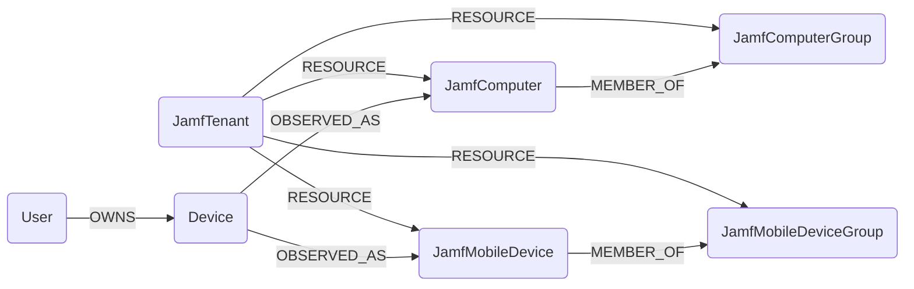

## Jamf Schema



### JamfTenant

Representation of a Jamf tenant, identified by the configured Jamf base URI.

> **Ontology Mapping**: This node has the extra label `Tenant` to enable cross-platform queries for organizational tenants across different systems.

| Field | Description |
|-------|-------------|
| firstseen | Timestamp of when a sync job first created this node |
| lastupdated | Timestamp of the last time the node was updated |
| **id** | Jamf tenant ID (the base URI) |

#### Relationships

- `JamfComputerGroup` belongs to a `JamfTenant`.
  ```
  (:JamfTenant)-[:RESOURCE]->(:JamfComputerGroup)
  ```
- `JamfMobileDeviceGroup` belongs to a `JamfTenant`.
  ```
  (:JamfTenant)-[:RESOURCE]->(:JamfMobileDeviceGroup)
  ```
- `JamfComputer` belongs to a `JamfTenant`.
  ```
  (:JamfTenant)-[:RESOURCE]->(:JamfComputer)
  ```
- `JamfMobileDevice` belongs to a `JamfTenant`.
  ```
  (:JamfTenant)-[:RESOURCE]->(:JamfMobileDevice)
  ```


### JamfComputerGroup

Representation of a Jamf computer group.

| Field | Description |
|-------|-------------|
| firstseen | Timestamp of when a sync job first created this node |
| lastupdated | Timestamp of the last time the node was updated |
| **id** | The group id |
| name | Friendly name of the group |
| description | Group description |
| membership_count | Number of members reported by Jamf |
| is_smart | Whether the group is a smart group |

#### Relationships

- `JamfComputerGroup` belongs to a `JamfTenant`.
  ```
  (:JamfTenant)-[:RESOURCE]->(:JamfComputerGroup)
  ```
- `JamfComputer` can be a member of a `JamfComputerGroup`.
  ```
  (:JamfComputer)-[:MEMBER_OF]->(:JamfComputerGroup)
  ```


### JamfMobileDeviceGroup

Representation of a Jamf mobile device group.

| Field | Description |
|-------|-------------|
| firstseen | Timestamp of when a sync job first created this node |
| lastupdated | Timestamp of the last time the node was updated |
| **id** | The group id |
| name | Friendly name of the group |
| description | Group description |
| membership_count | Number of members reported by Jamf |
| is_smart | Whether the group is a smart group |

#### Relationships

- `JamfMobileDeviceGroup` belongs to a `JamfTenant`.
  ```
  (:JamfTenant)-[:RESOURCE]->(:JamfMobileDeviceGroup)
  ```
- `JamfMobileDevice` can be a member of a `JamfMobileDeviceGroup`.
  ```
  (:JamfMobileDevice)-[:MEMBER_OF]->(:JamfMobileDeviceGroup)
  ```


### JamfComputer

Representation of a Jamf-managed macOS computer inventory record.

> **Ontology Mapping**: `JamfComputer` contributes to the `Device` ontology using serial number as the primary key and hostname as a supplemental match strategy. When Jamf provides a device email, the ontology also uses that email as a correlation signal to derive canonical `(:User)-[:OWNS]->(:Device)` relationships.

| Field | Description |
|-------|-------------|
| firstseen | Timestamp of when a sync job first created this node |
| lastupdated | Timestamp of the last time the node was updated |
| **id** | Jamf computer inventory id |
| udid | Device UDID |
| **name** | Device hostname |
| **serial_number** | Device serial number |
| model | Device model |
| model_identifier | Model identifier |
| platform | Platform reported by Jamf |
| os_name | OS family |
| os_version | OS version |
| os_build | OS build |
| report_date | Last inventory report timestamp |
| last_contact_time | Last Jamf contact timestamp |
| site_name | Jamf site name |
| supervised | Whether the device is supervised |
| user_approved_mdm | Whether MDM is user approved |
| declarative_device_management_enabled | Whether DDM is enabled |
| enrolled_via_automated_device_enrollment | Whether ADE was used |
| remote_management_managed | Whether remote management is enabled |
| filevault_enabled | Whether FileVault is enabled |
| firewall_enabled | Whether the firewall is enabled |
| gatekeeper_status | Gatekeeper status |
| sip_status | SIP status |
| secure_boot_level | Secure boot level |
| activation_lock_enabled | Whether Activation Lock is enabled |
| recovery_lock_enabled | Whether Recovery Lock is enabled |
| bootstrap_token_escrowed_status | Bootstrap token escrow state |
| username | Associated username |
| user_real_name | Associated real name |
| email | Associated email address |

#### Relationships

- `JamfComputer` belongs to a `JamfTenant`.
  ```
  (:JamfTenant)-[:RESOURCE]->(:JamfComputer)
  ```
- `JamfComputer` can be a member of a `JamfComputerGroup`.
  ```
  (:JamfComputer)-[:MEMBER_OF]->(:JamfComputerGroup)
  ```
- `Device` can observe the same endpoint as a `JamfComputer`.
  ```
  (:Device)-[:OBSERVED_AS]->(:JamfComputer)
  ```
- `User` can own a canonical `Device` observed through Jamf when the Jamf device email matches the canonical user email.
  ```
  (:User)-[:OWNS]->(:Device)-[:OBSERVED_AS]->(:JamfComputer)
  ```


### JamfMobileDevice

Representation of a Jamf-managed iPhone or iPad inventory record.

> **Ontology Mapping**: `JamfMobileDevice` contributes to the `Device` ontology using serial number as the primary key while promoting Jamf `display_name` and a normalized Jamf mobile OS value into the canonical `Device` hostname and OS fields. When Jamf provides a device email, the ontology also uses that email as a correlation signal to derive canonical `(:User)-[:OWNS]->(:Device)` relationships.

| Field | Description |
|-------|-------------|
| firstseen | Timestamp of when a sync job first created this node |
| lastupdated | Timestamp of the last time the node was updated |
| **id** | Jamf mobile device inventory id |
| **display_name** | Device display name |
| managed | Whether the device is managed |
| supervised | Whether the device is supervised |
| last_inventory_update_date | Last inventory update timestamp |
| last_enrolled_date | Enrollment timestamp |
| platform | Jamf device type |
| os | Normalized OS family derived from the Jamf device type when available |
| os_version | OS version |
| os_build | OS build |
| **serial_number** | Device serial number |
| model | Device model |
| model_identifier | Model identifier |
| activation_lock_enabled | Whether Activation Lock is enabled |
| bootstrap_token_escrowed | Whether bootstrap token is escrowed |
| data_protected | Whether data protection is enabled |
| hardware_encryption | Whether hardware encryption is enabled |
| jailbreak_detected | Whether jailbreak/rooting was detected |
| lost_mode_enabled | Whether lost mode is enabled |
| passcode_compliant | Whether the passcode meets policy |
| passcode_present | Whether a passcode is present |
| username | Associated username |
| user_real_name | Associated real name |
| email | Associated email address |

#### Relationships

- `JamfMobileDevice` belongs to a `JamfTenant`.
  ```
  (:JamfTenant)-[:RESOURCE]->(:JamfMobileDevice)
  ```
- `JamfMobileDevice` can be a member of a `JamfMobileDeviceGroup`.
  ```
  (:JamfMobileDevice)-[:MEMBER_OF]->(:JamfMobileDeviceGroup)
  ```
- `Device` can observe the same endpoint as a `JamfMobileDevice`.
  ```
  (:Device)-[:OBSERVED_AS]->(:JamfMobileDevice)
  ```
- `User` can own a canonical `Device` observed through Jamf when the Jamf device email matches the canonical user email.
  ```
  (:User)-[:OWNS]->(:Device)-[:OBSERVED_AS]->(:JamfMobileDevice)
  ```
