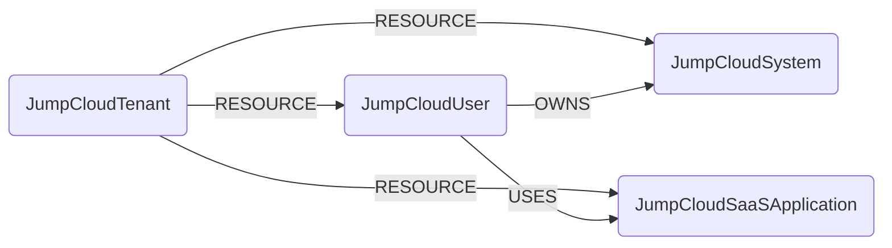

## JumpCloud Schema



### JumpCloudTenant

Representation of a JumpCloud organization.

> **Ontology Mapping**: This node has the extra label `Tenant` to enable cross-platform queries for organizational tenants across different systems (e.g., OktaOrganization, AzureTenant, GCPOrganization).

| Field | Description |
|-------|-------------|
| firstseen | Timestamp of when a sync job first created this node |
| lastupdated | Timestamp of the last time the node was updated |
| id | JumpCloud organization ID |

#### Relationships

- A `JumpCloudTenant` contains `JumpCloudUser` nodes.
    ```
    (:JumpCloudTenant)-[:RESOURCE]->(:JumpCloudUser)
    ```
- A `JumpCloudTenant` contains `JumpCloudSystem` nodes.
    ```
    (:JumpCloudTenant)-[:RESOURCE]->(:JumpCloudSystem)
    ```
- A `JumpCloudTenant` contains `JumpCloudSaaSApplication` nodes.
    ```
    (:JumpCloudTenant)-[:RESOURCE]->(:JumpCloudSaaSApplication)
    ```


### JumpCloudUser

Representation of a user account in JumpCloud.

| Field | Description |
|-------|-------------|
| firstseen | Timestamp of when a sync job first created this node |
| lastupdated | Timestamp of the last time the node was updated |
| id | JumpCloud user ID |
| username | Username |
| email | User email address |
| firstname | First name |
| lastname | Last name |
| displayname | Display name |
| activated | Whether the account is activated |
| suspended | Whether the account is suspended |
| account_locked | Whether the account is locked |
| mfa_configured | Whether MFA is configured for this user |
| created | Timestamp of when the account was created |
| lastlogin | Timestamp of the last login |

#### Relationships

- A `JumpCloudUser` belongs to a `JumpCloudTenant`.
    ```
    (:JumpCloudTenant)-[:RESOURCE]->(:JumpCloudUser)
    ```
- A `JumpCloudUser` owns a `JumpCloudSystem`.
    ```
    (:JumpCloudUser)-[:OWNS]->(:JumpCloudSystem)
    ```
- A `JumpCloudUser` uses a `JumpCloudSaaSApplication`.
    ```
    (:JumpCloudUser)-[:USES]->(:JumpCloudSaaSApplication)
    ```


### JumpCloudSystem

Representation of a managed device (asset) in JumpCloud.

| Field | Description |
|-------|-------------|
| firstseen | Timestamp of when a sync job first created this node |
| lastupdated | Timestamp of the last time the node was updated |
| id | JumpCloud asset ID |
| jc_system_id | JumpCloud system ID (used to correlate with system insights data) |
| primary_user | Display name of the primary user assigned to this device |
| primary_user_id | JumpCloud user ID of the primary user |
| model | Device hardware model |
| os_family | Operating system family (e.g., Darwin, Windows) |
| os_version | Operating system version |
| os | Full operating system name |
| status | Device status (e.g., active) |
| serial_number | Device serial number |

#### Relationships

- A `JumpCloudSystem` belongs to a `JumpCloudTenant`.
    ```
    (:JumpCloudTenant)-[:RESOURCE]->(:JumpCloudSystem)
    ```
- A `JumpCloudUser` owns a `JumpCloudSystem`.
    ```
    (:JumpCloudUser)-[:OWNS]->(:JumpCloudSystem)
    ```


### JumpCloudSaaSApplication

Representation of a SaaS application managed in JumpCloud.

| Field | Description |
|-------|-------------|
| firstseen | Timestamp of when a sync job first created this node |
| lastupdated | Timestamp of the last time the node was updated |
| id | JumpCloud application ID |
| name | Application name |
| description | Application description |

#### Relationships

- A `JumpCloudSaaSApplication` belongs to a `JumpCloudTenant`.
    ```
    (:JumpCloudTenant)-[:RESOURCE]->(:JumpCloudSaaSApplication)
    ```
- A `JumpCloudUser` uses a `JumpCloudSaaSApplication`.
    ```
    (:JumpCloudUser)-[:USES]->(:JumpCloudSaaSApplication)
    ```
