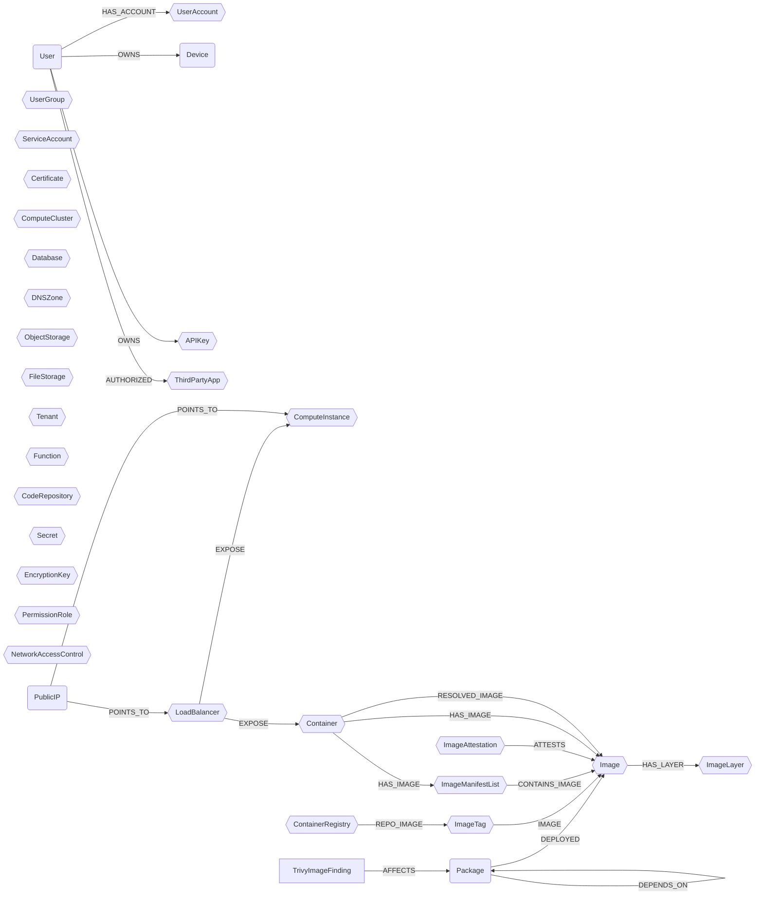

## Ontology Schema




:::{note}
In this schema, `squares` represent `Abstract Nodes` and `hexagons` represent `Semantic Labels` (on module nodes).
:::

### Ontology Properties on Nodes

Cartography's ontology system supports two distinct patterns for organizing and querying data across modules:

#### 1. Abstract Ontology Nodes

Abstract ontology nodes (e.g., `User`, `Device`) are **dedicated nodes created separately** from module-specific nodes. They serve as unified, cross-module representations of entities.

**How it works:**
- Cartography creates new ontology nodes (`:User`, `:Device`) based on mappings from multiple source modules
- These nodes aggregate and normalize data from module-specific nodes
- Relationships link ontology nodes to their source nodes (e.g., `(:User)-[:HAS_ACCOUNT]->(:EntraUser)`)

#### 2. Semantic Labels (Extra Labels)

Semantic labels (e.g., `UserAccount`, `APIKey`) are **extra labels added directly** to module-specific nodes. They enable unified querying without creating separate nodes.

**How it works:**
- Module nodes receive an additional label (e.g., `:EntraUser:UserAccount`, `:AnthropicApiKey:APIKey`)
- Ontology mappings add normalized `_ont_*` properties to these nodes
- The `_ont_source` property tracks which module provided the data
- No separate ontology nodes are created; the module node itself carries the semantic label

#### Ontology Properties (`_ont_*`)

When mappings are applied, nodes automatically receive `_ont_*` properties with normalized ontology field values:

- **Cross-module querying**: Use consistent field names across different modules
- **Data normalization**: Access standardized field values regardless of source format
- **Source tracking**: The `_ont_source` property indicates which module provided the data

:::{important}
Semantic-label queries should use the documented `_ont_*` field names directly, for example `_ont_name`, `_ont_region`, or `_ont_source`.
If you still have queries using `_ont_id`, update them to the current field that represents that concept for the semantic label you are querying.
:::

### User

```{note}
User is an abstract ontology node.
```

A user is a person (or agent) who uses a computer or network service.
A user often has one or many user accounts.

```{important}
If field `active` is null, it should not be considered as `true` or `false`, only as unknown.
```

| Field | Description |
|-------|-------------|
| **id** | The unique identifier for the user. |
| firstseen | Timestamp of when a sync job first created this node. |
| lastupdated | Timestamp of the last time the node was updated. |
| email | User's primary email. |
| username | Login of the user in the main IDP. |
| fullname | User's full name. |
| firstname | User's first name. |
| lastname | User's last name. |
| active | Boolean indicating if the user is active (e.g. disabled in the IDP). |

#### Relationships

- `User` has one or many `UserAccount` (semantic label):
    ```
    (:User)-[:HAS_ACCOUNT]->(:UserAccount)
    ```
- `User` can own one or many `Device`:
    ```
    (:User)-[:OWNS]->(:Device)
    ```
  Jamf device emails, CrowdStrike host emails, and provider-native ownership edges are examples of signals Cartography can use to derive this relationship.
- `User` can own one or many `APIKey` (semantic label):
    ```
    (:User)-[:OWNS]->(:APIKey)
    ```

### UserAccount

```{note}
UserAccount is a semantic label.
```

A user account represents an identity on a specific system or service.
Unlike the abstract `User` node, `UserAccount` is a semantic label applied to concrete user nodes from different modules, enabling unified queries across platforms.

| Field | Description |
|-------|-------------|
| _ont_email | User's email address (often used as primary identifier). |
| _ont_username | User's login name or username. |
| _ont_fullname | User's full name. |
| _ont_firstname | User's first name. |
| _ont_lastname | User's last name. |
| _ont_has_mfa | Whether multi-factor authentication is enabled for this account. |
| _ont_inactive | Whether the account is inactive, disabled, suspended, or locked. |
| _ont_lastactivity | Timestamp of the last activity or login for this account. |
| _ont_source | Source of the data. |


### UserGroup

```{note}
UserGroup is a semantic label.
```

A user group represents a logical grouping of users or resources within a cloud provider or SaaS platform.
Groups are a key part of the identity graph and enable attack path analysis through group membership relationships.
Unlike the abstract `User` node, `UserGroup` is a semantic label applied to concrete group nodes from different modules, enabling unified queries across platforms.

Common group concepts across platforms include:
- **Cloud IAM**: AWS IAM Groups, AWS SSO Groups, OCI Groups, Scaleway Groups
- **Identity Providers**: Entra Groups, Okta Groups, Keycloak Groups, Google Workspace Groups, GSuite Groups
- **Collaboration**: GitHub Teams, GitLab Groups, Slack Groups, PagerDuty Teams
- **Network/Device**: Duo Groups, Tailscale Groups

| Field | Description |
|-------|-------------|
| _ont_name | Display name of the group (REQUIRED). |
| _ont_description | Description of the group. |
| _ont_email | Email address associated with the group (for mail-enabled groups). |
| _ont_source | Source of the data. |


### Device

```{note}
Device is an abstract ontology node.
```

A client computer is a host that accesses a service made available by a server or a third party provider.

| Field | Description |
|-------|-------------|
| **id** | The unique identifier for the device. |
| firstseen | Timestamp of when a sync job first created this node. |
| lastupdated | Timestamp of the last time the node was updated. |
| hostname | Hostname of the device. |
| instance_id | Provider-specific instance identifier when available. |
| manufacturer | Device manufacturer. |
| os | OS running on the device. |
| os_version | Version of the OS running on the device. |
| model | Device model (e.g. ThinkPad Carbon X1 G11) |
| platform | Platform or device family reported by the source (e.g. `macOS`, `ios`). |
| serial_number | Device serial number. |

#### Relationships

- `Device` is linked to one or many nodes that implements the notion into a module
    ```
    (:User)-[:HAS_REPRESENTATION]->(:*)
    ```
- `User` can own one or many `Device`
    ```
    (:User)-[:OWNS]->(:Device)
    ```
  This relationship may be derived from provider signals such as Jamf device emails, CrowdStrike host emails, or native provider ownership edges.


### APIKey

```{note}
APIKey is a semantic label.
```

An API key (or access key) is a credential used for programmatic access to services and APIs.
API keys are used across different cloud providers and SaaS platforms for authentication and authorization.

| Field | Description |
|-------|-------------|
| _ont_name | A human-readable name or description for the API key. |
| _ont_created_at | Timestamp when the API key was created. |
| _ont_updated_at | Timestamp when the API key was last updated. |
| _ont_expires_at | Timestamp when the API key expires (if applicable). |
| _ont_last_used_at | Timestamp when the API key was last used. |


#### Relationships

- `User` can own one or many `APIKey`
    ```
    (:User)-[:OWNS]->(:APIKey)
    ```


### Secret

```{note}
Secret is a semantic label.
```

A secret represents sensitive data stored in a secrets management service across different cloud providers and platforms.
Secrets can include database credentials, API keys, certificates, and other sensitive configuration data.
They are managed by dedicated services like AWS Secrets Manager, GCP Secret Manager, Azure Key Vault, GitHub Actions Secrets, and Kubernetes Secrets.

| Field | Description |
|-------|-------------|
| _ont_name | The name or identifier of the secret (REQUIRED). |
| _ont_created_at | Timestamp when the secret was created. |
| _ont_updated_at | Timestamp when the secret was last updated. |
| _ont_rotation_enabled | Whether automatic rotation is enabled for the secret. |


### EncryptionKey

```{note}
EncryptionKey is a semantic label.
```

An encryption key represents a cryptographic key managed by a cloud key management service.
It generalizes concepts like AWS KMS Keys, GCP Cloud KMS CryptoKeys, and Azure Key Vault Keys.
Encryption keys are used for data encryption, signing, and other cryptographic operations.

| Field | Description |
|-------|-------------|
| _ont_name | The name or identifier of the encryption key (REQUIRED). |
| _ont_key_type | The key purpose or usage type (e.g., "ENCRYPT_DECRYPT", "SIGN_VERIFY"). |
| _ont_enabled | Whether the encryption key is currently enabled. |
| _ont_rotation_enabled | Whether automatic key rotation is configured. |


### ComputeInstance

```{note}
ComputeInstance is a semantic label.
```

A compute instance represents a virtual machine or server instance running in a cloud environment.
It generalizes concepts like EC2 Instances, DigitalOcean Droplets, and Scaleway Instances.

| Field | Description |
|-------|-------------|
| _ont_name | The name of the instance. |
| _ont_region | The region or zone where the instance is located. |
| _ont_public_ip_address | The public IP address of the instance. |
| _ont_private_ip_address | The private IP address of the instance. |
| _ont_state | The current state of the instance (e.g., running, stopped). |
| _ont_type | The type or size of the instance (e.g., t2.micro, s-1vcpu-1gb). |
| _ont_created_at | Timestamp when the instance was created. |


### Container

```{note}
Container is a semantic label.
```

A container represents a lightweight, standalone executable package that includes everything needed to run an application.
It generalizes concepts like ECS Containers, Kubernetes Containers, individual containers within Azure Container Groups (`AzureContainerInstance`), and individual containers within GCP Cloud Run Services (`GCPCloudRunServiceContainer`) and Jobs (`GCPCloudRunJobContainer`).

```{note}
GCP Cloud Run Services, Jobs and Revisions are themselves **not** modeled as `Container` (and no longer as `Function` either). Services and Jobs are orchestrators (analogous to `ECSService` / AWS Batch); Revisions are pure versioning markers for Services. Their per-container specs are materialized as child `GCPCloudRunServiceContainer` / `GCPCloudRunJobContainer` nodes that carry `:Container` and `RESOLVED_IMAGE`.
```

| Field | Description |
|-------|-------------|
| _ont_name | The name of the container. |
| _ont_image | The container image (e.g., nginx:latest). |
| _ont_image_digest | The digest/SHA256 of the container image. |
| _ont_state | The current state of the container (e.g., running, stopped, waiting). |
| _ont_cpu | CPU allocated to the container. |
| _ont_memory | Memory allocated to the container (in MB). |
| _ont_region | The region or zone where the container is running. |
| _ont_namespace | Namespace for logical isolation (e.g., Kubernetes namespace). |
| _ont_health_status | The health status of the container. |

#### Relationships

- `Container` references the image it was asked to run via `HAS_IMAGE` (created at ingest time by matching container runtime digest to image digest). The target may be either a single-platform `Image` or an `ImageManifestList`:
    ```
    (:Container)-[:HAS_IMAGE]->(:Image)
    (:Container)-[:HAS_IMAGE]->(:ImageManifestList)
    ```
- `Container` is connected to a concrete single platform `Image` that actually ran via `RESOLVED_IMAGE`. This edge is produced by the `resolved_image_analysis.json` analysis job, which runs after the ontology stage. It is only created when the target can be deterministically identified:
    - When `HAS_IMAGE` already points at an `:Image` (not `:ImageManifestList`), `RESOLVED_IMAGE` is created directly.
    - When `HAS_IMAGE` points at an `:ImageManifestList`, `RESOLVED_IMAGE` is created to the child `:Image` reached via `CONTAINS_IMAGE` whose architecture matches the container's `architecture_normalized`. If zero or more than one child match, no edge is created (determinism guard).
    ```
    (:Container)-[:RESOLVED_IMAGE]->(:Image)
    ```


### ComputeCluster

```{note}
ComputeCluster is a semantic label.
```

A compute cluster represents a managed container orchestration or data processing environment across cloud providers.
It generalizes concepts like AWS EKS clusters, AWS ECS clusters, AWS EMR clusters, Azure Kubernetes Service clusters, GCP GKE clusters, and native Kubernetes clusters.

| Field | Description |
|-------|-------------|
| _ont_name | The name of the cluster. |
| _ont_region | The region or location where the cluster is deployed. |
| _ont_version | The version of the cluster engine (e.g., Kubernetes version, EMR release label). |
| _ont_endpoint | The API endpoint or FQDN for the cluster. |
| _ont_status | The current status of the cluster (e.g., ACTIVE, RUNNING, Succeeded). |


### ThirdPartyApp

```{note}
ThirdPartyApp is a semantic label.
```

An OAuth application (or OAuth client) represents a third-party application that has been authorized to access user data via OAuth 2.0, OpenID Connect, or SAML protocols.
OAuth apps span across identity providers (Google Workspace, Okta, Entra, Keycloak) and represent potential security risks when users grant excessive permissions.

| Field | Description |
|-------|-------------|
| _ont_client_id | The OAuth client ID - unique identifier for the application (REQUIRED). |
| _ont_name | Human-readable display name of the OAuth application (REQUIRED). |
| _ont_enabled | Whether the OAuth application is currently enabled/active. |
| _ont_native_app | Whether this is a native/mobile application (vs web application). |
| _ont_protocol | The authentication protocol used (e.g., oauth2, openid-connect, saml). |
| _ont_source | Source module of the data (e.g., googleworkspace, keycloak, entra, okta). |


#### Relationships

- `User` can authorize `ThirdPartyApp` (for modules that track user-level OAuth authorizations):
    ```
    (:User)-[:AUTHORIZED]->(:ThirdPartyApp)
    ```


### DNSZone

```{note}
DNSZone is a semantic label.
```

A DNS zone represents a managed DNS zone across different cloud providers and DNS services.
It generalizes concepts like AWS Route 53 Hosted Zones, GCP Cloud DNS Zones, and Cloudflare Zones.

| Field | Description |
|-------|-------------|
| _ont_name | The DNS zone name or domain (REQUIRED). |
| _ont_public | Whether the zone is publicly accessible (boolean). |
| _ont_source | Source of the data. |


### Database

```{note}
Database is a semantic label.
```

A database represents a managed data storage system across different cloud providers and database technologies.
It generalizes concepts like AWS RDS instances/clusters, DynamoDB tables, Azure SQL databases, Azure CosmosDB databases, and GCP Bigtable instances.

| Field | Description |
|-------|-------------|
| _ont_db_name | The name/identifier of the database (REQUIRED). |
| _ont_db_type | The database engine/type (e.g., "mysql", "postgres", "dynamodb", "mongodb", "cassandra", "cosmosdb-sql", "bigtable"). |
| _ont_db_version | The database engine version. |
| _ont_db_endpoint | The connection endpoint/address for the database. |
| _ont_db_port | The port number the database listens on. |
| _ont_db_encrypted | Whether the database storage is encrypted. |
| _ont_db_location | The physical location/region of the database. |


### PermissionRole

```{note}
PermissionRole is a semantic label.
```

A permission role represents an IAM role or permission role that can be assumed by principals across different cloud providers and identity platforms.
It generalizes concepts like AWS IAM Roles, AWS Permission Sets, Azure Role Definitions, GCP IAM Roles, Keycloak Roles, Kubernetes Roles/ClusterRoles, Cloudflare Roles, and OCI Policies.

Common role concepts across platforms include:
- **Cloud IAM**: AWS IAM Roles, AWS Permission Sets, Azure Role Definitions, GCP IAM Roles, OCI Policies
- **Container Orchestration**: Kubernetes Roles, Kubernetes ClusterRoles
- **Identity Providers**: Keycloak Roles
- **SaaS Platforms**: Cloudflare Roles

| Field | Description |
|-------|-------------|
| _ont_name | Display name of the role (REQUIRED). |
| _ont_type | Whether the role is builtin or custom (e.g., "builtin", "custom"). |
| _ont_scope | The scope level of the role (e.g., "global", "account", "org", "project", "namespace", "cluster"). |
| _ont_source | Source of the data. |


### ObjectStorage

```{note}
ObjectStorage is a semantic label.
```

An object storage represents a managed blob/object storage system across different cloud providers.
It generalizes concepts like AWS S3 buckets, GCP Cloud Storage buckets, and Azure Blob Containers.

| Field | Description |
|-------|-------------|
| _ont_name | The name/identifier of the storage bucket/container (REQUIRED). |
| _ont_location | The region/location of the storage. |
| _ont_encrypted | Whether the storage is encrypted. |
| _ont_versioning | Whether versioning is enabled. |
| _ont_public | Whether the storage has public access (not available for all providers). |


### FileStorage

```{note}
FileStorage is a semantic label.
```

A file storage represents a managed network file system or file share across different cloud providers.
It generalizes concepts like AWS EFS and Azure Files shares, as opposed to object storage (S3-like)
or block storage (EBS-like).

| Field | Description |
|-------|-------------|
| _ont_name | The name/identifier of the file system/share (REQUIRED). |
| _ont_location | The region/location of the file storage. |
| _ont_encrypted | Whether the storage is encrypted at rest. |


### Tenant

```{note}
Tenant is a semantic label.
```

A tenant represents the top-level organizational boundary or billing entity within a cloud provider or SaaS platform.
Tenants serve as the root container for all resources, users, and configurations within a given service.
We add a Tenant semantic label to all nodes that have outward 'RESOURCE' relationships.

Common tenant concepts across platforms include:
- **Cloud Providers**: AWS Accounts, Azure Tenants, GCP Organizations/Projects
- **Identity Providers**: Entra Tenants, Okta Organizations, Keycloak Organizations
- **SaaS Platforms**: GitHub Organizations, Anthropic Workspaces, OpenAI Projects, Cloudflare Accounts
- **MDM/Security**: Kandji Tenants, SentinelOne Accounts, LastPass Tenants

| Field | Description |
|-------|-------------|
| _ont_name | Display name or friendly name of the tenant/organization (REQUIRED for most modules). |
| _ont_status | Current status/state of the tenant (e.g., active, suspended, archived). |
| _ont_domain | Primary domain name associated with the tenant (for workspace/domain-based services). |


### ServiceAccount

```{note}
ServiceAccount is a semantic label.
```

A service account represents a non-human identity used for automation and inter-service communication.
Unlike user accounts, service accounts are designed for programmatic access and workload identity.

Common service account concepts across platforms include:
- **Cloud Providers**: GCP Service Accounts, AWS Service Principals
- **Container Orchestration**: Kubernetes Service Accounts
- **SaaS Platforms**: OpenAI Service Accounts, Scaleway Applications

| Field | Description |
|-------|-------------|
| _ont_name | Display name of the service account (REQUIRED). |
| _ont_email | Email address associated with the service account. |
| _ont_active | Whether the service account is active. |
| _ont_source | Source of the data. |


### Certificate

```{note}
Certificate is a semantic label.
```

A certificate represents a managed TLS/SSL certificate used for securing communications.
It generalizes concepts like AWS ACM Certificates, AWS IAM Server Certificates, and Azure Key Vault Certificates.

| Field | Description |
|-------|-------------|
| _ont_domain | Domain name or certificate name (REQUIRED). |
| _ont_expiry | Expiration date/time of the certificate. |
| _ont_issuer | Certificate issuer. |
| _ont_source | Source of the data. |


### Function

```{note}
Function is a semantic label.
```

A function represents a serverless compute unit that runs code or containers in response to events without managing servers.
It generalizes concepts like AWS Lambda functions, GCP Cloud Functions, and Azure Function Apps. GCP Cloud Run Services and Jobs are orchestrators (not functions) — see the note in the Relationships section below.

| Field | Description |
|-------|-------------|
| _ont_name | The name of the function (REQUIRED). |
| _ont_runtime | The runtime environment (e.g., python3.9, nodejs18.x, dotnet6). Only applicable for code-based functions. |
| _ont_memory | Memory allocated to the function (in MB). |
| _ont_timeout | Timeout for function execution (in seconds). |
| _ont_deployment_type | The deployment type: `code` for source-code functions, `container` for container-image functions. Derived per-provider: AWS Lambda maps `PackageType` (`Zip`→`code`, `Image`→`container`); Azure Function App maps `is_container`; GCP Cloud Functions are always `code`. |
| _ont_image | The container image reference (populated when the function is container-deployed: Lambda `PackageType=Image`, Azure Function App with `DOCKER|...`). |
| _ont_image_digest | Content-addressable digest (`sha256:...`) of the container image, when the reference is digest-pinned. |

#### Relationships

- `Function` is connected to the concrete single platform `Image` it actually ran via `RESOLVED_IMAGE`. This edge is produced by the `resolved_image_analysis.json` analysis job and covers container-based functions that expose a container image reference:
    - **AWSLambda** (`PackageType=Image`) has `HAS_IMAGE` on the node itself — `RESOLVED_IMAGE` is created directly.
    - **AzureFunctionApp** (`is_container=true`) has `HAS_IMAGE` on the node itself — `RESOLVED_IMAGE` is created directly.
    - **GCPCloudRunService** and **GCPCloudRunJob** do NOT carry `:Function`. They are orchestrators (analogous to `ECSService` and AWS Batch). Their per-container specs are materialized as child `GCPCloudRunServiceContainer` / `GCPCloudRunJobContainer` nodes that carry `:Container` and participate in `RESOLVED_IMAGE` via the `:Container` path.
    - When `HAS_IMAGE` points at an `:ImageManifestList`, the determinism guard from the `Container` section applies (single arch-matching child required).
    ```
    (:Function)-[:RESOLVED_IMAGE]->(:Image)
    ```


### CodeRepository

```{note}
CodeRepository is a semantic label.
```

A code repository represents a source code repository containing software projects and their version history.
Code repositories are critical assets for supply chain security as they contain intellectual property and often secrets.
It generalizes concepts like GitHub Repositories and GitLab Projects.

| Field | Description |
|-------|-------------|
| _ont_name | The name of the repository (REQUIRED). |
| _ont_fullname | The full path including namespace (e.g., "org/repo", "group/subgroup/project"). |
| _ont_description | Description of the repository. |
| _ont_url | Web URL to access the repository. |
| _ont_default_branch | The default branch name (e.g., "main", "master"). |
| _ont_public | Whether the repository is publicly accessible. |
| _ont_archived | Whether the repository is archived (read-only). |


### NetworkAccessControl

```{note}
NetworkAccessControl is a semantic label.
```

A network access control represents a security group, firewall rule, or network policy that controls network access across different cloud providers.
It generalizes concepts like AWS EC2 Security Groups, GCP Firewall Rules, Azure Network Security Groups, Azure Firewalls, and GCP Cloud Armor Policies.

| Field | Description |
|-------|-------------|
| _ont_name | The name of the security group or firewall (REQUIRED). |
| _ont_direction | Traffic direction (e.g., INGRESS, EGRESS), if applicable. |
| _ont_source | Source of the data. |


### LoadBalancer

```{note}
LoadBalancer is a semantic label.
```

A load balancer distributes incoming network traffic across multiple targets to ensure high availability and reliability.
It generalizes concepts like AWS Application/Network Load Balancers (ALB/NLB), AWS Classic ELBs, GCP Forwarding Rules, and Azure Load Balancers.

| Field | Description |
|-------|-------------|
| _ont_name | The name of the load balancer (REQUIRED). |
| _ont_lb_type | The type of load balancer (e.g., "application", "network", "classic", "Standard", "Basic"). |
| _ont_scheme | The load balancing scheme (e.g., "internet-facing", "internal", "EXTERNAL", "INTERNAL"). |
| _ont_dns_name | The DNS name or endpoint for the load balancer. |
| _ont_region | The region or location where the load balancer is deployed. |


#### Relationships

- `LoadBalancer` can expose one or many `ComputeInstance` (semantic label):
    ```
    (:LoadBalancer)-[:EXPOSE]->(:ComputeInstance)
    ```
- `LoadBalancer` can expose one or many `Container` (semantic label):
    ```
    (:LoadBalancer)-[:EXPOSE]->(:Container)
    ```


### PublicIP

```{note}
PublicIP is an abstract ontology node.
```

A public IP address represents a unique numerical identifier assigned to a device that is routable on the internet.
Public IP addresses can be either IPv4 or IPv6.

```{important}
If field `ip_version` is null, it should not be considered as `4` or `6`, only as unknown.
```

| Field | Description |
|-------|-------------|
| **id** | The unique identifier for the IP address (the IP address value itself). |
| firstseen | Timestamp of when a sync job first created this node. |
| lastupdated | Timestamp of the last time the node was updated. |
| ip_address | The IP address value (e.g., "203.0.113.1" or "2001:db8::1"). |
| ip_version | Integer indicating the IP version: `4` for IPv4, `6` for IPv6, or `null` if unknown. |

#### Relationships

- `PublicIP` is linked to one or many nodes that represent the IP in a module:
    ```
    (:PublicIP)-[:RESERVED_BY]->(:*)
    ```
- `PublicIP` can point to one or many `LoadBalancer` (semantic label) that use this IP:
    ```
    (:PublicIP)-[:POINTS_TO]->(:LoadBalancer)
    ```
- `PublicIP` can point to one or many `ComputeInstance` (semantic label) that have this IP:
    ```
    (:PublicIP)-[:POINTS_TO]->(:ComputeInstance)
    ```


### Package

```{note}
Package is an abstract ontology node.
```

A package represents a software package (library, dependency, or system package) discovered across different scanning tools.
Package nodes are deduplicated by their `id`, which uses the format `{type}|{namespace/}{name}|{version}` for cross-tool matching.

| Field | Description |
|-------|-------------|
| **id** | Normalized ID for cross-tool matching (format: `{type}\|{namespace/}{name}\|{version}`). |
| firstseen | Timestamp of when a sync job first created this node. |
| lastupdated | Timestamp of the last time the node was updated. |
| name | Name of the package. |
| version | Version of the package. |
| type | Package ecosystem type (e.g., npm, pypi, deb). |
| purl | Package URL (e.g., `pkg:npm/express@4.18.2`). |

#### Relationships

- `Package` is linked to one or many source nodes that detected it:
    ```
    (:Package)-[:DETECTED_AS]->(:TrivyPackage)
    (:Package)-[:DETECTED_AS]->(:SyftPackage)
    ```
- `Package` can be deployed in one or many container images (propagated from TrivyPackage and SyftPackage):
    ```
    (:Package)-[:DEPLOYED]->(:Image)
    ```
- `Package` can be affected by one or many vulnerability findings (propagated from TrivyPackage):
    ```
    (:TrivyImageFinding)-[:AFFECTS]->(:Package)
    ```
- `Package` can have one or many recommended fix versions (propagated from TrivyPackage):
    ```
    (:Package)-[:SHOULD_UPDATE_TO]->(:TrivyFix)
    ```
- `Package` can depend on other packages (propagated from SyftPackage):
    ```
    (:Package)-[:DEPENDS_ON]->(:Package)
    ```

### ContainerRegistry

```{note}
ContainerRegistry is a semantic label.
```

A container registry represents a storage and distribution system for container images.
It generalizes concepts like AWS ECR repositories, GCP Artifact Registry repositories, and GitLab Container Registries.

| Field | Description |
|-------|-------------|
| _ont_name | The name of the container registry/repository (REQUIRED). |
| _ont_uri | The registry URI/endpoint for pulling images. |
| _ont_location | The region/location where the registry is hosted. |
| _ont_created_at | Timestamp when the registry was created. |
| _ont_size_bytes | Storage size in bytes. |


### ImageTag

```{note}
ImageTag is a semantic label.
```

An image tag represents a human-readable reference to a container image within a registry.
It generalizes concepts like AWS ECRRepositoryImage, GCP Artifact Registry image tags, and GitLab Container Registry tags.

| Field | Description |
|-------|-------------|
| _ont_tag | The tag name (e.g., "latest", "v1.0.0"). |
| _ont_uri | The full URI to the tagged image. |

#### Relationships

- `ImageTag` points to one or many `Image`:
    ```
    (:ImageTag)-[:IMAGE]->(:Image)
    ```


### Image

```{note}
Image is a conditional semantic label applied to container image nodes when `type="image"`.
```

An image represents a runnable container image (single-architecture or platform-specific).
It generalizes concepts like AWS ECRImage (type=image), GCP Container Images, and GitLab Container Images.

| Field | Description |
|-------|-------------|
| _ont_digest | The content-addressable digest (SHA256) of the image. |
| _ont_architecture | CPU architecture (e.g., "amd64", "arm64"). |
| _ont_os | Operating system (e.g., "linux", "windows"). |
| _ont_variant | Architecture variant (e.g., "v8" for ARM). |

#### Relationships

- `Image` can be linked to the public base image identified by Docker Scout:
    ```
    (:Image)-[:BUILT_ON]->(:DockerScoutPublicImage)
    ```

- `TrivyPackage` nodes discovered by Trivy are deployed on an `Image`:
    ```
    (:TrivyPackage)-[:DEPLOYED]->(:Image)
    ```

- `SyftPackage` nodes discovered by Syft are deployed on an `Image`:
    ```
    (:SyftPackage)-[:DEPLOYED]->(:Image)
    ```

- `TrivyImageFinding` vulnerabilities discovered by Trivy affect an `Image`:
    ```
    (:TrivyImageFinding)-[:AFFECTS]->(:Image)
    ```

- Canonical `Package` nodes are deployed on an `Image` (propagated from TrivyPackage and SyftPackage):
    ```
    (:Package)-[:DEPLOYED]->(:Image)
    ```


### ImageAttestation

```{note}
ImageAttestation is a conditional semantic label applied to container image nodes when `type="attestation"`.
```

An image attestation represents cryptographic metadata that validates or provides provenance information about a container image.
It generalizes concepts like AWS ECRImage attestations and OCI attestation manifests.

| Field | Description |
|-------|-------------|
| _ont_digest | The content-addressable digest (SHA256) of the attestation. |
| _ont_attestation_type | The type of attestation (e.g., "attestation-manifest"). |
| _ont_attests_digest | The digest of the image this attestation validates. |

#### Relationships

- `ImageAttestation` attests an `Image`:
    ```
    (:ImageAttestation)-[:ATTESTS]->(:Image)
    ```


### ImageManifestList

```{note}
ImageManifestList is a conditional semantic label applied to container image nodes when `type="manifest_list"`.
```

An image manifest list (also known as an image index) represents a multi-architecture container image that contains references to platform-specific images.
It generalizes concepts like AWS ECRImage manifest lists and OCI image indexes.

| Field | Description |
|-------|-------------|
| _ont_digest | The content-addressable digest (SHA256) of the manifest list. |
| _ont_child_image_digests | List of platform-specific image digests contained in this manifest list. |

#### Relationships

- `ImageManifestList` contains platform-specific `Image` nodes:
    ```
    (:ImageManifestList)-[:CONTAINS_IMAGE]->(:Image)
    ```


### ImageLayer

```{note}
ImageLayer is a semantic label.
```

An image layer represents an individual filesystem layer within a container image.
Layers are de-duplicated by their content-addressable digest, so multiple images may reference the same layer node.
It generalizes concepts like AWS ECRImageLayer and OCI image layers.

| Field | Description |
|-------|-------------|
| _ont_diff_id | The uncompressed (DiffID) SHA-256 digest of the layer. |
| _ont_is_empty | Boolean flag identifying Docker's canonical empty layer. |
| _ont_history | The shell command that created this layer (for Dockerfile matching). |

#### Relationships

- `Image` has layers:
    ```
    (:Image)-[:HAS_LAYER]->(:ImageLayer)
    ```
- Layers point to the next layer in sequence:
    ```
    (:ImageLayer)-[:NEXT]->(:ImageLayer)
    ```
