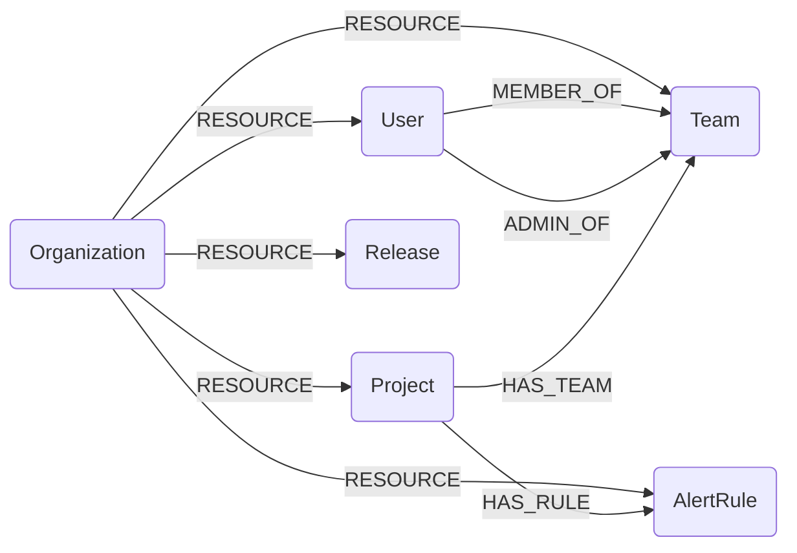

## Sentry Schema




### SentryOrganization

Represents a Sentry organization.

> **Ontology Mapping**: This node has the extra label `Tenant` to enable cross-platform queries for organizational tenants across different systems (e.g., OktaOrganization, AWSAccount).

| Field | Description |
|-------|-------------|
| **id** | The unique identifier of the organization |
| firstseen | Timestamp of when a sync job first created this node |
| lastupdated | Timestamp of the last time the node was updated |
| name | The name of the organization |
| slug | URL-friendly identifier for the organization |
| status | Current status of the organization (e.g., active) |
| date_created | When the organization was created (ISO 8601) |
| require_2fa | Whether the organization requires 2FA |
| is_early_adopter | Whether the organization is an early adopter |

#### Relationships
- Other resources belong to an `Organization`
    ```
    (SentryOrganization)-[:RESOURCE]->(
        :SentryTeam,
        :SentryUser,
        :SentryProject,
        :SentryRelease,
        :SentryAlertRule)
    ```


### SentryTeam

Represents a team within a Sentry organization.

> **Ontology Mapping**: This node has the extra label `UserGroup` to enable cross-platform queries for user groups across different systems (e.g., GitHubTeam, OktaGroup).

| Field | Description |
|-------|-------------|
| **id** | The unique identifier of the team |
| firstseen | Timestamp of when a sync job first created this node |
| lastupdated | Timestamp of the last time the node was updated |
| name | The name of the team |
| slug | URL-friendly identifier for the team |
| date_created | When the team was created (ISO 8601) |
| member_count | Number of members in the team |

#### Relationships
- `Team` belongs to an `Organization`
    ```
    (:SentryOrganization)-[:RESOURCE]->(:SentryTeam)
    ```
- `User` is a member of a `Team`
    ```
    (:SentryUser)-[:MEMBER_OF]->(:SentryTeam)
    ```
- `User` is an admin of a `Team` (owners are admins of all teams)
    ```
    (:SentryUser)-[:ADMIN_OF]->(:SentryTeam)
    ```
- `Project` has a `Team`
    ```
    (:SentryProject)-[:HAS_TEAM]->(:SentryTeam)
    ```


### SentryUser

Represents a member of a Sentry organization.

> **Ontology Mapping**: This node has the extra label `UserAccount` to enable cross-platform queries for user accounts across different systems (e.g., OktaUser, AWSSSOUser).

| Field | Description |
|-------|-------------|
| **id** | The unique membership identifier |
| firstseen | Timestamp of when a sync job first created this node |
| lastupdated | Timestamp of the last time the node was updated |
| email | The email address of the member |
| name | The display name of the member |
| role | The organization role (e.g., admin, member, owner) |
| date_created | When the membership was created (ISO 8601) |
| pending | Whether the invite is still pending |
| expired | Whether the invite has expired |
| has_2fa | Whether the user has 2FA enabled |

#### Relationships
- `User` belongs to an `Organization`
    ```
    (:SentryOrganization)-[:RESOURCE]->(:SentryUser)
    ```
- `User` is a member of a `Team`
    ```
    (:SentryUser)-[:MEMBER_OF]->(:SentryTeam)
    ```
- `User` is an admin of a `Team` (owners are admins of all teams)
    ```
    (:SentryUser)-[:ADMIN_OF]->(:SentryTeam)
    ```


### SentryProject

Represents a project in a Sentry organization.

| Field | Description |
|-------|-------------|
| **id** | The unique identifier of the project |
| firstseen | Timestamp of when a sync job first created this node |
| lastupdated | Timestamp of the last time the node was updated |
| name | The name of the project |
| slug | URL-friendly identifier for the project |
| platform | The primary platform of the project (e.g., python, javascript) |
| date_created | When the project was created (ISO 8601) |
| first_event | When the first event was received (ISO 8601) |

#### Relationships
- `Project` belongs to an `Organization`
    ```
    (:SentryOrganization)-[:RESOURCE]->(:SentryProject)
    ```
- `Project` has a `Team`
    ```
    (:SentryProject)-[:HAS_TEAM]->(:SentryTeam)
    ```
- `Project` has alert rules
    ```
    (:SentryProject)-[:HAS_RULE]->(:SentryAlertRule)
    ```


### SentryRelease

Represents a release in a Sentry organization.

| Field | Description |
|-------|-------------|
| **id** | Org-scoped version string (`{org_id}/{version}`) |
| firstseen | Timestamp of when a sync job first created this node |
| lastupdated | Timestamp of the last time the node was updated |
| version | The full version identifier |
| short_version | Abbreviated version string |
| date_created | When the release was created (ISO 8601) |
| date_released | When the release was published (ISO 8601) |
| commit_count | Number of commits in the release |
| deploy_count | Number of deploys for the release |
| new_groups | Number of new issues introduced |
| ref | Git reference associated with the release |
| url | URL associated with the release |

#### Relationships
- `Release` belongs to an `Organization`
    ```
    (:SentryOrganization)-[:RESOURCE]->(:SentryRelease)
    ```


### SentryAlertRule

Represents an issue alert rule configured on a Sentry project.

| Field | Description |
|-------|-------------|
| **id** | The unique identifier of the alert rule |
| firstseen | Timestamp of when a sync job first created this node |
| lastupdated | Timestamp of the last time the node was updated |
| name | The name of the alert rule |
| date_created | When the alert rule was created (ISO 8601) |
| action_match | Logic for conditions: all, any, or none |
| filter_match | Logic for filters: all, any, or none |
| frequency | Throttle interval in seconds |
| environment | The environment this rule applies to |
| status | Status of the rule (e.g., active) |
| project_slug | Slug of the project this rule belongs to |

#### Relationships
- `AlertRule` belongs to an `Organization` (sub-resource for cleanup)
    ```
    (:SentryOrganization)-[:RESOURCE]->(:SentryAlertRule)
    ```
- `AlertRule` is linked to a `Project`
    ```
    (:SentryProject)-[:HAS_RULE]->(:SentryAlertRule)
    ```
