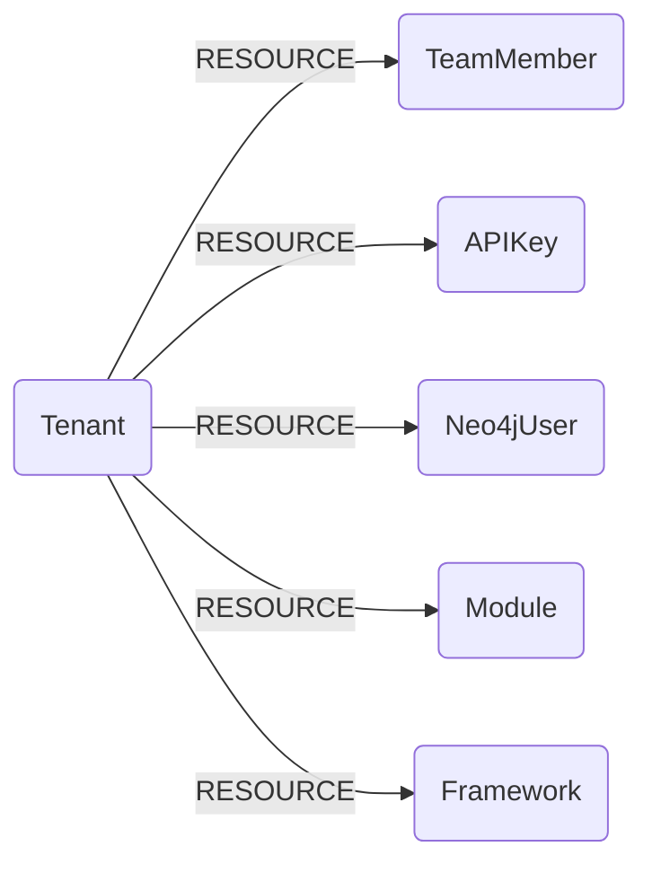

## SubImage Schema




### SubImageTenant

Represents a SubImage Tenant.

> **Ontology Mapping**: This node has the extra label `Tenant` to enable cross-platform queries for organizational tenants across different systems (e.g., OktaOrganization, AWSAccount).

| Field | Description |
|-------|-------------|
| **id** | The tenant identifier |
| firstseen | Timestamp of when a sync job first created this node |
| lastupdated | Timestamp of the last time the node was updated |
| account_id | The account identifier |
| scan_role_name | The IAM role name used for scanning |

#### Relationships
- Other resources belong to a `Tenant`
    ```
    (SubImageTenant)-[:RESOURCE]->(
        :SubImageTeamMember,
        :SubImageAPIKey,
        :SubImageNeo4jUser,
        :SubImageModule,
        :SubImageFramework)
    ```


### SubImageTeamMember

Represents a team member within a SubImage tenant.

> **Ontology Mapping**: This node has the extra label `UserAccount` to enable cross-platform queries for user accounts across different systems (e.g., OktaUser, AWSSSOUser).

| Field | Description |
|-------|-------------|
| **id** | The member identifier |
| firstseen | Timestamp of when a sync job first created this node |
| lastupdated | Timestamp of the last time the node was updated |
| email | The email address of the team member |
| first_name | The first name of the team member |
| last_name | The last name of the team member |
| role | The role of the team member (e.g., admin, viewer) |

#### Relationships
- `TeamMember` belongs to a `Tenant`
    ```
    (SubImageTenant)-[:RESOURCE]->(SubImageTeamMember)
    ```


### SubImageAPIKey

Represents an API key in SubImage.

> **Ontology Mapping**: This node has the extra label `APIKey` to enable cross-platform queries for API keys across different systems (e.g., OpenAIApiKey, ScalewayAPIKey).

| Field | Description |
|-------|-------------|
| **id** | The app identifier |
| firstseen | Timestamp of when a sync job first created this node |
| lastupdated | Timestamp of the last time the node was updated |
| client_id | The client identifier |
| role | The role associated with the API key |
| name | The name of the API key |
| description | Description of the API key |

#### Relationships
- `APIKey` belongs to a `Tenant`
    ```
    (SubImageTenant)-[:RESOURCE]->(SubImageAPIKey)
    ```


### SubImageNeo4jUser

Represents a Neo4j database user configured in SubImage.

| Field | Description |
|-------|-------------|
| **id** | The username |
| firstseen | Timestamp of when a sync job first created this node |
| lastupdated | Timestamp of the last time the node was updated |

#### Relationships
- `Neo4jUser` belongs to a `Tenant`
    ```
    (SubImageTenant)-[:RESOURCE]->(SubImageNeo4jUser)
    ```


### SubImageModule

Represents a sync module configured in SubImage.

| Field | Description |
|-------|-------------|
| **id** | The module name |
| firstseen | Timestamp of when a sync job first created this node |
| lastupdated | Timestamp of the last time the node was updated |
| is_configured | Whether the module is configured |
| last_sync_status | The status of the last sync run |

#### Relationships
- `Module` belongs to a `Tenant`
    ```
    (SubImageTenant)-[:RESOURCE]->(SubImageModule)
    ```


### SubImageFramework

Represents a compliance framework in SubImage.

| Field | Description |
|-------|-------------|
| **id** | The framework identifier |
| firstseen | Timestamp of when a sync job first created this node |
| lastupdated | Timestamp of the last time the node was updated |
| name | The full name of the framework |
| short_name | The short name of the framework |
| scope | The scope of the framework (e.g., aws, all) |
| revision | The framework revision |
| enabled | Whether the framework is enabled |
| enabled_at | Timestamp of when the framework was enabled |
| disabled_at | Timestamp of when the framework was disabled |
| rule_count | The number of rules in the framework |

#### Relationships
- `Framework` belongs to a `Tenant`
    ```
    (SubImageTenant)-[:RESOURCE]->(SubImageFramework)
    ```
