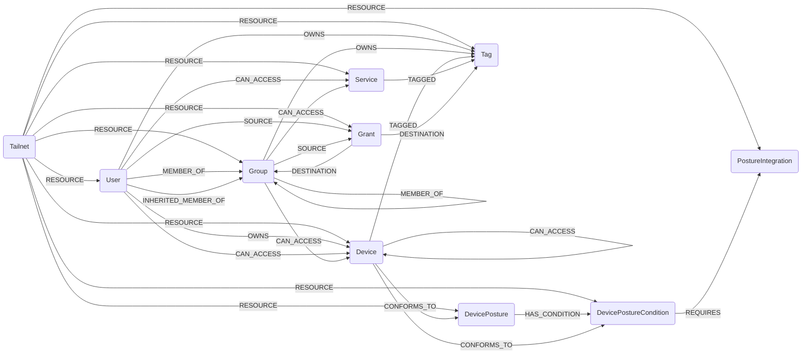

## Tailscale Schema



### TailscaleTailnet

Settings for a tailnet (aka Tenant).

> **Ontology Mapping**: This node has the extra label `Tenant` to enable cross-platform queries for organizational tenants across different systems (e.g., OktaOrganization, AWSAccount).

| Field | Description |
|-------|-------------|
| id    | ID of the Tailnet (name of the organization)
| firstseen| Timestamp of when a sync job first created this node  |
| lastupdated |  Timestamp of the last time the node was updated |
| devices_approval_on | Whether [device approval](https://tailscale.com/kb/1099/device-approval) is enabled for the tailnet. |
| devices_auto_updates_on | Whether [auto updates](https://tailscale.com/kb/1067/update#auto-updates) are enabled for devices that belong to this tailnet. |
| devices_key_duration_days | The [key expiry](https://tailscale.com/kb/1028/key-expiry) duration for devices on this tailnet. |
| users_approval_on | Whether [user approval](https://tailscale.com/kb/1239/user-approval) is enabled for this tailnet. |
| users_role_allowed_to_join_external_tailnets | Which user roles are allowed to [join external tailnets](https://tailscale.com/kb/1271/invite-any-user). |
| network_flow_logging_on | Whether [network flow logs](https://tailscale.com/kb/1219/network-flow-logs) are enabled for the tailnet. |
| regional_routing_on | Whether [regional routing](https://tailscale.com/kb/1115/high-availability#regional-routing) is enabled for the tailnet. |
| posture_identity_collection_on | Whether [identity collection](https://tailscale.com/kb/1326/device-identity) is enabled for [device posture](https://tailscale.com/kb/1288/device-posture) integrations for the tailnet. |

#### Relationships
- `User`, `Device`, `PostureIntegration`, `DevicePosture`, `DevicePostureCondition`, `Group`, `Tag`, `Grant`, `Service` belong to a `Tailnet`.
    ```
    (:TailscaleTailnet)-[:RESOURCE]->(
        :TailscaleUser,
        :TailscaleDevice,
        :TailscalePostureIntegration,
        :TailscaleDevicePosture,
        :TailscaleDevicePostureCondition,
        :TailscaleGroup,
        :TailscaleTag,
        :TailscaleGrant,
        :TailscaleService
    )
    ```

### TailscaleUser

Representation of a user within a tailnet.

> **Ontology Mapping**: This node has the extra label `UserAccount` to enable cross-platform queries for user accounts across different systems (e.g., OktaUser, AWSSSOUser).

| Field | Description |
|-------|-------------|
| id | The unique identifier for the user. |
| firstseen| Timestamp of when a sync job first created this node  |
| lastupdated |  Timestamp of the last time the node was updated |
| display_name | The name of the user. |
| login_name | The emailish login name of the user. |
| email | The email of the user. |
| profile_pic_url | The profile pic URL for the user. |
| created | The time the user joined their tailnet. |
| type | The type of relation this user has to the tailnet associated with the request. |
| role | The role of the user. Learn more about [user roles](https://tailscale.com/kb/1138/user-roles). |
| status | The status of the user. |
| device_count | Number of devices the user owns. |
| last_seen | The later of either:<br/>- The last time any of the user's nodes were connected to the network.<br/>- The last time the user authenticated to any tailscale service, including the admin panel. |
| currently_connected | `true` when the user has a node currently connected to the control server. |


#### Relationships
- `User` belongs to a `Tailnet`.
    ```
    (:TailscaleTailnet)-[:RESOURCE]->(:TailscaleUser)
    ```
- `Device` is owned by a `User`.
    ```
    (:TailscaleUser)-[:OWNS]->(:TailscaleDevice)
    ```
- `Users` are member of a `Group`
    ```
    (:TailscaleUser)-[:MEMBER_OF]->(:TailscaleGroup)
    ```
- `Users` are transitively member of a parent `Group` (resolved from sub-group hierarchy)
    ```
    (:TailscaleUser)-[:INHERITED_MEMBER_OF]->(:TailscaleGroup)
    ```
- `Users` own a `Tag`
    ```
    (:TailscaleUser)-[:OWNS]->(:TailscaleTag)
    ```
- `Users` can access `Devices` and `Services` (resolved from grants)
    ```
    (:TailscaleUser)-[:CAN_ACCESS]->(:TailscaleDevice)
    (:TailscaleUser)-[:CAN_ACCESS]->(:TailscaleService)
    ```
- `Users` are sources of `Grants`
    ```
    (:TailscaleUser)-[:SOURCE]->(:TailscaleGrant)
    ```


### TailscaleDevice

A Tailscale device (sometimes referred to as *node* or *machine*), is any computer or mobile device that joins a tailnet.

> **Ontology Mapping**: This node has the extra label `Device` to enable cross-platform queries for devices across different systems (e.g., BigfixComputer, CrowdstrikeHost, KandjiDevice).

| Field | Description |
|-------|-------------|
| id | The preferred identifier for a device |
| firstseen| Timestamp of when a sync job first created this node  |
| lastupdated |  Timestamp of the last time the node was updated |
| name | The MagicDNS name of the device.<br/>Learn more about MagicDNS at https://tailscale.com/kb/1081/. |
| hostname | The machine name in the admin console.<br/>Learn more about machine names at https://tailscale.com/kb/1098/. |
| client_version | The version of the Tailscale client<br/>software; this is empty for external devices. |
| update_available | 'true' if a Tailscale client version<br/>upgrade is available. This value is empty for external devices. |
| os | The operating system that the device is running. |
| created | The date on which the device was added<br/>to the tailnet; this is empty for external devices. |
| last_seen | When device was last active on the tailnet. |
| key_expiry_disabled | 'true' if the keys for the device will not expire.<br/>Learn more at https://tailscale.com/kb/1028/. |
| expires | The expiration date of the device's auth key.<br/>Learn more about key expiry at https://tailscale.com/kb/1028/. |
| authorized | 'true' if the device has been authorized to join the tailnet; otherwise, 'false'.<br/>Learn more about device authorization at https://tailscale.com/kb/1099/. |
| is_external | 'true', indicates that a device is not a member of the tailnet, but is shared in to the tailnet;<br/>if 'false', the device is a member of the tailnet.<br/>Learn more about node sharing at https://tailscale.com/kb/1084/. |
| node_key | Mostly for internal use, required for select operations, such as adding a node to a locked tailnet.<br/>Learn about tailnet locks at https://tailscale.com/kb/1226/. |
| blocks_incoming_connections | 'true' if the device is not allowed to accept any connections over Tailscale, including pings.<br/>Learn more in the "Allow incoming connections" section of https://tailscale.com/kb/1072/. |
| client_connectivity_endpoints | Client's magicsock UDP IP:port endpoints (IPv4 or IPv6). |
| client_connectivity_mapping_varies_by_dest_ip | 'true' if the host's NAT mappings vary based on the destination IP. |
| tailnet_lock_error | Indicates an issue with the tailnet lock node-key signature on this device.<br/>This field is only populated when tailnet lock is enabled. |
| tailnet_lock_key | The node's tailnet lock key.<br/>Every node generates a tailnet lock key (so the value will be present) even if tailnet lock is not enabled.<br/>Learn more about tailnet lock at https://tailscale.com/kb/1226/. |
| serial_number | The first serial number from posture identity, if available |
| posture_identity_serial_numbers | Posture identification collection |
| posture_identity_disabled |  Device posture identification collection enabled |
| posture_node_os | Device posture value for `node:os`. |
| posture_node_os_version | Device posture value for `node:osVersion`. |
| posture_node_ts_auto_update | Device posture value for `node:tsAutoUpdate`. |
| posture_node_ts_release_track | Device posture value for `node:tsReleaseTrack`. |
| posture_node_ts_state_encrypted | Device posture value for `node:tsStateEncrypted`. |
| posture_node_ts_version | Device posture value for `node:tsVersion`. |
| posture_ip_country | Device posture value for `ip:country`. |
| posture_falcon_zta_score | Device posture value for `falcon:ztaScore`. |
| posture_sentinelone_operational_state | Device posture value for `sentinelOne:operationalState`. |
| posture_sentinelone_active_threats | Device posture value for `sentinelOne:activeThreats`. |
| posture_sentinelone_agent_version | Device posture value for `sentinelOne:agentVersion`. |
| posture_sentinelone_encrypted_applications | Device posture value for `sentinelOne:encryptedApplications`. |
| posture_sentinelone_firewall_enabled | Device posture value for `sentinelOne:firewallEnabled`. |
| posture_sentinelone_infected | Device posture value for `sentinelOne:infected`. |
| posture_kolide_auth_state | Device posture value for `kolide:authState`. |
| posture_fleet_present | Device posture value for `fleet:present`. |
| posture_fleet_policies | List of `fleetPolicy:*` posture keys present on the device. |
| posture_huntress_defender_status | Device posture value for `huntress:defenderStatus`. |
| posture_huntress_defender_policy_status | Device posture value for `huntress:defenderPolicyStatus`. |
| posture_huntress_firewall_status | Device posture value for `huntress:firewallStatus`. |
| posture_kandji_mdm_enabled | Device posture value for `kandji:mdmEnabled`. |
| posture_kandji_agent_installed | Device posture value for `kandji:agentInstalled`. |
| posture_jamfpro_remote_managed | Device posture value for `jamfPro:remoteManaged`. |
| posture_jamfpro_supervised | Device posture value for `jamfPro:supervised`. |
| posture_jamfpro_firewall_enabled | Device posture value for `jamfPro:firewallEnabled`. |
| posture_jamfpro_file_vault_status | Device posture value for `jamfPro:fileVaultStatus`. |
| posture_jamfpro_sip_enabled | Device posture value for `jamfPro:SIPEnabled`. |
| posture_intune_compliance_state | Device posture value for `intune:complianceState`. |
| posture_intune_azure_ad_registered | Device posture value for `intune:azureADRegistered`. |
| posture_intune_device_registration_state | Device posture value for `intune:deviceRegistrationState`. |
| posture_intune_is_supervised | Device posture value for `intune:isSupervised`. |
| posture_intune_is_encrypted | Device posture value for `intune:isEncrypted`. |
| posture_intune_managed_device_owner_type | Device posture value for `intune:managedDeviceOwnerType`. |


#### Relationships
- `Device` belongs to a `Tailnet`.
    ```
    (:TailscaleTailnet)-[:RESOURCE]->(:TailscaleDevice)
    ```
- `Device` is owned by a `User`.
    ```
    (:TailscaleUser)-[:OWNS]->(:TailscaleDevice)
    ```
- `Devices` are tagged with `Tag`
    ```
    (:TailscaleDevice)-[:TAGGED]->(:TailscaleTag)
    ```


### TailscaleGrant

A grant rule from the Tailscale ACL/policy file. Grants define access rules with sources, destinations, and capabilities.

| Field | Description |
|-------|-------------|
| id | Stable content-hash ID (eg. `grant:a1b2c3d4e5f6`). Computed from the grant's src, dst, ip, app, and srcPosture fields. |
| firstseen| Timestamp of when a sync job first created this node  |
| lastupdated |  Timestamp of the last time the node was updated |
| sources | Native list of source selectors (users, groups, tags). |
| destinations | Native list of destination selectors (tags, groups, services, IPs). |
| ip_rules | Native list of network capabilities (eg. `["tcp:443"]`). |
| app_capabilities | JSON-serialized dict of application capabilities. |
| src_posture | Native list of required posture policies for sources. |

#### Relationships
- `Grant` belongs to a `Tailnet`.
    ```
    (:TailscaleTailnet)-[:RESOURCE]->(:TailscaleGrant)
    ```
- `Users` and `Groups` are sources of a `Grant`.
    ```
    (:TailscaleUser)-[:SOURCE]->(:TailscaleGrant)
    (:TailscaleGroup)-[:SOURCE]->(:TailscaleGrant)
    ```
- `Grants` target `Tags` and `Groups` as destinations.
    ```
    (:TailscaleGrant)-[:DESTINATION]->(:TailscaleTag)
    (:TailscaleGrant)-[:DESTINATION]->(:TailscaleGroup)
    ```

#### Resolved Access (CAN_ACCESS)

Effective access relationships are resolved from grants and loaded as MatchLinks. The `granted_by` property on `CAN_ACCESS` is a list of grant IDs that justify the access.

```
(:TailscaleUser)-[:CAN_ACCESS {granted_by: [...]}]->(:TailscaleDevice)
(:TailscaleUser)-[:CAN_ACCESS {granted_by: [...]}]->(:TailscaleService)
(:TailscaleGroup)-[:CAN_ACCESS {granted_by: [...]}]->(:TailscaleDevice)
(:TailscaleGroup)-[:CAN_ACCESS {granted_by: [...]}]->(:TailscaleService)
(:TailscaleDevice)-[:CAN_ACCESS {granted_by: [...]}]->(:TailscaleDevice)
```


### TailscaleService

A Tailscale Service published in the tailnet. Services are named resources backed by one or more device hosts, accessible via stable MagicDNS names.

| Field | Description |
|-------|-------------|
| id | Service ID in grant selector format (eg. `svc:web-server`). |
| firstseen| Timestamp of when a sync job first created this node  |
| lastupdated |  Timestamp of the last time the node was updated |
| name | The unique name of the service. |
| comment | An optional description for the service. |
| ipv4_address | The IPv4 address assigned to the service. |
| ipv6_address | The IPv6 address assigned to the service. |
| ports | Native list of protocol:port pairs (eg. `["tcp:443"]`). |
| tags | JSON-serialized list of tags associated with the service. |

#### Relationships
- `Service` belongs to a `Tailnet`.
    ```
    (:TailscaleTailnet)-[:RESOURCE]->(:TailscaleService)
    ```
- `Services` are tagged with `Tags`.
    ```
    (:TailscaleService)-[:TAGGED]->(:TailscaleTag)
    ```
- `Users` and `Groups` can access `Services` (resolved from grants).
    ```
    (:TailscaleUser)-[:CAN_ACCESS]->(:TailscaleService)
    (:TailscaleGroup)-[:CAN_ACCESS]->(:TailscaleService)
    ```
- `Devices` can conform to posture conditions and full postures.
    ```
    (:TailscaleDevice)-[:CONFORMS_TO]->(:TailscaleDevicePostureCondition)
    (:TailscaleDevice)-[:CONFORMS_TO]->(:TailscaleDevicePosture)
    ```
- `Devices` can access other `Devices` (resolved from grants and user access propagation)
    ```
    (:TailscaleDevice)-[:CAN_ACCESS]->(:TailscaleDevice)
    ```


### TailscaleDevicePosture

Logical posture policy blocks defined in the ACL.

| Field | Description |
|-------|-------------|
| id | Posture ID from the ACL, for example `posture:healthySentinelOneMac`. |
| firstseen| Timestamp of when a sync job first created this node  |
| lastupdated | Timestamp of the last time the node was updated |
| name | Posture name without the `posture:` prefix. |
| description | Human-readable description generated from the ACL conditions. |

#### Relationships
- `DevicePosture` belongs to a `Tailnet`.
    ```
    (:TailscaleTailnet)-[:RESOURCE]->(:TailscaleDevicePosture)
    ```
- `DevicePosture` is composed of one or more `DevicePostureCondition` nodes.
    ```
    (:TailscaleDevicePosture)-[:HAS_CONDITION]->(:TailscaleDevicePostureCondition)
    ```
- `Devices` can conform to the full posture.
    ```
    (:TailscaleDevice)-[:CONFORMS_TO]->(:TailscaleDevicePosture)
    ```


### TailscaleDevicePostureCondition

Atomic posture assertions extracted from ACL posture definitions.

| Field | Description |
|-------|-------------|
| id | Stable condition identifier derived from the posture ID and condition index. |
| firstseen| Timestamp of when a sync job first created this node  |
| lastupdated | Timestamp of the last time the node was updated |
| name | The posture attribute being evaluated, for example `sentinelOne:infected` or `node:os`. |
| provider | The provider/namespace inferred from the attribute, for example `sentinelone` or `node`. |
| operator | Comparison operator such as `==`, `IN`, or `IS SET`. |
| value | Expected comparison value serialized as a string. |

#### Relationships
- `DevicePostureCondition` belongs to a `Tailnet`.
    ```
    (:TailscaleTailnet)-[:RESOURCE]->(:TailscaleDevicePostureCondition)
    ```
- `DevicePostureCondition` can require a configured posture integration.
    ```
    (:TailscaleDevicePostureCondition)-[:REQUIRES]->(:TailscalePostureIntegration)
    ```
- `Devices` can conform to individual conditions, enabling partial compliance analysis.
    ```
    (:TailscaleDevice)-[:CONFORMS_TO]->(:TailscaleDevicePostureCondition)
    ```


### TailscalePostureIntegration

A configured PostureIntegration.

| Field | Description |
|-------|-------------|
| id | A unique identifier for the integration (generated by the system). |
| firstseen| Timestamp of when a sync job first created this node  |
| lastupdated |  Timestamp of the last time the node was updated |
| provider | The device posture provider.<br/><br/>Required on POST requests, ignored on PATCH requests. |
| cloud_id | Identifies which of the provider's clouds to integrate with.<br/><br/>- For CrowdStrike Falcon, it will be one of `us-1`, `us-2`, `eu-1` or `us-gov`.<br/>- For Microsoft Intune, it will be one of `global` or `us-gov`. <br/>- For Jamf Pro, Kandji and Sentinel One, it is the FQDN of your subdomain, for example `mydomain.sentinelone.net`.<br/>- For Kolide, this is left blank. |
| client_id | Unique identifier for your client.<br/><br/>- For Microsoft Intune, it will be your application's UUID.<br/>- For CrowdStrike Falcon and Jamf Pro, it will be your client id.<br/>- For Kandji, Kolide and Sentinel One, this is left blank. |
| tenant_id | The Microsoft Intune directory (tenant) ID. For other providers, this is left blank. |
| config_updated | Timestamp of the last time this configuration was updated, in RFC 3339 format. |
| status_last_sync | Timestamp of the last synchronization with the device posture provider, in RFC 3339 format. |
| status_error | If the last synchronization failed, this shows the error message associated with the failed synchronization. |
| status_provider_host_count | The number of devices known to the provider. |
| status_matched_count | The number of Tailscale nodes that were matched with provider. |
| status_possible_matched_count | The number of Tailscale nodes with identifiers for matching. |

#### Relationships
- `PostureIntegration` belongs to a `Tailnet`.
    ```
    (:TailscaleTailnet)-[:RESOURCE]->(:TailscalePostureIntegration)
    ```


### TailscaleGroup

A group in Tailscale (either `group` or `autogroup`).

> **Ontology Mapping**: This node has the extra label `UserGroup` to enable cross-platform queries for user groups across different systems (e.g., AWSGroup, EntraGroup, GoogleWorkspaceGroup).

| Field | Description |
|-------|-------------|
| id | Group ID (eg. `group:example` or `autogroup:admin`) |
| firstseen| Timestamp of when a sync job first created this node  |
| lastupdated |  Timestamp of the last time the node was updated |
| name | The group name (eg. `example`) |

#### Relationships
- `Group` belongs to a `Tailnet`.
    ```
    (:TailscaleTailnet)-[:RESOURCE]->(:TailscaleGroup)
    ```
- `Users` are member of a `Group`
    ```
    (:TailscaleUser)-[:MEMBER_OF]->(:TailscaleGroup)
    ```
- `Groups` are member of a `Group`
    ```
    (:TailscaleGroup)-[:MEMBER_OF]->(:TailscaleGroup)
    ```
- `Users` are transitively member of a parent `Group`
    ```
    (:TailscaleUser)-[:INHERITED_MEMBER_OF]->(:TailscaleGroup)
    ```
- `Group` own a `Tag`
    ```
    (:TailscaleGroup)-[:OWNS]->(:TailscaleTag)
    ```
- `Groups` can access `Devices` and `Services` (resolved from grants)
    ```
    (:TailscaleGroup)-[:CAN_ACCESS]->(:TailscaleDevice)
    (:TailscaleGroup)-[:CAN_ACCESS]->(:TailscaleService)
    ```
- `Groups` are sources of `Grants`
    ```
    (:TailscaleGroup)-[:SOURCE]->(:TailscaleGrant)
    ```

### TailscaleTag

A tag in Tailscale (defined and used by ACL).

| Field | Description |
|-------|-------------|
| id | Tag ID (eg. `tag:example`) |
| firstseen| Timestamp of when a sync job first created this node  |
| lastupdated |  Timestamp of the last time the node was updated |
| name | The tag name (eg. `example`) |

#### Relationships
- `Tag` belongs to a `Tailnet`.
    ```
    (:TailscaleTailnet)-[:RESOURCE]->(:TailscaleTag)
    ```
- `Users` own a `Tag`
    ```
    (:TailscaleUser)-[:OWNS]->(:TailscaleTag)
    ```
- `Group` own a `Tag`
    ```
    (:TailscaleGroup)-[:OWNS]->(:TailscaleTag)
    ```
- `Devices` are tagged with `Tag`
    ```
    (:TailscaleDevice)-[:TAGGED]->(:TailscaleTag)
    ```
