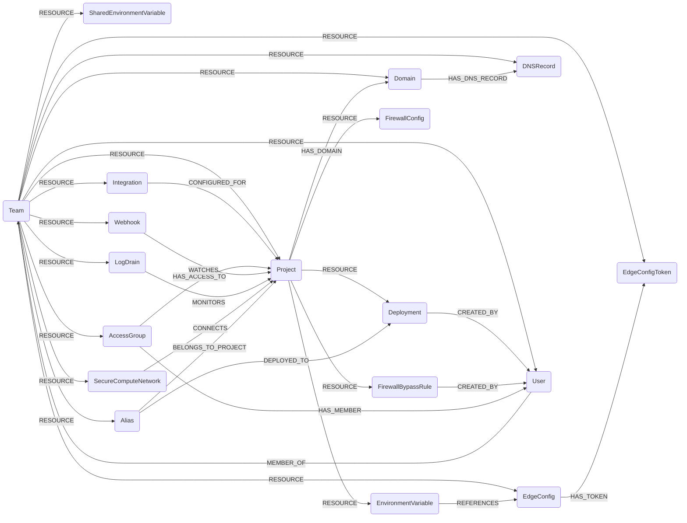

## Vercel Schema



### VercelTeam

Represents a Vercel team (organization).

> **Ontology Mapping**: This node has the extra label `Tenant` to enable cross-platform queries for organizational tenants across different systems (e.g., OktaOrganization, AzureTenant, GCPOrganization).

| Field | Description |
|-------|-------------|
| **id** | Team ID. |
| firstseen | Timestamp of when a sync job first created this node. |
| lastupdated | Timestamp of the last time the node was updated. |
| name | Team display name. |
| slug | URL slug of the team. |
| created_at | Team creation timestamp (ms). |
| avatar | URL of the team avatar. |

#### Relationships
- Team members belong to the team. Each user also carries a `MEMBER_OF` relationship with membership properties (`role`, `confirmed`, `joined_from`).
    ```
    (:VercelTeam)-[:RESOURCE]->(:VercelUser)
    (:VercelUser)-[:MEMBER_OF]->(:VercelTeam)
    ```
- All Vercel resources belong to the team.
    ```
    (:VercelTeam)-[:RESOURCE]->(:VercelProject | :VercelDomain | :VercelDNSRecord | :VercelSharedEnvironmentVariable | :VercelIntegration | :VercelAccessGroup | :VercelWebhook | :VercelLogDrain | :VercelSecureComputeNetwork | :VercelAlias | :VercelEdgeConfig | :VercelEdgeConfigToken)
    ```

### VercelUser

Represents a Vercel team member.

> **Ontology Mapping**: This node has the extra label `UserAccount` to enable cross-platform queries for user accounts across different systems (e.g., OktaUser, EntraUser, GSuiteUser).

| Field | Description |
|-------|-------------|
| **id** | User UID. |
| firstseen | Timestamp of when a sync job first created this node. |
| lastupdated | Timestamp of the last time the node was updated. |
| email | User email. |
| username | Vercel username. |
| name | Display name. |
| role | Team role (owner, member, developer, viewer, billing). |
| created_at | Account creation timestamp (ms). |
| joined_from | How the user joined the team. |
| confirmed | Whether the membership is confirmed. |

#### Relationships
- A user is both owned by the team (`RESOURCE`) and linked to it via `MEMBER_OF`. The `MEMBER_OF` relationship carries membership properties (`role`, `confirmed`, `joined_from`) that describe the user's role within that specific team.
    ```
    (:VercelTeam)-[:RESOURCE]->(:VercelUser)
    (:VercelUser)-[:MEMBER_OF]->(:VercelTeam)
    ```

### VercelProject

Represents a Vercel project.

| Field | Description |
|-------|-------------|
| **id** | Project ID. |
| firstseen | Timestamp of when a sync job first created this node. |
| lastupdated | Timestamp of the last time the node was updated. |
| name | Project name. |
| framework | Framework preset (nextjs, gatsby, etc.). |
| node_version | Node.js version. |
| build_command | Build command override. |
| dev_command | Dev command override. |
| install_command | Install command override. |
| output_directory | Build output directory. |
| public_source | Whether the source code is publicly viewable. |
| serverless_function_region | Region where serverless functions are deployed. |
| created_at | Creation timestamp (ms). |
| updated_at | Last update timestamp (ms). |
| auto_expose_system_envs | Whether system env vars are auto-exposed. |
| root_directory | Root directory for the project. |
| git_fork_protection | Whether fork PRs can trigger deployments. |
| skew_protection_max_age | Max age of deployments kept for skew protection. |

#### Relationships
- A project belongs to a team.
    ```
    (:VercelTeam)-[:RESOURCE]->(:VercelProject)
    ```
- Projects own deployments, env vars, project domains, firewall config, and firewall bypass rules.
    ```
    (:VercelProject)-[:RESOURCE]->(:VercelDeployment | :VercelEnvironmentVariable | :VercelFirewallConfig | :VercelFirewallBypassRule)
    ```

### VercelDeployment

Represents an individual deployment.

| Field | Description |
|-------|-------------|
| **id** | Deployment UID. |
| firstseen | Timestamp of when a sync job first created this node. |
| lastupdated | Timestamp of the last time the node was updated. |
| name | Deployment name. |
| url | Public deployment URL. |
| created_at | Creation timestamp (ms). |
| ready_at | Ready timestamp (ms). |
| state | State (READY, BUILDING, ERROR, CANCELED, QUEUED). |
| target | Target environment (production, preview). |
| source | Source (git, cli, api). |
| creator_uid | UID of the user who created the deployment. |
| meta_git_commit_sha | Commit SHA of the deployment source. |
| meta_git_branch | Branch alias of the deployment source. |

#### Relationships
- A deployment belongs to a project.
    ```
    (:VercelProject)-[:RESOURCE]->(:VercelDeployment)
    ```
- A deployment was created by a user.
    ```
    (:VercelDeployment)-[:CREATED_BY]->(:VercelUser)
    ```

### VercelDomain

Represents a domain owned by the team.

| Field | Description |
|-------|-------------|
| **id** | Domain name (used as ID). |
| firstseen | Timestamp of when a sync job first created this node. |
| lastupdated | Timestamp of the last time the node was updated. |
| name | Domain name. |
| service_type | `external` or `zeit.world`. |
| verified | Whether the domain is verified. |
| created_at | Creation timestamp (ms). |
| expires_at | Registration expiration timestamp (ms). |
| cdn_enabled | Whether the CDN is enabled. |
| bought_at | Timestamp the domain was purchased (ms). |

#### Relationships
- A domain belongs to a team.
    ```
    (:VercelTeam)-[:RESOURCE]->(:VercelDomain)
    ```
- A domain contains DNS records via `HAS_DNS_RECORD`.
    ```
    (:VercelDomain)-[:HAS_DNS_RECORD]->(:VercelDNSRecord)
    ```
- Projects attach to domains via `HAS_DOMAIN`, which carries per-project configuration (`redirect`, `redirect_status_code`, `git_branch`, `verified`, `created_at`, `updated_at`, `project_domain_id`). Auto-generated `*.vercel.app` and external CNAMEd domains are also upserted as `VercelDomain` nodes via this relationship, without clobbering team-level domain fields.
    ```
    (:VercelProject)-[:HAS_DOMAIN]->(:VercelDomain)
    ```

### VercelDNSRecord

Represents a DNS record on a Vercel-managed domain.

> **Ontology Mapping**: This node has the extra label `DNSRecord` to enable cross-platform queries for DNS records across different systems.

| Field | Description |
|-------|-------------|
| **id** | Record ID. |
| firstseen | Timestamp of when a sync job first created this node. |
| lastupdated | Timestamp of the last time the node was updated. |
| name | Record name. |
| type | Record type (A, AAAA, CNAME, MX, TXT, etc.). |
| value | Record value. |
| ttl | Record TTL. |
| priority | MX priority (when applicable). |
| created_at | Creation timestamp (ms). |

#### Relationships
- A DNS record belongs to the team and is contained in a domain via `HAS_DNS_RECORD`.
    ```
    (:VercelTeam)-[:RESOURCE]->(:VercelDNSRecord)
    (:VercelDomain)-[:HAS_DNS_RECORD]->(:VercelDNSRecord)
    ```

### VercelEnvironmentVariable

Represents a per-project environment variable. The value is intentionally not stored.

| Field | Description |
|-------|-------------|
| **id** | Env var ID. |
| firstseen | Timestamp of when a sync job first created this node. |
| lastupdated | Timestamp of the last time the node was updated. |
| key | Variable name. |
| type | Variable type (encrypted, plain, sensitive, secret). |
| target | List of target environments (production, preview, development). |
| git_branch | Git branch scope. |
| created_at | Creation timestamp (ms). |
| updated_at | Last update timestamp (ms). |
| edge_config_id | Linked Edge Config ID, if any. |
| comment | Optional description. |

#### Relationships
- A project contains env vars.
    ```
    (:VercelProject)-[:RESOURCE]->(:VercelEnvironmentVariable)
    ```
- An env var can reference an edge config.
    ```
    (:VercelEnvironmentVariable)-[:REFERENCES]->(:VercelEdgeConfig)
    ```

### VercelSharedEnvironmentVariable

Represents a team-level shared env var. The value is intentionally not stored.

| Field | Description |
|-------|-------------|
| **id** | Env var ID. |
| firstseen | Timestamp of when a sync job first created this node. |
| lastupdated | Timestamp of the last time the node was updated. |
| key | Variable name. |
| type | Variable type. |
| target | List of target environments. |
| created_at | Creation timestamp (ms). |
| updated_at | Last update timestamp (ms). |

#### Relationships
- Shared env vars belong to a team.
    ```
    (:VercelTeam)-[:RESOURCE]->(:VercelSharedEnvironmentVariable)
    ```

### VercelFirewallConfig

Represents the WAF / firewall configuration for a project.

| Field | Description |
|-------|-------------|
| **id** | Synthesized ID (`{project_id}_firewall`). |
| firstseen | Timestamp of when a sync job first created this node. |
| lastupdated | Timestamp of the last time the node was updated. |
| enabled | Whether the firewall is enabled. |
| updated_at | Last update timestamp (ms). |

#### Relationships
- A firewall config belongs to a project.
    ```
    (:VercelProject)-[:RESOURCE]->(:VercelFirewallConfig)
    ```

### VercelFirewallBypassRule

Represents a firewall bypass rule that weakens WAF protections.

| Field | Description |
|-------|-------------|
| **id** | Rule ID. |
| firstseen | Timestamp of when a sync job first created this node. |
| lastupdated | Timestamp of the last time the node was updated. |
| domain | Domain the rule applies to. |
| ip | IP address allowlisted. |
| note | Operator-provided note. |
| created_at | Creation timestamp (ms). |
| actor_id | UID of the user who created the bypass. |

#### Relationships
- A bypass rule belongs to a project and was created by a user.
    ```
    (:VercelProject)-[:RESOURCE]->(:VercelFirewallBypassRule)-[:CREATED_BY]->(:VercelUser)
    ```

### VercelIntegration

Represents a third-party integration installed on the team.

| Field | Description |
|-------|-------------|
| **id** | Integration ID. |
| firstseen | Timestamp of when a sync job first created this node. |
| lastupdated | Timestamp of the last time the node was updated. |
| slug | Integration slug. |
| integration_id | Integration marketplace ID. |
| status | Status (installed, removed). |
| scopes | Granted scopes. |
| project_selection | `all` or `selected`. |
| project_ids | List of selected project IDs. |
| source | How the integration was installed. |
| created_at | Creation timestamp (ms). |
| updated_at | Last update timestamp (ms). |

#### Relationships
- An integration belongs to a team and is configured for specific projects.
    ```
    (:VercelTeam)-[:RESOURCE]->(:VercelIntegration)-[:CONFIGURED_FOR]->(:VercelProject)
    ```

### VercelAccessGroup

Represents a team access group used for RBAC.

> **Ontology Mapping**: This node has the extra label `Group` to enable cross-platform queries for user groups across different systems (e.g., OktaGroup, GoogleWorkspaceGroup, AWSGroup).

| Field | Description |
|-------|-------------|
| **id** | Access group ID. |
| firstseen | Timestamp of when a sync job first created this node. |
| lastupdated | Timestamp of the last time the node was updated. |
| name | Access group name. |
| created_at | Creation timestamp (ms). |
| updated_at | Last update timestamp (ms). |
| members_count | Number of members. |
| projects_count | Number of projects. |
| is_dsync_managed | Whether the group is managed via directory sync. |
| member_ids | List of user IDs. |

#### Relationships
- An access group groups users.
    ```
    (:VercelTeam)-[:RESOURCE]->(:VercelAccessGroup)-[:HAS_MEMBER]->(:VercelUser)
    ```
- An access group grants access to projects. The `HAS_ACCESS_TO` relationship carries a `role` property (`ADMIN`, `PROJECT_DEVELOPER`, `PROJECT_VIEWER`, or `PROJECT_GUEST`) describing the per-project privilege level.
    ```
    (:VercelAccessGroup)-[:HAS_ACCESS_TO]->(:VercelProject)
    ```

### VercelWebhook

Represents a team webhook endpoint.

| Field | Description |
|-------|-------------|
| **id** | Webhook ID. |
| firstseen | Timestamp of when a sync job first created this node. |
| lastupdated | Timestamp of the last time the node was updated. |
| url | Destination URL. |
| events | List of subscribed event types. |
| project_ids | List of project IDs this webhook watches. |
| created_at | Creation timestamp (ms). |
| updated_at | Last update timestamp (ms). |

#### Relationships
- Webhooks belong to a team and watch specific projects.
    ```
    (:VercelTeam)-[:RESOURCE]->(:VercelWebhook)-[:WATCHES]->(:VercelProject)
    ```

### VercelLogDrain

Represents a log delivery drain.

| Field | Description |
|-------|-------------|
| **id** | Drain ID. |
| firstseen | Timestamp of when a sync job first created this node. |
| lastupdated | Timestamp of the last time the node was updated. |
| name | Drain name. |
| url | Destination URL. |
| delivery_format | Format (json, ndjson, syslog). |
| status | Drain status (enabled, disabled, errored). |
| sources | List of log sources. |
| environments | List of environments monitored. |
| project_ids | List of monitored project IDs. |
| created_at | Creation timestamp (ms). |

#### Relationships
- Log drains belong to a team and monitor specific projects.
    ```
    (:VercelTeam)-[:RESOURCE]->(:VercelLogDrain)-[:MONITORS]->(:VercelProject)
    ```

### VercelSecureComputeNetwork

Represents a Vercel Connect private network.

| Field | Description |
|-------|-------------|
| **id** | Network ID. |
| firstseen | Timestamp of when a sync job first created this node. |
| lastupdated | Timestamp of the last time the node was updated. |
| name | Network name. |
| region | AWS region. |
| status | Network status. |
| created_at | Creation timestamp (ms). |

#### Relationships
- Networks belong to a team.
    ```
    (:VercelTeam)-[:RESOURCE]->(:VercelSecureComputeNetwork)
    ```
- Networks attach to projects per environment. The `CONNECTS` relationship carries an `environments` list (e.g. `["production", "preview"]`) and a `passive_environments` list with the subset of those environments where the network is configured as a passive (failover) attachment.
    ```
    (:VercelSecureComputeNetwork)-[:CONNECTS]->(:VercelProject)
    ```

### VercelAlias

Represents a URL alias pointing at a deployment.

| Field | Description |
|-------|-------------|
| **id** | Alias UID. |
| firstseen | Timestamp of when a sync job first created this node. |
| lastupdated | Timestamp of the last time the node was updated. |
| alias | Alias hostname. |
| deployment_id | Deployment UID this alias points to. |
| project_id | Project ID this alias belongs to. |
| created_at | Creation timestamp (ms). |

#### Relationships
- An alias belongs to a team, points to a deployment, and belongs to a project.
    ```
    (:VercelTeam)-[:RESOURCE]->(:VercelAlias)-[:DEPLOYED_TO]->(:VercelDeployment)
    (:VercelAlias)-[:BELONGS_TO_PROJECT]->(:VercelProject)
    ```

### VercelEdgeConfig

Represents an edge configuration used to serve runtime data from the edge.

| Field | Description |
|-------|-------------|
| **id** | Edge config ID. |
| firstseen | Timestamp of when a sync job first created this node. |
| lastupdated | Timestamp of the last time the node was updated. |
| slug | Edge config slug. |
| created_at | Creation timestamp (ms). |
| updated_at | Last update timestamp (ms). |
| item_count | Number of items. |
| size_in_bytes | Size in bytes. |
| digest | Content digest. |

#### Relationships
- Edge configs belong to a team and expose access tokens via `HAS_TOKEN`.
    ```
    (:VercelTeam)-[:RESOURCE]->(:VercelEdgeConfig)
    (:VercelEdgeConfig)-[:HAS_TOKEN]->(:VercelEdgeConfigToken)
    ```

### VercelEdgeConfigToken

Represents a read token granting access to an edge config. The token value is intentionally not stored.

| Field | Description |
|-------|-------------|
| **id** | Token ID. |
| firstseen | Timestamp of when a sync job first created this node. |
| lastupdated | Timestamp of the last time the node was updated. |
| label | Token label. |
| created_at | Creation timestamp (ms). |

#### Relationships
- Tokens belong to the team and are exposed by an edge config via `HAS_TOKEN`.
    ```
    (:VercelTeam)-[:RESOURCE]->(:VercelEdgeConfigToken)
    (:VercelEdgeConfig)-[:HAS_TOKEN]->(:VercelEdgeConfigToken)
    ```
